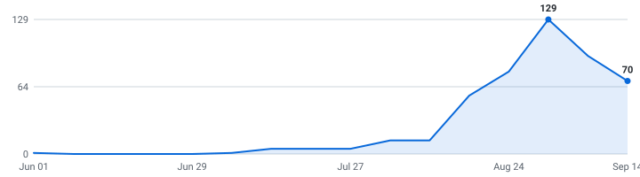

# 🔐 Summer 2027 Security & Networking Internships

**A self-updating engine that tracks security, networking, and infrastructure internships so you don't have to.**

&nbsp;&nbsp;&nbsp;

### 42 open roles · 42 new this week

4,183 employers tracked · data as of Aug 16, 2026 at 22:07 UTC

_15 have a cycle the employer stated · 27 are recent postings whose cycle isn't stated (listed separately, never mixed in)._

**[🖥️ Live dashboard](https://ihrtkaii.github.io/secnet-internships/)** · **[📡 RSS](https://ihrtkaii.github.io/secnet-internships/feed.xml)** · **[⚙️ JSON API](https://ihrtkaii.github.io/secnet-internships/api/jobs.json)**

Instead of refreshing a dozen career pages by hand, it reads company hiring feeds directly and keeps one live list — newest roles on top, refreshed automatically throughout the day.

---

## What this is

This is an engine, not a hand-kept list. It polls company career feeds every 3 hours, finds the internships, removes duplicates, and rebuilds this page on its own.

Every link comes straight from the source — so it's real and current, not a stale list someone forgot to update. Speed matters.

## What makes this different

| | |
|---|---|
| 📅 **[Drop Radar](#drop-radar)** | A forecast of **what's coming**. Each marquee company's typical opening window, replaced by the real drop date the moment the engine catches it live. Windows are estimates and labelled as such; only dates the engine saw itself are marked verified. |
| 🛂 **Visa intel, computed** | 🇺🇸 / 🛂 flags detected automatically from every job description, plus ✓ for employers with a real H-1B track record (USCIS data, FY2022-23 — a history, not a promise). The big lists crowdsource this by hand; here it's code. Most postings say nothing either way, and those show as unknown rather than guessed. |
| 📆 **A real date on nearly every role** | Taken from the job portal itself wherever the portal states one, so newest-first actually means newest. The exact coverage figure is printed at the bottom of this page every run. |
| 🧰 **Skill tags + pay, extracted** | Every posting's text is scanned for the stack it wants (Python, C++, PyTorch, …) and the pay it states — searchable on the [dashboard](https://ihrtkaii.github.io/secnet-internships/), and included in the CSV and API. |
| ⚙️ **An engine, not a spreadsheet** | 4,422 job-board endpoints (4,183 distinct employers; some run more than one board) polled every 3 hours across 12 ATS platforms. Full source and tests in this repo. |

## Scope

| | |
|---|---|
| **Roles** | Cybersecurity, network engineering, systems/infrastructure, and IT operations internships |
| **Region** | United States |
| **Cycles** | Summer 2027 and Fall 2026 |

## About

This tracks security and networking internships specifically, because the major community internship lists filter on software-engineering titles and silently discard roles like "Network Engineer Intern", "SOC Analyst Intern", and "GRC Intern". Built on zshah101's engine with a replacement classifier tuned for these titles.

## How to use

<b>Reading the table — flags, dates, and the cycle split</b> (click to expand)

- Roles are grouped by cycle below - **newest posting on top, oldest at the bottom.**
- A cycle section holds only roles whose **employer stated that cycle** - in the title, or in the posting's own text. Postings that name no cycle anywhere are in *Recently posted — cycle not stated* further down, with **no cycle guessed for them**. Same quality bar, different amount of evidence.
- The **Posted** column is the date the company published the role.
- **_(3 openings)_ after a role title** = the employer has that many separate live requisitions for the same job, in the same place, for the same cycle. They're all real and each takes its own application, so they're linked individually (**Apply**, then **#2**, **#3**) instead of repeating the row. Counts still count requisitions, and the CSV export is never grouped.
- **🆁 after a company name** = **this role is remote** — the posting's own location or title says so. It marks the role on that row, not the whole company.
- **Flags after a role title:** 🇺🇸 = requires U.S. citizenship or a security clearance · 🛂 = the posting says it won't sponsor a work visa · 🆕 = spotted in the last 48 hours. Sponsorship flags are detected automatically from each job description - treat them as a strong hint and confirm on the posting.
- **✓ after a company name** = a real H-1B track record: USCIS approved 10+ petitions for that employer in FY2022–2023 (matched automatically against the official [H-1B Employer Data Hub](https://www.uscis.gov/tools/reports-and-studies/h-1b-employer-data-hub)). No ✓ doesn't mean they won't sponsor - it means we can't prove they have.
- Track your applications with [`data/internships.csv`](data/internships.csv) (opens in Excel / Google Sheets).
- Missing a company? Adding one takes a single line, see [CONTRIBUTING.md](CONTRIBUTING.md).

---

## 🔐 Security

### Summer 2027  (3 employer-stated)

| Company | Role | Category | Location | Skills | Posted | Apply |
|---|---|---|---|---|---|---|
| Fifth Third Bank | 2027 IT Audit Intern | GRC / Risk | Cincinnati, OH | No skills listed | Aug 06, 2026 | [Apply](https://fifththird.wd5.myworkdayjobs.com/53careers/job/Cincinnati-OH/XMLNAME-2027-IT-Audit-Intern_R70611) |
| Pentair | IT & Cybersecurity Leadership Development Internship Program -  Summer 2027 🛂 | Security (general) | Golden Valley, MN | No skills listed | Aug 04, 2026 | [Apply](https://pentair.wd5.myworkdayjobs.com/pentair_careers/job/Golden-Valley-MN/IT---Cybersecurity-Leadership-Development-Internship-Program----Summer-2027_R23700) |
| Appian ✓ | Information Security Engineer Intern 🛂 | Security (general) | McLean, Virginia | LLMs | Jul 27, 2026 | [Apply](https://job-boards.greenhouse.io/appian/jobs/8088496) |

### Fall 2026  (2 employer-stated)

| Company | Role | Category | Location | Skills | Posted | Apply |
|---|---|---|---|---|---|---|
| Rocket Companies | Security Services Intern - Fall 2026 | Security (general) | Detroit, MI | No skills listed | Jul 30, 2026 | [Apply](https://quickenloans.wd5.myworkdayjobs.com/rocket_careers/job/Detroit-MI/Security-Services-Intern---Fall-2026_R-082242) |
| Notion | Governance, Risk, and Compliance Intern (Fall 2026) | GRC / Risk | San Francisco, California | Python | Jul 15, 2026 | [Apply](https://jobs.ashbyhq.com/notion/6ccbc30c-2de0-4395-af14-3641cd15961b) |

### Recently posted — cycle not stated  (10 roles)

These postings never name a cycle — not in the title, not in the posting text — so neither do we. They're recent tech internships (posted within the last few weeks), often exactly the early drops worth applying to first; we just can't tell you which cycle they're for, and we'd rather say so than guess. The moment a posting's own text states a cycle, the role moves up into that section automatically.

| Company | Role | Category | Location | Skills | Posted | Apply |
|---|---|---|---|---|---|---|
| ONEOK | Cyber Security Intern - Tulsa, OK 🆕 | Security (general) | Tulsa, OK | No skills listed | Aug 14, 2026 | [Apply](https://oneok.wd1.myworkdayjobs.com/ONEOK_Early_Careers/job/Tulsa-OK/Cyber-Security-Intern---Tulsa--OK_R8449) |
| Crowe ✓ | Incident Response Intern | SOC / Detection | Sarasota FL USA | Python, Bash, AWS | Aug 14, 2026 | [Apply](https://crowe.wd12.myworkdayjobs.com/external_careers/job/Sarasota-FL-USA/Incident-Response-Intern_R-71609) |
| Copart ✓ | Vulnerability Management Engineering Intern | Security (general) | Dallas, TX - Headquarters | Python, SQL, GraphQL | Aug 07, 2026 | [Apply](https://copart.wd12.myworkdayjobs.com/copart/job/Dallas-TX---Headquarters/Vulnerability-Management-Engineering-Intern-_JR109639) |
| Old Mission Capital | Compliance Analyst Co-Op | GRC / Risk | Chicago, IL, United States | Python, SQL | Aug 05, 2026 | [Apply](https://www.oldmissioncapital.com/careers/?gh_jid=7828063003) |
| Thales | AppSec Product Support Intern | AppSec / Product Sec | Texas | No skills listed | Aug 04, 2026 | [Apply](https://thales.wd3.myworkdayjobs.com/careers/job/Texas/AppSec-Product-Support-Intern_R0328978-1) |
| Monolithic Power Systems ✓ | Security Analyst Intern | Security (general) | San Jose, CA | Python, Bash, Kubernetes, Docker | Aug 03, 2026 | [Apply](https://monolithicpower.wd12.myworkdayjobs.com/MPS_Careers/job/San-Jose-CA/Security-Analyst-Intern_R-982-1) |
| Louisiana Blue 🆁 | CW IT Audit Intern | GRC / Risk | Remote-LA | No skills listed | Jul 29, 2026 | [Apply](https://bcbsla.wd1.myworkdayjobs.com/Generation_Blue/job/Remote-LA/CW-IT-Audit-Intern_R11951) |
| Carnegie Mellon University ✓ | Security Services Intern - Fall Semester 🛂 | Security (general) | Pittsburgh, PA | No skills listed | Jul 24, 2026 | [Apply](https://cmu.wd5.myworkdayjobs.com/cmu/job/Pittsburgh-PA/Security-Services-Intern---Fall-Semester_2024907-1) |
| SWBC | Security Intern | Security (general) | San Antonio, TX | No skills listed | Jul 21, 2026 | [Apply](https://swbc.wd1.myworkdayjobs.com/swbccareers/job/San-Antonio-TX/Security-Intern_R0015253) |
| Zscaler ✓ 🆁 | Detection Engineer- SkillBridge Intern 🆕 | SOC / Detection | Remote - USA | No skills listed | Apr 20, 2026 | [Apply](https://job-boards.greenhouse.io/zscaler/jobs/5114254007) |

## 🌐 Network & Infrastructure

### Summer 2027  (9 employer-stated)

| Company | Role | Category | Location | Skills | Posted | Apply |
|---|---|---|---|---|---|---|
| Gartner ✓ | Summer 2027 IT Intern (May 2028 Graduates) | IT Support / Ops | Stamford, CT | Python, Java, C#, JavaScript | Aug 13, 2026 | [Apply](https://gartner.wd5.myworkdayjobs.com/EXT/job/Stamford-CT/Summer-2027-IT-Intern--May-2028-Graduates-_113095) |
| RTX | Summer 2027: Intern Air Combat Training: Systems Engineering (Onsite) 🇺🇸 | Systems & Cloud Infra | US-IA-CEDAR RAPIDS-130 ~ 5350 C Ave NE… | No skills listed | Aug 12, 2026 | [Apply](https://globalhr.wd5.myworkdayjobs.com/Private_Posting_No_TMP/job/US-IA-CEDAR-RAPIDS-130--5350-C-Ave-NE--BLDG-130/Summer-2027--Intern-Air-Combat-Training--Systems-Engineering--Onsite-_01865658) |
| ING | Summer 2027 Internship - Tech (Infrastructure) | Systems & Cloud Infra | New York | Python, Azure, Git | Aug 11, 2026 | [Apply](https://ing.wd3.myworkdayjobs.com/icsgblcor/job/New-York/Summer-2027-Internship---Tech--Infrastructure-_REQ-10119621) |
| Montenson | System Administrator Intern 🛂 | Systems & Cloud Infra | MN, United States | No skills listed | Aug 10, 2026 | [Apply](https://fa-esgu-saasfaprod1.fa.ocs.oraclecloud.com/hcmUI/CandidateExperience/en/sites/CX_1/job/23368) |
| RTX | Systems Engineer Intern - Summer 2027 (Onsite) 🛂 | Systems & Cloud Infra | US-IA-CEDAR RAPIDS-112 ~ 400 Collins Rd… | Python, MATLAB | Aug 04, 2026 | [Apply](https://globalhr.wd5.myworkdayjobs.com/Private_Posting_No_TMP/job/US-IA-CEDAR-RAPIDS-112--400-Collins-Rd-NE--BLDG-112/Systems-Engineer-Intern---Summer-2027--Onsite-_01864173) |
| Medtronic ✓ | IT Intern - Summer 2027 🛂 | IT Support / Ops | Minneapolis +2 more | Python, SQL, AWS | Aug 03, 2026 | [Apply](https://medtronic.wd1.myworkdayjobs.com/MedtronicCareers/job/Minneapolis-Minnesota-United-States-of-America/IT-Intern---Summer-2027_R73625-1) |
| PDT Partners | Summer 2027 Systems Engineering Intern | Systems & Cloud Infra | New York, NY | Kubernetes | Jul 24, 2026 | [Apply](https://job-boards.greenhouse.io/pdtpartners/jobs/8083292) |
| Solar Turbines ✓ | 2027 IT Intern 🛂 | IT Support / Ops | San Diego, California | No skills listed | Jul 23, 2026 | [Apply](https://cat.wd5.myworkdayjobs.com/solarturbines/job/San-Diego-California/XMLNAME-2027-IT-Intern_R0000381898) |
| Akuna Capital ✓ | Platform Engineer Intern, Summer 2027 | Systems & Cloud Infra | Chicago, IL | AWS, Kubernetes | Jul 13, 2026 | [Apply](https://www.akunacapital.com/careers/job/8018856/?gh_jid=8018856) |

### Fall 2026  (1 employer-stated)

| Company | Role | Category | Location | Skills | Posted | Apply |
|---|---|---|---|---|---|---|
| Motorola | R&D Intern - Wireless Systems Engineer - 2026 🇺🇸 | Network / Telecom | Los Angeles, CA | MATLAB | Mar 30, 2026 | [Apply](https://motorolasolutions.wd5.myworkdayjobs.com/Careers/job/Los-Angeles-CA/R-D-Intern---Wireless-Systems-Engineer---2026_R62376) |

### Recently posted — cycle not stated  (15 roles)

These postings never name a cycle — not in the title, not in the posting text — so neither do we. They're recent tech internships (posted within the last few weeks), often exactly the early drops worth applying to first; we just can't tell you which cycle they're for, and we'd rather say so than guess. The moment a posting's own text states a cycle, the role moves up into that section automatically.

| Company | Role | Category | Location | Skills | Posted | Apply |
|---|---|---|---|---|---|---|
| Securityriskadvisors | DevOps Engineering Generalist Co-op | Systems & Cloud Infra | Rochester, New York, United States | Python, Java, C++, C# | Aug 12, 2026 | [Apply](https://apply.workable.com/securityriskadvisors/j/3B23FB7BEB/) |
| Booz Allen | AI RAN Telecommunications Engineer Intern 🇺🇸 _(2 openings)_ | Network / Telecom | McLean, VA | Python, C++, PyTorch, TensorFlow | Aug 11, 2026 | [Apply](https://bah.wd1.myworkdayjobs.com/bah_jobs/job/McLean-VA/AI-RAN-Telecommunications-Engineer-Intern_R0246415) [#2](https://bah.wd1.myworkdayjobs.com/bah_jobs/job/McLean-VA/AI-RAN-Telecommunications-Engineer-Intern_R0246869) |
| Erickson Senior Living | IT Intern – Enterprise Applications | IT Support / Ops | Baltimore, MD | No skills listed | Aug 11, 2026 | [Apply](https://erickson.wd108.myworkdayjobs.com/external/job/Baltimore-MD/IT-Intern_R0101964-1) |
| Canadian Solar | Intern, IT Infrastructure Support | Systems & Cloud Infra | Walnut Creek, CA | Azure | Aug 10, 2026 | [Apply](https://canadiansolar.wd5.myworkdayjobs.com/CanadianSolar/job/Walnut-Creek-CA/Intern--IT-Infrastructure-Support_10001383) |
| Amentum | Network Engineer Internship IRES - SSFB 🇺🇸 | Network / Telecom | US-CO-Colorado Springs | No skills listed | Aug 10, 2026 | [Apply](https://pae.wd1.myworkdayjobs.com/amentum_careers/job/US-CO-Colorado-Springs/Network-Engineer-Internship-IRES---SSFB_R0167863) |
| Bosch ✓ | Internship Vehicle Thermal Systems Engineering | Systems & Cloud Infra | Farmington Hills, MI, United States | No skills listed | Aug 07, 2026 | [Apply](https://jobs.smartrecruiters.com/BoschGroup/744000142173185) |
| RTX | Intern Conversion/ Systems Engineer I (Onsite) 🇺🇸 _(2 openings)_ | Systems & Cloud Infra | US-IA-CEDAR RAPIDS-130 ~ 5350 C Ave NE… | Python, Linux | Aug 07, 2026 | [Apply](https://globalhr.wd5.myworkdayjobs.com/Private_Posting_No_TMP/job/US-IA-CEDAR-RAPIDS-130--5350-C-Ave-NE--BLDG-130/Intern-Conversion--Systems-Engineer-I--Onsite-_01863190) [#2](https://globalhr.wd5.myworkdayjobs.com/Private_Posting_No_TMP/job/US-IA-CEDAR-RAPIDS-130--5350-C-Ave-NE--BLDG-130/Intern-Conversion--Systems-Engineer-I--Onsite-_01863596) |
| Motorola 🆁 | CAD/RMS System Administrator - Internship 🛂 | Systems & Cloud Infra | Washington DC Remote Work, More... | SQL | Aug 05, 2026 | [Apply](https://motorolasolutions.wd5.myworkdayjobs.com/Careers/job/Washington-DC-Remote-Work/CAD-RMS-Technical-Co-op-Program_R64127) |
| Texas Instruments ✓ | Network Engineer - Encore Program Internship 🛂 | Network / Telecom | Dallas, TX, United States | Python, AWS, GCP, Azure | Jul 29, 2026 | [Apply](https://edbz.fa.us2.oraclecloud.com/hcmUI/CandidateExperience/en/sites/CX_1/job/25016832) |
| Texas A&M International University | Intern- Information Technology (End User Support- OIT) | IT Support / Ops | Laredo, TX | No skills listed | Jul 28, 2026 | [Apply](https://tamus.wd1.myworkdayjobs.com/TAMIU_Student_Employment/job/Laredo-TX/Intern--Information-Technology--End-User-Support--OIT-_R-095335) |
| Prysmian Cables & Systems | IT Intern | IT Support / Ops | Highland Heights, KY | Python, JavaScript, LLMs | Jul 21, 2026 | [Apply](https://prysmiangroup.wd3.myworkdayjobs.com/careers/job/Highland-Heights-KY/IT-Intern_R-34910) |
| DRW ✓ | Leadership Rotation Network Intern 🛂 | Network / Telecom | Chicago, IL | Python, SQL, Pandas, Git | Jul 13, 2026 | [Apply](https://job-boards.greenhouse.io/drweng/jobs/7993195) |
| STR | Sensors Fall/Spring Co-op – RF Systems Engineer 🇺🇸 | Network / Telecom | Woburn, MA | Python, MATLAB, Computer Vision | Jul 07, 2026 | [Apply](https://job-boards.greenhouse.io/systemstechnologyresearch/jobs/4693331006) |
| TransMarket Group | DevOps/SRE Intern 🆕 | Systems & Cloud Infra | Chicago, Illinois, United States | Python, Docker, Git | Jun 02, 2026 | [Apply](https://job-boards.greenhouse.io/transmarketgroup/jobs/5151577007?gh_jid=5151577007) |
| Neuralink | IT Systems Administrator Intern 🆕 | Systems & Cloud Infra | Austin +5 more | Python, Bash, Linux | May 15, 2026 | [Apply](https://boards.greenhouse.io/neuralink/jobs/7736276003?gh_jid=7736276003) |

## 📅 Drop Radar — when companies usually post for Summer 2027

Stop refreshing career pages. 🎯 = the employer's **own posted date**, read from their careers API. (We may have discovered the role after it went live — the date is the employer's, not our discovery time.) The rest are typical opening **months**, hand-checked against each company's careers page and public recruiting guides. ✅ = already live in the list above.

> **Heads up:** companies trend *earlier* every cycle, and "~Aug" is a month, not a day. Treat "expected" as when to **start watching**, and "rolling" companies as worth checking year-round.

| Company | Typical opening | Expected this cycle | Status |
|---|---|---|---|
| 🎯 Akuna Capital | Jul 13 | dropped Jul 13 | ✅ [open now](https://www.akunacapital.com/careers/job/8018856/?gh_jid=8018856) |
| 🎯 Solar Turbines | Jul 23 | dropped Jul 23 | ✅ [open now](https://cat.wd5.myworkdayjobs.com/solarturbines/job/San-Diego-California/XMLNAME-2027-IT-Intern_R0000381898) |
| 🎯 PDT Partners | Jul 24 | dropped Jul 24 | ✅ [open now](https://job-boards.greenhouse.io/pdtpartners/jobs/8083292) |
| 🎯 Appian | Jul 27 | dropped Jul 27 | ✅ [open now](https://job-boards.greenhouse.io/appian/jobs/8088496) |
| 🎯 Medtronic | Aug 03 | dropped Aug 03 | ✅ [open now](https://medtronic.wd1.myworkdayjobs.com/MedtronicCareers/job/Minneapolis-Minnesota-United-States-of-America/IT-Intern---Summer-2027_R73625-1) |
| 🎯 Pentair | Aug 04 | dropped Aug 04 | ✅ [open now](https://pentair.wd5.myworkdayjobs.com/pentair_careers/job/Golden-Valley-MN/IT---Cybersecurity-Leadership-Development-Internship-Program----Summer-2027_R23700) |
| 🎯 RTX | Aug 04 | dropped Aug 04 | ✅ [open now](https://globalhr.wd5.myworkdayjobs.com/Private_Posting_No_TMP/job/US-IA-CEDAR-RAPIDS-112--400-Collins-Rd-NE--BLDG-112/Systems-Engineer-Intern---Summer-2027--Onsite-_01864173) |
| 🎯 Fifth Third Bank | Aug 06 | dropped Aug 06 | ✅ [open now](https://fifththird.wd5.myworkdayjobs.com/53careers/job/Cincinnati-OH/XMLNAME-2027-IT-Audit-Intern_R70611) |
| 🎯 CNO Financial Group | Aug 03 | dropped Aug 03 · closed | 🗓️ dropped |

_12 companies on the [full radar](https://ihrtkaii.github.io/secnet-internships/#radar). **12** dated from our own live observations 🎯 (this grows every cycle). "~Aug" = hand-verified typical month, not a promise of the day; "rolling" = posts year-round; "waiting" = not seen in our tracked feeds yet, not a guarantee it isn't out somewhere else._

<strong>Recently closed</strong> — 2 roles that left the list in the last 14 days

_Why each one left is in the last column, because the two reasons carry different evidence. **Gone from feed** = two consecutive complete reads of the employer's board no longer returned it (strong, but not the employer telling us directly). **Out of scope** = still posted, but it no longer passes our filters — our call, not theirs. **Not recorded** = closed before we started tracking the reason._

| Company | Role | Cycle | Closed | Why |
|---|---|---|---|---|
| Amazon | Software Development Engineer Intern, AWS Data Services - Fall 2026 (US) | Fall 2026 | 2026-08-16 | out of scope |
| CNO Financial Group | Enterprise Architecture IT Intern - REMOTE | Summer 2027 | 2026-08-13 | gone from feed |

---

## Hiring timeline

Internships posted per week, from each role's real published date - redrawn automatically on every run. When this line takes off, recruiting season is open:

<picture>
  <source media="(prefers-color-scheme: dark)" srcset="docs/trends-dark.svg">
  
</picture>

## How it stays current

A small Python engine reads public company hiring feeds directly, keeps the roles that match the scope above, de-duplicates across sources, records each role's published date once (so it never shifts), and regenerates this page through GitHub Actions. It polls every company concurrently (async) with retry/backoff and per-host rate limits. The full source is in this repo.

_Engine (last run): 4,064 of 4,422 registered boards returned successfully across 12 ATS platforms (97% of boards attempted, 91% of the full registry) · completed in 886.8s · 526 board(s) returned a capped result set, so their roles were not eligible to be closed this run · employer or source-derived date on 100% of open roles._

## How this list is built

[METHODOLOGY.md](METHODOLOGY.md) documents exactly what every label claims — what separates a stated cycle from an inferred one, what the ✓ H-1B badge does and doesn't mean, how a role gets closed, and which limitations are known. Anything on this page that doesn't match the code is a bug worth reporting.

## Contributing

Adding a company takes one line, see [CONTRIBUTING.md](CONTRIBUTING.md), or just [open a request](../../issues/new?template=add-company.yml) with the board URL. **Spotted something wrong?** [Report the exact field](../../issues/new?template=wrong-data.yml) — wrong country, wrong cycle, closed role, bad sponsorship flag. Those reports usually fix a rule, which fixes every other role too.

Also here: [SECURITY.md](SECURITY.md) · [ARCHITECTURE.md](ARCHITECTURE.md) · [MIT licensed](LICENSE).

Built by one student with AI assistance, in the open. The part that matters isn't who typed it — it's that the rules, the tests, and every run's output are all public and checkable.

## Note on dates

The **Posted** column shows when a role was published, with the newest at the top. I pull the posting date straight from each job portal, but a lot of them don't expose one publicly, so those rows show a dash (—) for now instead of a guessed date. The ones that do publish a date are dated. Know the real date for a dashed role? Open a PR and I'll merge it.

Roles can close at any time, so always confirm on the company's own site before applying.

---

Derived from [zshah101/Automated-List-Of-Summer-2027-and-Fall-2026-Tech-Internships](https://github.com/zshah101/Automated-List-Of-Summer-2027-and-Fall-2026-Tech-Internships) (MIT), with a replacement filter module for security and networking titles.
