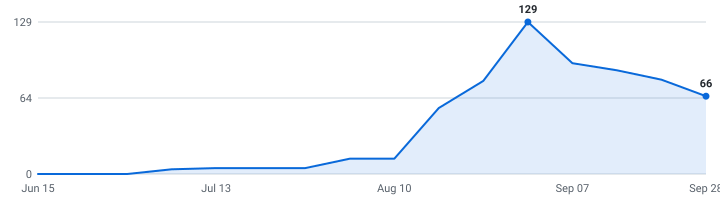

# 🔐 Summer 2027 Security & Networking Internships

**A self-updating engine that tracks security, networking, and infrastructure internships so you don't have to.**

&nbsp;&nbsp;&nbsp;

### 564 open roles (496 listed below) · 64 new this week

4,732 employers tracked · data as of Oct 09, 2026 at 18:38 UTC

_407 have a cycle the employer stated · 157 are recent postings whose cycle isn't stated (listed separately, never mixed in)._

**[🖥️ Live dashboard](https://ihrtkaii.github.io/secnet-internships/)** · **[📡 RSS](https://ihrtkaii.github.io/secnet-internships/feed.xml)** · **[⚙️ JSON API](https://ihrtkaii.github.io/secnet-internships/api/jobs.json)**

This is my version of an open-source internship tracker, filtered to security, networking, and infrastructure roles. It reads company hiring feeds every 3 hours and keeps one list with the newest roles on top. Browse and search it on the [live dashboard](https://ihrtkaii.github.io/secnet-internships/).

---

## What this is

This is an engine, not a hand-kept list. It polls company career feeds every 3 hours, finds the internships, removes duplicates, and rebuilds this page on its own.

Every link comes straight from the employer's own job board, so it points to a live posting.

## What makes this different

| | |
|---|---|
| 📅 **[Drop Radar](#drop-radar)** | A forecast of **what's coming**. Each marquee company's typical opening window, replaced by the real drop date the moment the engine catches it live. Windows are estimates and labelled as such; only dates the engine saw itself are marked verified. |
| 🛂 **Visa intel, computed** | 🇺🇸 / 🛂 flags detected automatically from every job description, plus ✓ for employers with a real H-1B track record (USCIS data, FY2022-23: a history, not a promise). The big lists crowdsource this by hand; here it's code. Most postings say nothing either way, and those show as unknown rather than guessed. |
| 📆 **A real date on nearly every role** | Taken from the job portal itself wherever the portal states one, so newest-first actually means newest. The exact coverage figure is printed at the bottom of this page every run. |
| 🧰 **Skill tags + pay, extracted** | Every posting's text is scanned for the stack it wants (Python, C++, PyTorch, …) and the pay it states, searchable on the [dashboard](https://ihrtkaii.github.io/secnet-internships/), and included in the CSV and API. |
| ⚙️ **An engine, not a spreadsheet** | 5,012 job-board endpoints (4,732 distinct employers; some run more than one board) polled every 3 hours across 12 ATS platforms. Full source and tests in this repo. |

## Scope

| | |
|---|---|
| **Roles** | Cybersecurity, network engineering, systems/infrastructure, and IT operations internships |
| **Region** | United States |
| **Cycles** | Summer 2027 and Fall 2026 |

## About

This tracks security and networking internships specifically, because the major community internship lists filter on software-engineering titles and silently discard roles like "Network Engineer Intern", "SOC Analyst Intern", and "GRC Intern". Built on zshah101's engine with a replacement classifier tuned for these titles.

## How to use

<b>Reading the table: flags, dates, and the cycle split</b> (click to expand)

- Roles are grouped by cycle below - **newest posting on top, oldest at the bottom.**
- A cycle section holds only roles whose **employer stated that cycle** - in the title, or in the posting's own text. Postings that name no cycle anywhere are in *Recently posted — cycle not stated* further down, with **no cycle guessed for them**. Same quality bar, different amount of evidence.
- The **Posted** column is the date the company published the role.
- **_(3 openings)_ after a role title** = the employer has that many separate live requisitions for the same job, in the same place, for the same cycle. They're all real and each takes its own application, so they're linked individually (**Apply**, then **#2**, **#3**) instead of repeating the row. Counts still count requisitions, and the CSV export is never grouped.
- **🆁 after a company name** = **this role is remote**: the posting's own location or title says so. It marks the role on that row, not the whole company.
- **Flags after a role title:** 🇺🇸 = requires U.S. citizenship or a security clearance · 🛂 = the posting says it won't sponsor a work visa · 🆕 = spotted in the last 48 hours. Sponsorship flags are detected automatically from each job description - treat them as a strong hint and confirm on the posting.
- **✓ after a company name** = a real H-1B track record: USCIS approved 10+ petitions for that employer in FY2022–2023 (matched automatically against the official [H-1B Employer Data Hub](https://www.uscis.gov/tools/reports-and-studies/h-1b-employer-data-hub)). No ✓ doesn't mean they won't sponsor - it means we can't prove they have.
- Track your applications with [`data/internships.csv`](data/internships.csv) (opens in Excel / Google Sheets).
- Missing a company? Adding one takes a single line, see [CONTRIBUTING.md](CONTRIBUTING.md).

---

## 🔐 Security

### Summer 2027  (105 employer-stated)

| Company | Role | Category | Location | Skills | Posted | Apply |
|---|---|---|---|---|---|---|
| Allison Transmission ✓ | IT Security Analyst Internship - Summer 2027 🆕 | Security (general) | Indianapolis, IN | No skills listed | Oct 09, 2026 | [Apply](https://allisontransmission.wd1.myworkdayjobs.com/ATI-External/job/Indianapolis-IN/IT-Security-Analyst-Internship---Summer-2027_R008295) |
| Nissan | Corporate Security Intern - Summer 2027 - Franklin, TN 🛂 🆕 | Security (general) | Franklin +1 more | No skills listed | Oct 09, 2026 | [Apply](https://alliance.wd3.myworkdayjobs.com/nissanjobs/job/Franklin-Tennessee---United-States-of-America/Corporate-Security-Intern---Summer-2027---Franklin--TN_R00214220) |
| Apple Bank | 2027 Summer Intern- Information Security 🛂 🆕 | Security (general) | New York, NY | No skills listed | Oct 07, 2026 | [Apply](https://applebank.wd5.myworkdayjobs.com/applebankcareers/job/New-York-NY/XMLNAME-2027-Summer-Intern--Information-Security_2026-1416) |
| Mastercard | Security Infrastructure Engineering & Architecture Intern, Summer 2027 – Arlington, VA, US 🆕 | Security (general) | Arlington, Virginia | Python, Java | Oct 07, 2026 | [Apply](https://mastercard.wd1.myworkdayjobs.com/Campus/job/Arlington-Virginia/Security-Infrastructure-Engineering---Architecture-Intern--Summer-2027---Arlington--VA--US_R-284924) |
| MEMX | Information Security Intern, Summer 2027 (Hybrid, NYC) | Security (general) | United States | AWS, Azure | Oct 06, 2026 | [Apply](https://job-boards.greenhouse.io/memx/jobs/5445236008) |
| CACI | Cyber Analyst Intern - Summer 2027 | Security (general) | Ashburn, VA, US | Linux | Oct 06, 2026 | [Apply](https://caci.wd1.myworkdayjobs.com/external/job/Ashburn-VA-US/Cyber-Analyst-Intern---Summer-2027_333161) |
| Dmainc | Cybersecurity Intern - Summer 2027 | Security (general) | Fort Wayne, IN | No skills listed | Oct 06, 2026 | [Apply](https://dmainc.wd5.myworkdayjobs.com/dma/job/Fort-Wayne-IN/Cybersecurity-Intern---Summer-2027_REQ742) |
| Midland States Bank | Intern - Security Analyst | Security (general) | St. Louis, MO | No skills listed | Oct 05, 2026 | [Apply](https://midlandsb.wd1.myworkdayjobs.com/msbcareers/job/St-Louis-MO/Intern---Security-Analyst_JR1473) |
| Mastercard | Corporate Security Operations Intern, Summer 2027 – St. Louis, MO, US | SOC / Detection | O'Fallon, Missouri | No skills listed | Oct 05, 2026 | [Apply](https://mastercard.wd1.myworkdayjobs.com/Campus/job/OFallon-Missouri/Corporate-Security-Operations-Intern--Summer-2027---St-Louis--MO--US_R-284925) |
| Mastercard | Security Engineering & Enablement Intern, Summer 2027 – St. Louis, MO, US | Security (general) | O'Fallon, Missouri | No skills listed | Oct 05, 2026 | [Apply](https://mastercard.wd1.myworkdayjobs.com/Campus/job/OFallon-Missouri/Security-Engineering---Enablement-Intern--Summer-2027---St-Louis--MO--US_R-284927) |
| Expedia Group | Security Engineering Intern - 2027 - Seattle | Security (general) | Washington - Seattle Campus | Python, Java, C++, C# | Oct 05, 2026 | [Apply](https://expedia.wd108.myworkdayjobs.com/private/job/Washington---Seattle-Campus/Security-Engineering-Intern---2027---Seattle_R-110310) |
| CACI | Network / Cybersecurity Intern - Summer 2027 _(2 openings)_ | Security (general) | High Point, NC, US | No skills listed | Oct 02, 2026 | [Apply](https://caci.wd1.myworkdayjobs.com/external/job/High-Point-NC-US/Network---Cybersecurity-Intern---Summer-2027_333001) [#2](https://caci.wd1.myworkdayjobs.com/external/job/High-Point-NC-US/Network---Cybersecurity-Intern---Summer-2027_333034-1) |
| CACI | Cyber Security Intern - Summer 2027 🇺🇸 | Security (general) | Springfield, VA, US | No skills listed | Oct 02, 2026 | [Apply](https://caci.wd1.myworkdayjobs.com/external/job/Springfield-VA-US/Cyber-Security-Intern---Summer-2027_333046) |
| Vanguard | College to Corporate IT Internship-Risk & Security Engineer (PA) | Security (general) | Malvern, PA | No skills listed | Oct 02, 2026 | [Apply](https://vanguard.wd5.myworkdayjobs.com/vanguard_external/job/Malvern-PA/College-to-Corporate-IT-Internship-Risk---Security-Engineer--PA-_182784) |
| ATC | Intern - Cyber Security Summer 2027 | Security (general) | Pewaukee, WI | No skills listed | Oct 01, 2026 | [Apply](https://atcllc.wd5.myworkdayjobs.com/atcllc/job/Pewaukee-WI/Intern---Cyber-Security-Summer-2027_R0003307) |
| The Federal Reserve System | Summer 2027 Intern-Cybersecurity and Information Security 🛂 | Security (general) | Chicago, IL | No skills listed | Oct 01, 2026 | [Apply](https://rb.wd5.myworkdayjobs.com/FRS/job/Chicago-IL/Summer-2027-Intern-Cybersecurity-and-Information-Security_R-0000033612-1) |
| The Federal Reserve System | TS - Application Security Intern - 2027 🇺🇸 | AppSec / Product Sec | Cleveland, OH | No skills listed | Oct 01, 2026 | [Apply](https://rb.wd5.myworkdayjobs.com/FRS/job/Cleveland-OH/TS---Application-Security-Intern---2027_R-0000033625) |
| Varda Space | Cybersecurity Internship - Summer 2027 🇺🇸 | Security (general) | El Segundo, California, United States | Python, Bash | Oct 01, 2026 | [Apply](https://job-boards.greenhouse.io/vardaspace/jobs/8005821003) |
| ACLU Kentucky | Summer 2027 Undergraduate Intern, National Security Project | Security (general) | New York, NY | No skills listed | Sep 28, 2026 | [Apply](https://job-boards.greenhouse.io/acluinternships/jobs/8842752002) |
| Waymo ✓ | 2027 Summer Intern, PhD, Perception Systems Engineering: Pedestrian Detection Precision | SOC / Detection | San Francisco, California | Python, SQL | Sep 28, 2026 | [Apply](https://careers.withwaymo.com/jobs?gh_jid=8234670) |
| RTX | Cyber Research Internship (Summer 2027) - Onsite 🇺🇸 | Security (general) | US-IA-CEDAR RAPIDS-166 ~ 855 35Th St NE… | Python, C++ | Sep 28, 2026 | [Apply](https://globalhr.wd5.myworkdayjobs.com/rec_rtx_ext_gateway/job/US-IA-CEDAR-RAPIDS-166--855-35Th-St-NE--BLDG-166/Cyber-Research-Internship--Summer-2027----Onsite_01872177) |
| Upbound Group | Cybersecurity Intern | Security (general) | Plano, TX | Python, SQL, Pandas, LLMs | Sep 28, 2026 | [Apply](https://upbound.wd501.myworkdayjobs.com/Upbound/job/Plano-TX/Cybersecurity-Intern_R-100776) |
| GM financial | Intern - Cybersecurity 🛂 | Security (general) | Irving, TX, United States | No skills listed | Sep 28, 2026 | [Apply](https://fa-exvu-saasfaprod1.fa.ocs.oraclecloud.com/hcmUI/CandidateExperience/en/sites/CX_1/job/260805) |
| GM financial | Intern - Cybersecurity | Security (general) | Arlington, TX, United States | No skills listed | Sep 28, 2026 | [Apply](https://fa-exvu-saasfaprod1.fa.ocs.oraclecloud.com/hcmUI/CandidateExperience/en/sites/CX_1/job/260836) |
| General Dynamics Information Technology ✓ | GDIT Summer Internship Program – Summer 2027 Cybersecurity Associate Internship 🇺🇸 | Security (general) | USA LA Bossier City | No skills listed | Sep 23, 2026 | [Apply](https://gdit.wd5.myworkdayjobs.com/gdit_earlytalent/job/USA-LA-Bossier-City/GDIT-Summer-Internship-Program---Summer-2027-Cybersecurity-Associate-Internship_RQ228929-2) |
| Marvell | Security Verification/Validation Engineer Intern, BS - Summer 2027 | Security (general) | Chandler, AZ | Linux, Verilog | Sep 23, 2026 | [Apply](https://marvell.wd1.myworkdayjobs.com/MarvellCareers/job/Chandler-AZ/Security-Verification-Validation-Engineer-Intern--BS---Summer-2027_2604148-1) |
| Bracco | Product Security Engineering Intern | AppSec / Product Sec | USA, Eden Prairie, Minnesota, 55344 | Python, C++, C#, .NET | Sep 22, 2026 | [Apply](https://bracco.wd103.myworkdayjobs.com/braccocareers/job/USA-Eden-Prairie-Minnesota-55344/Product-Security-Engineering-Intern_JR100318) |
| Northrop Grumman | 2027 Intern - Systems Security/Cybersecurity Engineer 🇺🇸 | Security (general) | United States-Florida-Melbourne | No skills listed | Sep 22, 2026 | [Apply](https://ngc.wd1.myworkdayjobs.com/Northrop_Grumman_External_Site/job/United-States-Florida-Melbourne/XMLNAME-2027-Intern---Systems-Security-Cybersecurity-Engineer_R10252418) |
| Northrop Grumman | 2027 Cyber Software Engineer Intern - Tampa FL 🇺🇸 | Security (general) | United States-Florida-Tampa | No skills listed | Sep 22, 2026 | [Apply](https://ngc.wd1.myworkdayjobs.com/Northrop_Grumman_External_Site/job/United-States-Florida-Tampa/XMLNAME-2027-Cyber-Software-Engineer-Intern---Tampa-FL_R10249530) |
| Northrop Grumman | 2027 Cyber Systems Engineer Intern-Tampa FL 🇺🇸 | Security (general) | United States-Florida-Tampa | Python, LLMs | Sep 22, 2026 | [Apply](https://ngc.wd1.myworkdayjobs.com/Northrop_Grumman_External_Site/job/United-States-Florida-Tampa/XMLNAME-2027-Cyber-Systems-Engineer-Intern-Tampa-FL_R10249196) |
| Western Alliance | Summer 2027 Internship - Phoenix, AZ - IT Security | Security (general) | Phoenix, AZ | No skills listed | Sep 21, 2026 | [Apply](https://wd5.myworkdaysite.com/recruiting/westernalliancebank/WAB/job/Phoenix-AZ/Summer-2027-Internship---Phoenix--AZ---IT-Security_R13775) |
| Centene 🆁 | Cybersecurity Summer 2027 Intern (Undergraduate) | Security (general) | Remote-MO | No skills listed | Sep 18, 2026 | [Apply](https://centene.wd5.myworkdayjobs.com/Centene_External/job/Remote-MO/Cybersecurity-Summer-2027-Intern--Undergraduate-_1660514) |
| Motorola | Cyber Security - 2027 Summer Internship (Chicago Hybrid) 🛂 | Security (general) | Chicago, IL, More... | Python, Java, LLMs, AWS | Sep 18, 2026 | [Apply](https://motorolasolutions.wd5.myworkdayjobs.com/Careers/job/Chicago-IL/Cyber-Security---2027-Summer-Internship--Chicago-Hybrid-_R68369) |
| Netsmart | Security Analyst Future (Summer 2027 Internship) | Security (general) | Overland Park, KS | SQL, AWS, Azure | Sep 18, 2026 | [Apply](https://ntst.wd1.myworkdayjobs.com/careers/job/Overland-Park-KS/Security-Analyst-Future--Summer-2027-Internship-_R015669) |
| Robinhood | Security Risk Management Intern (Summer 2027) | Security (general) | Menlo Park, CA | AWS | Sep 16, 2026 | [Apply](https://boards.greenhouse.io/robinhood/jobs/8207970?t=gh_src=&gh_jid=8207970) |
| Rocket Lab | Security Analyst Intern Summer 2027 🇺🇸 | Security (general) | Middle River, MD | No skills listed | Sep 16, 2026 | [Apply](https://job-boards.greenhouse.io/rocketlab/jobs/7986963003) |
| Rocket Lab | Security Analyst Intern Summer 2027 🇺🇸 | Security (general) | Albuquerque, NM | No skills listed | Sep 16, 2026 | [Apply](https://job-boards.greenhouse.io/rocketlab/jobs/7986874003) |
| Rocket Lab | Security Analyst Intern Summer 2027 🇺🇸 | Security (general) | Long Beach, CA | No skills listed | Sep 16, 2026 | [Apply](https://job-boards.greenhouse.io/rocketlab/jobs/7986956003) |
| Rocket Lab | Security Analyst Intern Summer 2027 🇺🇸 | Security (general) | Wallops Island, VA | No skills listed | Sep 16, 2026 | [Apply](https://job-boards.greenhouse.io/rocketlab/jobs/7986961003) |
| Bass Pro Shops | Cybersecurity Intern Summer 2027 | Security (general) | Springfield +1 more | No skills listed | Sep 16, 2026 | [Apply](https://basspro.wd1.myworkdayjobs.com/careers/job/Springfield-MO-Bass-Pro-Shops-Base-Camp/Cybersecurity-Intern-Summer-2027_R267444) |
| CAI | Cybersecurity Analyst Intern | Security (general) | California | Python, AWS, Azure, Linux | Sep 15, 2026 | [Apply](https://cai.wd5.myworkdayjobs.com/computer_aid/job/California/Cybersecurity-Analyst-Intern_R8488) |
| CoStar Group | Security Engineer Intern - Richmond, VA 🛂 | Security (general) | US-VA Richmond | Python, Bash, Linux | Sep 14, 2026 | [Apply](https://costar.wd1.myworkdayjobs.com/Costar_Campus/job/US-VA-Richmond/Security-Engineer-Intern---Richmond--VA_R39726) |
| TD Bank | 2027 Summer Internship Program - Global Technology & Solutions - Cyber Security | Security (general) | Mount Laurel, New Jersey | No skills listed | Sep 13, 2026 | [Apply](https://td.wd3.myworkdayjobs.com/TD_Bank_Careers/job/Mount-Laurel-New-Jersey/XMLNAME-2027-Summer-Internship-Program---Global-Technology---Solutions---Cyber-Security_R_1510795) |
| National Information Solutions Cooperative (NISC) | Intern - Information Security (Cybersecurity) | Security (general) | Mandan, ND | Linux | Sep 10, 2026 | [Apply](https://job-boards.greenhouse.io/testnisc/jobs/8191987) |
| Cox | Cybersecurity Intern - Summer 2027 _(2 openings)_ | Security (general) | Atlanta GA | Python, JavaScript | Sep 10, 2026 | [Apply](https://cox.wd1.myworkdayjobs.com/Cox_External_Career_Site_1/job/Atlanta-GA/Cybersecurity-Intern---Summer-2027_R202682288) [#2](https://cox.wd1.myworkdayjobs.com/Cox_External_Career_Site_1/job/Atlanta-GA/Cybersecurity-Intern---Summer-2027_R202683372) |
| Equifax ✓ | Security Intern 🛂 | Security (general) | USA - Georgia - Alpharetta - 30005 | Python, Java, C#, Ruby | Sep 08, 2026 | [Apply](https://equifax.wd5.myworkdayjobs.com/UR_External/job/USA---Georgia---Alpharetta---30005/Security-Intern_J00178958) |
| Auto-Owners Insurance | IT Security Engineer Internship - Summer 2027 | Security (general) | Lansing, MI | No skills listed | Sep 08, 2026 | [Apply](https://aoins.wd5.myworkdayjobs.com/AutoOwners/job/Lansing-MI/IT-Security-Engineer-Internship---Summer-2027_R_14477) |
| Meijer | Information Security Intern- Summer 2027 | Security (general) | Grand Rapids, MI | No skills listed | Sep 08, 2026 | [Apply](https://meijer.wd5.myworkdayjobs.com/Meijer/job/Grand-Rapids-MI/Information-Security-Intern--Summer-2027_R000698302) |
| U.S. Bank | 2027 Information Security Summer Intern | Security (general) | Cincinnati, OH | Python | Sep 08, 2026 | [Apply](https://usbank.wd1.myworkdayjobs.com/US_Bank_Careers/job/Cincinnati-OH/XMLNAME-2027-Information-Security-Summer-Intern_2026-0025770) |
| Merck | 2027 Future Talent Program – Global Security Resiliency Center - Intern 🛂 | Security (general) | USA - New Jersey - Rahway | Tableau | Sep 08, 2026 | [Apply](https://msd.wd5.myworkdayjobs.com/searchjobs/job/USA---New-Jersey---Rahway/XMLNAME-2027-Future-Talent-Program---Global-Security-Resiliency-Center---Intern_R413882) |
| Merck | 2027 Future Talent Program - North America Regional Security Team - Intern 🛂 | Security (general) | USA - New Jersey - Rahway | No skills listed | Sep 08, 2026 | [Apply](https://msd.wd5.myworkdayjobs.com/searchjobs/job/USA---New-Jersey---Rahway/XMLNAME-2027-Future-Talent-Program---North-America-Regional-Security-Team---Intern_R413091) |
| Schonfeld | 2027 Cybersecurity Operations Intern | Security (general) | New York, New York, United States | No skills listed | Sep 04, 2026 | [Apply](https://job-boards.greenhouse.io/schonfeld/jobs/8171696) |
| Barclays | 2027 Compliance Analyst Summer Internship Program New York | GRC / Risk | New York, 745 7th Avenue | No skills listed | Sep 04, 2026 | [Apply](https://barclays.wd3.myworkdayjobs.com/External_Career_Site_Barclays/job/New-York-745-7th-Avenue/XMLNAME-2027-Compliance-Analyst-Summer-Internship-Program-New-York_JR-0000123191) |
| Hy-Vee | Cyber Security Intern- Summer 2027 | Security (general) | Corporate Office +3 more | No skills listed | Sep 04, 2026 | [Apply](https://hyvee.wd1.myworkdayjobs.com/HyVeeCareers/job/Corporate-Office-Westown-Pkwy-West-Des-Moines-IA/Cyber-Security-Intern--Summer-2027_R250153) |
| Hy-Vee | IT Security Loss Prevention Intern - Summer 2027 | Security (general) | Corporate Office +3 more | No skills listed | Sep 04, 2026 | [Apply](https://hyvee.wd1.myworkdayjobs.com/HyVeeCareers/job/Corporate-Office-Westown-Pkwy-West-Des-Moines-IA/IT-Security-Loss-Prevention-Intern---Summer-2027_R250154) |
| Sierra Nevada Corporation | Systems Security Engineering Intern (Summer 2027) 🇺🇸 | Security (general) | Hagerstown, MD | MATLAB | Sep 03, 2026 | [Apply](https://snc.wd1.myworkdayjobs.com/snc_external_career_site/job/Hagerstown-MD/Systems-Security-Engineering-Intern--Summer-2027-_R0030783) |
| IAT Insurance Group | Cyber Security Internship 🛂 | Security (general) | Raleigh NC | No skills listed | Sep 01, 2026 | [Apply](https://iatinsurancegroup.wd1.myworkdayjobs.com/iat/job/Raleigh-NC/Cyber-Security-Internship_JR100410) |
| Armanino ✓ | Summer 2027 IT Audit Intern (Dallas) | GRC / Risk | Dallas, Texas | No skills listed | Sep 01, 2026 | [Apply](https://armaninollp.wd1.myworkdayjobs.com/Armanino/job/Dallas-Texas/Summer-2027-IT-Audit-Intern--Dallas-_JR104286) |
| Armanino ✓ | Summer 2027 IT Audit Intern (Denver) | GRC / Risk | Denver, Colorado | No skills listed | Sep 01, 2026 | [Apply](https://armaninollp.wd1.myworkdayjobs.com/Armanino/job/Denver-Colorado/Summer-2027-IT-Audit-Intern_JR104282) |
| Armanino ✓ | Summer 2027 IT Audit Intern (Saint Louis) | GRC / Risk | St. Louis, Missouri | No skills listed | Sep 01, 2026 | [Apply](https://armaninollp.wd1.myworkdayjobs.com/Armanino/job/St-Louis-Missouri/Summer-2027-IT-Audit-Intern--Denver-_JR104283) |
| Booz Allen | University - 2027 Summer Games Cyber Security Intern - Annapolis Junction, MD 🇺🇸 | Security (general) | Annapolis Junction, MD | Linux | Sep 01, 2026 | [Apply](https://bah.wd1.myworkdayjobs.com/bah_jobs/job/Annapolis-Junction-MD/University---2027-Summer-Games-Cyber-Security-Intern---Annapolis-Junction--MD_R0248414) |
| Booz Allen | University - 2027 Summer Games Cyber Security Intern - Ft. Walton Beach, FL 🇺🇸 | Security (general) | Fort Walton Beach, FL | Linux | Sep 01, 2026 | [Apply](https://bah.wd1.myworkdayjobs.com/bah_jobs/job/Fort-Walton-Beach-FL/University---2027-Summer-Games-Cyber-Security-Intern---Ft-Walton-Beach--FL_R0248416) |
| HP IQ | Software Engineering Intern, Security Intern (Summer 2027) | Security (general) | San Francisco, CA | Python, Java, C++ | Aug 31, 2026 | [Apply](https://job-boards.greenhouse.io/hpiq/jobs/6116398004) |
| United Parcel Service (UPS) | UPS Information Security Summer 2027 Internship - NJ 🇺🇸 | Security (general) | US - UPS TECHNOLOGY HEADQUARTERS & DATA… | Python, Java, C++, SQL | Aug 31, 2026 | [Apply](https://hcmportal.wd5.myworkdayjobs.com/Search/job/US---UPS-TECHNOLOGY-HEADQUARTERS--DATACENTER-NJRAR/UPS-Information-Security-Summer-2027-Internship---NJ_R26029761) |
| Vanguard | College to Corporate IT Internship - Risk & Security - Engineer | Security (general) | Dallas/Ft. Worth, TX | No skills listed | Aug 31, 2026 | [Apply](https://vanguard.wd5.myworkdayjobs.com/vanguard_external/job/DallasFt-Worth-TX/College-to-Corporate-IT-Internship---Risk---Security---Engineer_181851) |
| Charles River Associates (CRA) | (2028 Bachelor's/Master's graduates) Cyber and Forensic Technology Consulting Analyst/Associate Intern (Summer 2027) | Security (general) | Boston +11 more | Python, C#, SQL | Aug 28, 2026 | [Apply](https://job-boards.greenhouse.io/charlesriverassociates/jobs/8128811) |
| Conagra Brands ✓ | Cybersecurity Internship - Summer 2027 | Security (general) | Omaha, Nebraska | No skills listed | Aug 28, 2026 | [Apply](https://conagrabrands.wd1.myworkdayjobs.com/Careers_US/job/Omaha-Nebraska/Cybersecurity-Internship---Summer-2027_Req-039965) |
| AbbVie ✓ | 2027 Business Technology Solutions Intern - Cybersecurity (Undergraduate) _(2 openings)_ | Security (general) | North Chicago +2 more | Python, Java, C#, JavaScript | Aug 27, 2026 | [Apply](https://jobs.smartrecruiters.com/AbbVie/3743990014896329) [#2](https://jobs.smartrecruiters.com/AbbVie/3743990015679246) |
| AbbVie ✓ | 2027 Business Technology Solutions Intern - Cybersecurity (Undergraduate) | Security (general) | Irvine, CA, United States (Hybrid) | Python, Java, C#, JavaScript | Aug 27, 2026 | [Apply](https://jobs.smartrecruiters.com/AbbVie/3743990014900496) |
| AbbVie ✓ | 2027 Business Technology Solutions Intern - Cybersecurity (Undergraduate) | Security (general) | South San Francisco +2 more | Python, Java, C#, JavaScript | Aug 27, 2026 | [Apply](https://jobs.smartrecruiters.com/AbbVie/3743990014900536) |
| Air Products | Summer Intern- IT & Cyber Audit (2027) | Security (general) | Allentown, Pennsylvania | No skills listed | Aug 27, 2026 | [Apply](https://airproducts.wd5.myworkdayjobs.com/AP0001/job/Allentown-Pennsylvania/Summer-Intern--IT---Cyber-Audit--2027-_JR-2026-21954) |
| Leidos ✓ | Cybersecurity Analyst Intern 🇺🇸 | Security (general) | Alexandria, VA | No skills listed | Aug 26, 2026 | [Apply](https://leidos.wd5.myworkdayjobs.com/External/job/Alexandria-VA/Cybersecurity-Analyst-Intern_R-00190671) |
| Leidos ✓ | Cybersecurity Analyst Intern 🇺🇸 | Security (general) | Odenton, MD | Python, Bash, Linux | Aug 26, 2026 | [Apply](https://leidos.wd5.myworkdayjobs.com/External/job/Odenton-MD/Cybersecurity-Analyst-Intern_R-00190663) |
| Leidos ✓ | Cybersecurity Analyst Intern 🇺🇸 | Security (general) | Pearl Harbor, HI | Python, Bash, Linux | Aug 26, 2026 | [Apply](https://leidos.wd5.myworkdayjobs.com/External/job/Pearl-Harbor-HI/Cybersecurity-Analyst-Intern_R-00190665) |
| Leidos ✓ | Cybersecurity Analyst Intern 🇺🇸 | Security (general) | Shiloh, IL | Python, Bash, Linux | Aug 26, 2026 | [Apply](https://leidos.wd5.myworkdayjobs.com/External/job/Shiloh-IL/Cybersecurity-Analyst-Intern_R-00190667) |
| DTCC | Information Security Intern [2027 Intern Program] | Security (general) | Jersey City +8 more | No skills listed | Aug 25, 2026 | [Apply](https://ebxr.fa.us2.oraclecloud.com/hcmUI/CandidateExperience/en/sites/CX_1/job/214476) |
| DTCC | Cyber Security Risk Intern [2027 Internship Program] | Security (general) | Jersey City +8 more | No skills listed | Aug 25, 2026 | [Apply](https://ebxr.fa.us2.oraclecloud.com/hcmUI/CandidateExperience/en/sites/CX_1/job/214487) |
| Honeywell | Information Systems, IT, Cyber Engineer & Data Science - Summer 2027 Intern (US Person Required) 🇺🇸 | Security (general) | United States | No skills listed | Aug 25, 2026 | [Apply](https://ibqbjb.fa.ocs.oraclecloud.com/hcmUI/CandidateExperience/en/sites/CX_1/job/155554) |
| Honeywell | Information Systems, IT, Cyber Engineer & Data Science - Summer 2027 Intern | Security (general) | United States | No skills listed | Aug 25, 2026 | [Apply](https://ibqbjb.fa.ocs.oraclecloud.com/hcmUI/CandidateExperience/en/sites/CX_1/job/155555) |
| Verkada ✓ | Security Software Engineering Intern 2027 | Security (general) | San Mateo, CA United States | Python, Go, Computer Vision, AWS | Aug 25, 2026 | [Apply](https://job-boards.greenhouse.io/verkada/jobs/5213881007) |
| GlobalFoundries | Cybersecurity Intern (Summer 2027) | Security (general) | USA - New York - Malta | No skills listed | Aug 25, 2026 | [Apply](https://globalfoundries.wd1.myworkdayjobs.com/External/job/USA---New-York---Malta/Cybersecurity-Intern--Summer-2027-_JR-2604459) |
| BNY | 2027 BNY Summer Internship Program - Risk and Compliance (New York, NY) | GRC / Risk | New York, NY, United States | LLMs | Aug 24, 2026 | [Apply](https://eofe.fa.us2.oraclecloud.com/hcmUI/CandidateExperience/en/sites/CX_1001/job/81271) |
| BNY | 2027 BNY Summer Internship Program - Risk and Compliance (Pittsburgh, PA) | GRC / Risk | Pittsburgh, PA, United States | LLMs | Aug 24, 2026 | [Apply](https://eofe.fa.us2.oraclecloud.com/hcmUI/CandidateExperience/en/sites/CX_1001/job/81276) |
| BNY | 2027 BNY Summer Internship Program - Risk and Compliance (Lake Mary, FL) | GRC / Risk | Lake Mary, FL, United States | LLMs | Aug 24, 2026 | [Apply](https://eofe.fa.us2.oraclecloud.com/hcmUI/CandidateExperience/en/sites/CX_1001/job/81277) |
| Lawrence Livermore National Laboratory (LLNL) | National Security Engineering Division (NSED) Graduate Intern - Summer 2027 | Security (general) | Livermore, CA, United States | No skills listed | Aug 21, 2026 | [Apply](https://jobs.smartrecruiters.com/LLNL/3743990014731646) |
| Lawrence Livermore National Laboratory (LLNL) | National Security Engineering Division (NSED) Undergraduate Intern - Summer 2027 | Security (general) | Livermore, CA, United States (Hybrid) | No skills listed | Aug 21, 2026 | [Apply](https://jobs.smartrecruiters.com/LLNL/3743990014731656) |
| Fifth Third Bank | Information Security Co-op - Cyber Threat Interdiction - Summer 2027 | SOC / Detection | Cincinnati, OH | No skills listed | Aug 20, 2026 | [Apply](https://fifththird.wd5.myworkdayjobs.com/53careers/job/Cincinnati-OH/Information-Security-Co-op---Cyber-Threat-Interdiction---Summer-2027_R71582) |
| Fifth Third Bank | Information Security Co-op – Identity & Access Management – Summer 2027 | Cloud & Infra Sec | Cincinnati, OH | No skills listed | Aug 20, 2026 | [Apply](https://fifththird.wd5.myworkdayjobs.com/53careers/job/Cincinnati-OH/Information-Security-Co-op---Identity---Access-Management---Summer-2027_R71591) |
| Armanino ✓ | Summer 2027 - IT Audit Intern (Austin) _(2 openings)_ | GRC / Risk | Austin, Texas | No skills listed | Aug 19, 2026 | [Apply](https://armaninollp.wd1.myworkdayjobs.com/Armanino/job/Austin-Texas/Summer-2027---IT-Audit-Intern--Austin-_JR104221) [#2](https://armaninollp.wd1.myworkdayjobs.com/Armanino/job/Austin-Texas/Summer-2027-IT-Audit-Intern--Austin-_JR104287) |
| Hilton Worldwide | 2027 Corporate Summer Internship - Technology (Software Engineering and Cyber) | Security (general) | Memphis +8 more | No skills listed | Aug 17, 2026 | [Apply](https://efet.fa.us2.oraclecloud.com/hcmUI/CandidateExperience/en/sites/CX_1009/job/218257) |
| American Express ✓ | Campus Undergraduate Summer Internship Program - 2027 Cybersecurity Analyst, Enterprise Technology Services- New York, NY | Security (general) | New York, NY, United States | Python, Bash | Aug 17, 2026 | [Apply](https://egug.fa.us2.oraclecloud.com/hcmUI/CandidateExperience/en/sites/CX_1/job/26011878) |
| American Express ✓ | Campus Graduate Masters Summer Internship Program - 2027 Cybersecurity Analyst, Enterprise Technology Services- New York, NY | Security (general) | New York, NY, United States | Python, Bash | Aug 17, 2026 | [Apply](https://egug.fa.us2.oraclecloud.com/hcmUI/CandidateExperience/en/sites/CX_1/job/26011893) |
| American Express ✓ | Campus Undergraduate Summer Internship Program - 2027 Cybersecurity Analyst, Enterprise Technology Services- Atlanta, GA | Security (general) | Atlanta, GA, United States | Python, Bash | Aug 17, 2026 | [Apply](https://egug.fa.us2.oraclecloud.com/hcmUI/CandidateExperience/en/sites/CX_1/job/26011908) |
| American Express ✓ | Campus Graduate Masters Summer Internship Program - 2027 Cybersecurity Analyst, Enterprise Technology Services- Atlanta, GA | Security (general) | Atlanta, GA, United States | Python, Bash | Aug 17, 2026 | [Apply](https://egug.fa.us2.oraclecloud.com/hcmUI/CandidateExperience/en/sites/CX_1/job/26011913) |
| American Express ✓ | Campus Undergraduate Summer Internship Program - 2027 Cybersecurity Analyst, Enterprise Technology Services- Sunrise, FL | Security (general) | Sunrise, FL, United States | Python, Bash | Aug 17, 2026 | [Apply](https://egug.fa.us2.oraclecloud.com/hcmUI/CandidateExperience/en/sites/CX_1/job/26011914) |
| American Express ✓ | Campus Graduate Masters Summer Internship Program - 2027 Cybersecurity Analyst, Enterprise Technology Services- Sunrise, FL | Security (general) | Sunrise, FL, United States | Python, Bash | Aug 17, 2026 | [Apply](https://egug.fa.us2.oraclecloud.com/hcmUI/CandidateExperience/en/sites/CX_1/job/26012444) |
| American Express ✓ | Campus Undergraduate Summer Internship Program - 2027 Cybersecurity Analyst, Enterprise Technology Services- Phoenix, AZ | Security (general) | Phoenix, AZ, United States | Python, Bash | Aug 17, 2026 | [Apply](https://egug.fa.us2.oraclecloud.com/hcmUI/CandidateExperience/en/sites/CX_1/job/26012460) |
| American Express ✓ | Campus Graduate Masters Summer Internship Program - 2027 Cybersecurity Analyst, Enterprise Technology Services- Phoenix, AZ | Security (general) | Phoenix, AZ, United States | Python, Bash | Aug 17, 2026 | [Apply](https://egug.fa.us2.oraclecloud.com/hcmUI/CandidateExperience/en/sites/CX_1/job/26012462) |
| Vanguard | College to Corporate IT Internship - Risk & Security - Engineer  (NC) _(2 openings)_ | Security (general) | Charlotte, NC | No skills listed | Aug 17, 2026 | [Apply](https://vanguard.wd5.myworkdayjobs.com/vanguard_external/job/Charlotte-NC/College-to-Corporate-IT-Internship---Risk---Security---Engineer---NC-_177688-1) [#2](https://vanguard.wd5.myworkdayjobs.com/vanguard_external/job/Charlotte-NC/College-to-Corporate-IT-Internship-Risk---Security-Engineer--NC-_182785) |
| Vanguard | College to Corporate IT Internship - Risk & Security - Analyst  (NC) _(2 openings)_ | Security (general) | Charlotte, NC | No skills listed | Aug 17, 2026 | [Apply](https://vanguard.wd5.myworkdayjobs.com/vanguard_external/job/Charlotte-NC/College-to-Corporate-IT-Internship---Risk---Security---Analyst---NC-_177689-1) [#2](https://vanguard.wd5.myworkdayjobs.com/vanguard_external/job/Charlotte-NC/College-to-Corporate-IT-Internship---Risk---Security---Analyst---NC-_181764) |
| KeyBank | 2027 Summer Key Technology & Services: Cyber/Information Security Track Internship- Cleveland | Security (general) | Brooklyn, OH | Python, C#, JavaScript, SQL | Aug 17, 2026 | [Apply](https://keybank.wd5.myworkdayjobs.com/External_Career_Site/job/Brooklyn-OH/XMLNAME-2027-Summer-Key-Technology---Services--Cyber-Information-Security-Track-Internship--Cleveland_R-41384) |
| KeyBank | 2027 Summer Key Technology & Services: Security, Business & Strategy Track Internship- Cleveland | Security (general) | Brooklyn, OH | Python, C#, JavaScript, SQL | Aug 17, 2026 | [Apply](https://keybank.wd5.myworkdayjobs.com/External_Career_Site/job/Brooklyn-OH/XMLNAME-2027-Summer-Key-Technology---Services--Security--Business---Strategy-Track-Internship--Cleveland_R-41390) |
| Fifth Third Bank | 2027 IT Audit Intern | GRC / Risk | Cincinnati, OH | No skills listed | Aug 06, 2026 | [Apply](https://fifththird.wd5.myworkdayjobs.com/53careers/job/Cincinnati-OH/XMLNAME-2027-IT-Audit-Intern_R70611) |
| Pentair | IT & Cybersecurity Leadership Development Internship Program -  Summer 2027 🛂 | Security (general) | Golden Valley, MN | No skills listed | Aug 04, 2026 | [Apply](https://pentair.wd5.myworkdayjobs.com/pentair_careers/job/Golden-Valley-MN/IT---Cybersecurity-Leadership-Development-Internship-Program----Summer-2027_R23700) |
| Appian ✓ | Information Security Engineer Intern 🛂 | Security (general) | McLean, Virginia | LLMs | Jul 27, 2026 | [Apply](https://job-boards.greenhouse.io/appian/jobs/8088496) |

### Fall 2026  (5 employer-stated)

| Company | Role | Category | Location | Skills | Posted | Apply |
|---|---|---|---|---|---|---|
| Sierra Nevada Corporation | Systems Security Engineer I (For 2026 Interns Only) 🇺🇸 | Security (general) | Lone Tree, CO | Linux | Sep 30, 2026 | [Apply](https://snc.wd1.myworkdayjobs.com/snc_external_career_site/job/Lone-Tree-CO/Systems-Security-Engineer-I--For-2026-Interns-Only-_R0030608) |
| American Century Investments | Cybersecurity Intern 🛂 | Security (general) | Kansas City, Missouri | No skills listed | Sep 16, 2026 | [Apply](https://americancentury.wd5.myworkdayjobs.com/AmericanCenturyInvestments/job/Kansas-City-Missouri/Cybersecurity-Intern_R0005729) |
| Louisiana Blue | CW Security Operation Center Engineer Intern (Fall 2026- Starting in December) | Security (general) | Corporate - Baton Rouge, LA | No skills listed | Sep 14, 2026 | [Apply](https://bcbsla.wd1.myworkdayjobs.com/Generation_Blue/job/Corporate---Baton-Rouge-LA/CW-Security-Operation-Center-Engineer-Intern--Fall-2026--Starting-in-December-_R12127) |
| Northrop Grumman | 2026 Part-Time Cyber Security Engineering Intern - Aurora CO 🇺🇸 | Security (general) | United States-Colorado-Aurora | No skills listed | Aug 31, 2026 | [Apply](https://ngc.wd1.myworkdayjobs.com/Northrop_Grumman_External_Site/job/United-States-Colorado-Aurora/XMLNAME-2026-Part-Time-Cyber-Security-Engineering-Intern---Aurora-CO_R10248520) |
| Rocket Companies | Security Services Intern - Fall 2026 | Security (general) | Detroit, MI | No skills listed | Jul 30, 2026 | [Apply](https://quickenloans.wd5.myworkdayjobs.com/rocket_careers/job/Detroit-MI/Security-Services-Intern---Fall-2026_R-082242) |

### Recently posted — cycle not stated  (50 roles)

These postings never name a cycle, not in the title and not in the posting text, so neither do we. They're recent tech internships (posted within the last few weeks), often exactly the early drops worth applying to first; we just can't tell you which cycle they're for, and we'd rather say so than guess. The moment a posting's own text states a cycle, the role moves up into that section automatically.

| Company | Role | Category | Location | Skills | Posted | Apply |
|---|---|---|---|---|---|---|
| Eight Sleep 🆁 | Security & IT Intern 🛂 🆕 | Security (general) | Remote - US | Python, Git | Oct 09, 2026 | [Apply](https://jobs.ashbyhq.com/eightsleep/0ae8cdbe-8100-4f59-b702-16d836ab5550) |
| Bosch ✓ | Information Security and Privacy Intern 🆕 | Security (general) | Farmington Hills, MI, United States | LLMs | Oct 09, 2026 | [Apply](https://jobs.smartrecruiters.com/BoschGroup/744000154757409) |
| HCSC | Early Careers - Security Data Classification Intern 🛂 🆕 | Security (general) | TX - Richardson | No skills listed | Oct 08, 2026 | [Apply](https://hcsc.wd1.myworkdayjobs.com/HCSC_External/job/TX---Richardson/Early-Careers---Security-Data-Classification-Intern_R0059513) |
| TensorWave | Security Engineer Intern | Security (general) | Las Vegas, Nevada | Python, Bash | Oct 05, 2026 | [Apply](https://jobs.ashbyhq.com/tensorwave/8ec8b715-f9ad-48a7-869e-ed9d455119a5) |
| Graco | Cybersecurity Intern 🛂 | Security (general) | Dayton, Minnesota, USA (French Lake) | No skills listed | Oct 05, 2026 | [Apply](https://graco.wd501.myworkdayjobs.com/Graco_Careers/job/Dayton-Minnesota-USA-French-Lake/Cybersecurity-Intern_R0023516) |
| National Laboratory of the Rockies | Undergraduate / Graduate (Spring / Summer) Intern - Cyber Security Research – 5G | Security (general) | Golden, CO | Python, Java, C++, PyTorch | Oct 05, 2026 | [Apply](https://nrel.wd5.myworkdayjobs.com/NLR/job/Golden-CO/Undergraduate---Graduate--Spring---Summer--Intern---Cyber-Security-Research---5G_R14555) |
| HCSC | Early Careers - Vulnerability Management Intern 🛂 | Security (general) | TX - Richardson | No skills listed | Oct 02, 2026 | [Apply](https://hcsc.wd1.myworkdayjobs.com/HCSC_External/job/TX---Richardson/Early-Careers---Vulnerability-Management-Intern_R0059514) |
| American Bankers Association | Intern, Cybersecurity Policy Analyst | GRC / Risk | US DC Main Office | No skills listed | Oct 01, 2026 | [Apply](https://aba.wd1.myworkdayjobs.com/aba/job/US-DC-Main-Office/Intern--Cybersecurity-Policy-Analyst_R611) |
| Wellmark ✓ | Security Analyst Internship | Security (general) | Des Moines, IA, United States (Hybrid) | SQL, Node.js, Angular, Azure | Sep 30, 2026 | [Apply](https://jobs.smartrecruiters.com/WellmarkInc/744000152694203) |
| Perseus Group 🆁 | Cyber Security Intern | Security (general) | Remote - USA | No skills listed | Sep 25, 2026 | [Apply](https://talentmanagementsolution.wd3.myworkdayjobs.com/perseus-careers/job/Remote---USA/Cyber-Security-Intern_R52980-2) |
| DXC Technology | Cyber Security Intern | Security (general) | ITA - MI - MILAN | No skills listed | Sep 23, 2026 | [Apply](https://dxctechnology.wd1.myworkdayjobs.com/dxcjobs/job/ITA---MI---MILAN/Cyber-Security-Intern_51583298) |
| SWBC | Application Security Intern | AppSec / Product Sec | San Antonio, TX | Python, Git | Sep 23, 2026 | [Apply](https://swbc.wd1.myworkdayjobs.com/swbccareers/job/San-Antonio-TX/Application-Security-Intern_R0015572-2) |
| Gordon Food Service ✓ | Identity Analyst IT Internship | Cloud & Infra Sec | Wyoming, Michigan | No skills listed | Sep 22, 2026 | [Apply](https://gfs.wd5.myworkdayjobs.com/usjobs-gen-gfs/job/Wyoming-Michigan/Identity-Analyst-IT-Internship_R-57499-1) |
| Tanium ✓ | Cloud Security Intern | Cloud & Infra Sec | Durham, NC (Hybrid) | AWS | Sep 22, 2026 | [Apply](https://job-boards.greenhouse.io/tanium/jobs/8176398) |
| Howmet Aerospace | Cybersecurity Intern 🛂 | Security (general) | Pittsburgh, PA, United States | No skills listed | Sep 22, 2026 | [Apply](https://fa-exty-saasfaprod1.fa.ocs.oraclecloud.com/hcmUI/CandidateExperience/en/sites/CX_1/job/119551) |
| Johnson & Johnson | Medical Device Cybersecurity Co-Op 🛂 | Security (general) | Danvers +2 more | No skills listed | Sep 18, 2026 | [Apply](https://jj.wd5.myworkdayjobs.com/JJ/job/Danvers-Massachusetts-United-States-of-America/Medical-Device-Cybersecurity-Co-Op_R-099388) |
| Cisco | Security Engineer I (Intern) - United States 🇺🇸 | Security (general) | RTP, North Carolina, US | Python, Java, C++, AWS | Sep 16, 2026 | [Apply](https://cisco.wd5.myworkdayjobs.com/cisco_careers/job/RTP-North-Carolina-US/Security-Engineer-I--Intern----United-States_2025885) |
| Ankura Consulting Group | University Intern, Risk Advisory, Forensics 🇺🇸 | SOC / Detection | Dallas, TX | No skills listed | Sep 16, 2026 | [Apply](https://ankura.wd5.myworkdayjobs.com/ankura/job/Dallas-TX/University-Intern--Risk-Advisory--Forensics_R105025-1) |
| Ankura Consulting Group | University Intern, Risk Advisory, Forensics 🇺🇸 | SOC / Detection | Washington D.C. | No skills listed | Sep 16, 2026 | [Apply](https://ankura.wd5.myworkdayjobs.com/ankura/job/Washington-DC/University-Intern--Risk-Advisory--Forensics_R105029) |
| Texas Instruments ✓ | Information Technology Intern – Security 🛂 | Security (general) | Dallas, TX, United States | Python, Java, AWS, GCP | Sep 15, 2026 | [Apply](https://edbz.fa.us2.oraclecloud.com/hcmUI/CandidateExperience/en/sites/CX_1/job/25017626) |
| Tencent | Cyber Security Engineer Intern | Security (general) | US-California-Palo Alto | Python, Java, C++, Bash | Sep 14, 2026 | [Apply](https://tencent.wd1.myworkdayjobs.com/Tencent_Careers/job/US-California-Palo-Alto/Cyber-Security-Engineer-Intern_R108141-2) |
| Invesco | Early Career Intern - Global Security Department | Security (general) | Houston, Texas | Python | Sep 14, 2026 | [Apply](https://invesco.wd1.myworkdayjobs.com/IVZ/job/Houston-Texas/Early-Career-Intern---Global-Security-Department_R-15519-1) |
| Wex ✓ 🆁 | Backend Software Engineer Intern - C#, Cloud Security & AI (Undergraduate) | Cloud & Infra Sec | US - Remote | C#, Python, AWS, Docker | Sep 14, 2026 | [Apply](https://wexinc.wd5.myworkdayjobs.com/WEXInc/job/US---Remote/Backend-Software-Engineer-Intern---C---Cloud-Security---AI--Undergraduate-_R22589) |
| Fortune Brands | Product Management Intern, B2B Security | Security (general) | Deerfield +2 more | Tableau | Sep 11, 2026 | [Apply](https://jobs.smartrecruiters.com/FortuneBrands/744000149058098) |
| Oshkosh | Cyber Security Intern | Security (general) | Oshkosh, Wisconsin, United States | No skills listed | Sep 11, 2026 | [Apply](https://oshkoshcorporation.wd5.myworkdayjobs.com/Oshkosh/job/Oshkosh-Wisconsin-United-States/Cyber-Security-Intern_R50267) |
| Wellmark ✓ | Cyber Security Internship | Security (general) | Des Moines, IA, United States (Hybrid) | Python, Bash | Sep 11, 2026 | [Apply](https://jobs.smartrecruiters.com/WellmarkInc/744000148918178) |
| Booz Allen | Enterprise Cybersecurity Data Loss Prevention Intern 🇺🇸 | Security (general) | McLean, VA | AWS, GCP, Azure | Sep 10, 2026 | [Apply](https://bah.wd1.myworkdayjobs.com/bah_jobs/job/McLean-VA/Enterprise-Cybersecurity-Data-Loss-Prevention-Intern_R0249131-1) |
| Booz Allen | Enterprise Cybersecurity Education and Execution Intern 🇺🇸 | Security (general) | McLean, VA | No skills listed | Sep 09, 2026 | [Apply](https://bah.wd1.myworkdayjobs.com/bah_jobs/job/McLean-VA/Enterprise-Cybersecurity-Education-and-Execution-Intern_R0249071) |
| Crest Industries | Security Intern | Security (general) | Pineville, Louisiana | No skills listed | Sep 09, 2026 | [Apply](https://jobs.lever.co/crestoperations/c0be0317-9219-454b-bb32-f2cd471a3efd) |
| Northern Trust ✓ | Risk and Compliance Intern 🛂 | GRC / Risk | Chicago, IL | No skills listed | Sep 09, 2026 | [Apply](https://ntrs.wd1.myworkdayjobs.com/northerntrust/job/Chicago-IL/Risk-and-Compliance-Intern_R160771-1) |
| Zachry Group | Cyber Security Specialist I - Intern | Security (general) | Stonington +5 more | HTML/CSS | Sep 09, 2026 | [Apply](https://fa-evfm-saasfaprod1.fa.ocs.oraclecloud.com/hcmUI/CandidateExperience/en/sites/CX_1029/job/15624) |
| Gilead Sciences ✓ | Intern - Development - Governance, Risk & Analysis 🛂 _(2 openings)_ | GRC / Risk | United States - California - Foster City | No skills listed | Sep 08, 2026 | [Apply](https://gilead.wd1.myworkdayjobs.com/gileadcareers/job/United-States---California---Foster-City/Intern---Development---Governance--Risk---Analysis_R0054675) [#2](https://gilead.wd1.myworkdayjobs.com/gileadcareers/job/United-States---California---Foster-City/Intern---Development---Governance--Risk---Analysis_R0054743) |
| Harbinger Motors | Intern, Cybersecurity | Security (general) | Garden Grove, CA | Python, Bash | Sep 05, 2026 | [Apply](https://job-boards.greenhouse.io/harbingermotors/jobs/5231842007) |
| Cisco | Security Consulting Engineer I (Intern) - United States | Security (general) | RTP, North Carolina, US | Python, Java, C++, Terraform | Sep 03, 2026 | [Apply](https://cisco.wd5.myworkdayjobs.com/cisco_careers/job/RTP-North-Carolina-US/Security-Consulting-Engineer-I--Intern----United-States_2024817) |
| IEX | Cyber Security Analyst Intern | Security (general) | New York | Python, Ruby, Bash | Sep 02, 2026 | [Apply](https://job-boards.greenhouse.io/iex-interns/jobs/8173713) |
| Hewlett Packard (HP) | Software Product Security Engineer Intern 🛂 _(2 openings)_ | AppSec / Product Sec | Spring, Texas, United States of America | Python, C++, C#, TypeScript | Sep 02, 2026 | [Apply](https://hp.wd5.myworkdayjobs.com/ExternalCareerSite/job/Spring-Texas-United-States-of-America/Software-Product-Security-Engineer-Intern_UNI4744-1) [#2](https://hp.wd5.myworkdayjobs.com/ExternalCareerSite/job/Spring-Texas-United-States-of-America/Software-Product-Security-Engineer-Intern_UNI4740-1) |
| Sherwin-Williams ✓ | Year-Round IT Co-op, Cybersecurity | Security (general) | Cleveland, OH, United States | No skills listed | Sep 02, 2026 | [Apply](https://ejhp.fa.us6.oraclecloud.com/hcmUI/CandidateExperience/en/sites/CX_2/job/2622615) |
| US Foods ✓ 🆁 | Intern – Cybersecurity Operations (Hybrid: Onsite & Remote) 🛂 | Security (general) | Rosemont IL | Python, Bash, Linux | Sep 01, 2026 | [Apply](https://usfoods.wd1.myworkdayjobs.com/usfoodscareersExternal/job/Rosemont-IL/Intern---Cybersecurity-Operations--Hybrid--Onsite---Remote-_R282117) |
| US Foods ✓ 🆁 | Intern – Cybersecurity Risk (Hybrid: Onsite & Remote) 🛂 | Security (general) | Rosemont IL | No skills listed | Sep 01, 2026 | [Apply](https://usfoods.wd1.myworkdayjobs.com/usfoodscareersExternal/job/Rosemont-IL/Intern---Cybersecurity-Risk--Hybrid--Onsite---Remote-_R282118) |
| Genuine Parts Company ✓ | GRC/Cybersecurity Analyst Intern | GRC / Risk | Birmingham, AL, USA | Linux | Sep 01, 2026 | [Apply](https://genpt.wd1.myworkdayjobs.com/Careers/job/Birmingham-AL-USA/GRC-Cybersecurity-Analyst-Intern_R26_0000029137) |
| Northern Trust ✓ | Technology Intern – Information Security 🛂 | Security (general) | Chicago, IL | Python, Java, SQL, Bash | Sep 01, 2026 | [Apply](https://ntrs.wd1.myworkdayjobs.com/northerntrust/job/Chicago-IL/Technology-Intern---Information-Security_R160869-1) |
| Emerson Electric | Cybersecurity Engineering Co-op (Jan27-May27) | Security (general) | Shakopee, MN, United States | Python, C++ | Sep 01, 2026 | [Apply](https://hdjq.fa.us2.oraclecloud.com/hcmUI/CandidateExperience/en/sites/CX_1/job/26009321) |
| Emerson Electric | Cybersecurity Engineering Intern | Security (general) | Shakopee, MN, United States | Python, C++ | Sep 01, 2026 | [Apply](https://hdjq.fa.us2.oraclecloud.com/hcmUI/CandidateExperience/en/sites/CX_1/job/26009324) |
| Emerson Electric | Cybersecurity Engineering Intern | Security (general) | Boulder, CO, United States | Python, C++ | Sep 01, 2026 | [Apply](https://hdjq.fa.us2.oraclecloud.com/hcmUI/CandidateExperience/en/sites/CX_1/job/26009478) |
| Bosch ✓ | AI Security Research Intern | Security (general) | Pittsburgh, PA, United States | Python, PyTorch, LLMs | Aug 25, 2026 | [Apply](https://jobs.smartrecruiters.com/BoschGroup/744000145507908) |
| LEGO | Facility Security Intern | Security (general) | United States of America | No skills listed | Aug 24, 2026 | [Apply](https://lego.wd103.myworkdayjobs.com/LEGO_External/job/Temp-Richmond-Manufacturing/Security-Intern_0000035337) |
| Vanguard | College to Corporate IT Internship - Risk & Security - Engineer  (PA) | Security (general) | Malvern, PA | No skills listed | Aug 17, 2026 | [Apply](https://vanguard.wd5.myworkdayjobs.com/vanguard_external/job/Malvern-PA/College-to-Corporate-IT-Internship---Risk---Security---Engineer---PA-_177687-1) |
| Copart ✓ | Vulnerability Management Engineering Intern | Security (general) | Dallas, TX - Headquarters | Python, SQL, GraphQL | Aug 07, 2026 | [Apply](https://copart.wd12.myworkdayjobs.com/copart/job/Dallas-TX---Headquarters/Vulnerability-Management-Engineering-Intern-_JR109639) |
| Thales | AppSec Product Support Intern | AppSec / Product Sec | Texas | No skills listed | Aug 04, 2026 | [Apply](https://thales.wd3.myworkdayjobs.com/careers/job/Texas/AppSec-Product-Support-Intern_R0328978-1) |
| Carnegie Mellon University ✓ | Security Services Intern - Fall Semester 🛂 | Security (general) | Pittsburgh, PA | No skills listed | Jul 24, 2026 | [Apply](https://cmu.wd5.myworkdayjobs.com/cmu/job/Pittsburgh-PA/Security-Services-Intern---Fall-Semester_2024907-1) |

## 🌐 Network & Infrastructure

### Summer 2027  (190 employer-stated)

| Company | Role | Category | Location | Skills | Posted | Apply |
|---|---|---|---|---|---|---|
| Nissan | EA & Cloud Intern - Summer 2027 - Franklin, TN 🛂 🆕 | Cloud Platform | Franklin +1 more | Python, LLMs, AWS, Git | Oct 09, 2026 | [Apply](https://alliance.wd3.myworkdayjobs.com/nissanjobs/job/Franklin-Tennessee---United-States-of-America/EA---Cloud-Intern---Summer-2027---Franklin--TN_R00214214) |
| Stantec | Civil/Transportation Engineering Intern - Infrastructure (Summer 2027) 🆕 | Systems & Cloud Infra | Charleston +5 more | No skills listed | Oct 08, 2026 | [Apply](https://hdhl.fa.us6.oraclecloud.com/hcmUI/CandidateExperience/en/sites/CX_1/job/1008210) |
| Northrop Grumman | 2027-Systems Engineer Intern - McClellan CA 🇺🇸 🆕 | Systems & Cloud Infra | United States-California-McClellan | No skills listed | Oct 08, 2026 | [Apply](https://ngc.wd1.myworkdayjobs.com/Northrop_Grumman_External_Site/job/United-States-California-McClellan/XMLNAME-2027-Systems-Engineer-Intern---McClellan-CA_R10255163) |
| Northrop Grumman | 2027 Electrical/Systems Engineer Intern - Baltimore MD 🇺🇸 🆕 | Systems & Cloud Infra | United States-Maryland-Baltimore | No skills listed | Oct 08, 2026 | [Apply](https://ngc.wd1.myworkdayjobs.com/Northrop_Grumman_External_Site/job/United-States-Maryland-Baltimore/XMLNAME-2027-Electrical-Systems-Engineer-Intern---Baltimore-MD_R10255010) |
| The Aerospace Corporation | 2027 Network Systems Grad Intern 🇺🇸 🆕 | Network / Telecom | El Segundo, CA | Python, C++ | Oct 07, 2026 | [Apply](https://aero.wd5.myworkdayjobs.com/external/job/El-Segundo-CA/XMLNAME-2027-Network-Systems-Grad-Intern_R016836) |
| Nissan | Systems Engineer Intern - Summer 2027 - Canton, MS 🛂 🆕 | Systems & Cloud Infra | Canton +1 more | Python, C#, SQL | Oct 07, 2026 | [Apply](https://alliance.wd3.myworkdayjobs.com/nissanjobs/job/Canton-Mississippi---United-States-of-America/Systems-Engineer-Intern---Summer-2027---Canton--MS_R00214882) |
| Nissan | IS/IT Intern - Summer 2027 - Franklin, TN 🛂 🆕 | IT Support / Ops | Franklin +1 more | No skills listed | Oct 07, 2026 | [Apply](https://alliance.wd3.myworkdayjobs.com/nissanjobs/job/Franklin-Tennessee---United-States-of-America/IS-IT-Intern---Summer-2027---Franklin--TN_R00214212) |
| WSP | Electrical Engineering Intern (Mission Critical/Data Center) - Summer 2027 🆕 | Systems & Cloud Infra | Herndon, VA, United States | No skills listed | Oct 07, 2026 | [Apply](https://emit.fa.ca3.oraclecloud.com/hcmUI/CandidateExperience/en/sites/CX_2001/job/97071) |
| Jabil ✓ | Computer Systems Analyst Intern 🆕 | Systems & Cloud Infra | St. Petersburg/Tampa, FL | Python, SQL, GraphQL | Oct 07, 2026 | [Apply](https://jabil.wd5.myworkdayjobs.com/Jabil_Careers/job/St-PetersburgTampa-FL/Computer-Systems-Analyst-Intern_J2464586-1) |
| Mastercard | Security Infrastructure Engineering & Architecture Intern, Summer 2027 – Arlington, VA, US 🆕 | Security (general) | Arlington, Virginia | Python, Java | Oct 07, 2026 | [Apply](https://mastercard.wd1.myworkdayjobs.com/Campus/job/Arlington-Virginia/Security-Infrastructure-Engineering---Architecture-Intern--Summer-2027---Arlington--VA--US_R-284924) |
| MEMX | Network Engineering Intern, Summer 2027 (Hybrid, NYC) | Network / Telecom | United States | Python, Linux | Oct 06, 2026 | [Apply](https://job-boards.greenhouse.io/memx/jobs/5446002008) |
| Duke Energy | Local IT Support Internship (Huntersville, NC) - Summer 2027 | IT Support / Ops | Huntersville, NC | No skills listed | Oct 06, 2026 | [Apply](https://dukeenergy.wd1.myworkdayjobs.com/search/job/Huntersville-NC/Local-IT-Support-Internship--Huntersville--NC----Summer-2027_R41895) |
| Leidos ✓ | Systems Engineer Intern 🇺🇸 | Systems & Cloud Infra | Arlington, VA | Computer Vision, Git | Oct 06, 2026 | [Apply](https://leidos.wd5.myworkdayjobs.com/External/job/Arlington-VA/Systems-Engineer-Intern_R-00193940) |
| Philips | Intern –Systems Engineering, Oral Healthcare – Bothell, WA – Summer 2027 | Systems & Cloud Infra | Bothell, Washington, United States | Python, MATLAB | Oct 06, 2026 | [Apply](https://philips.wd3.myworkdayjobs.com/jobs-and-careers/job/Bothell-Washington-United-States/Intern--Systems-Engineering--Oral-Healthcare---Bothell--WA---Summer-2027_592938) |
| Anduril | 2027 Systems Engineer Intern | Systems & Cloud Infra | Boston +14 more | MATLAB, Computer Vision, Linux | Oct 05, 2026 | [Apply](https://boards.greenhouse.io/andurilindustries/jobs/5257690007?gh_jid=5257690007) |
| Midland States Bank | Intern - IT Infrastructure | Systems & Cloud Infra | Effingham, IL | Python | Oct 05, 2026 | [Apply](https://midlandsb.wd1.myworkdayjobs.com/msbcareers/job/Effingham-IL/Intern---IT-Infrastructure_JR1471) |
| Midland States Bank | Intern - Financial Services Cloud Admin - Salesforce | Cloud Platform | St. Louis, MO | No skills listed | Oct 05, 2026 | [Apply](https://midlandsb.wd1.myworkdayjobs.com/msbcareers/job/St-Louis-MO/Intern---Financial-Services-Cloud-Admin---Salesforce_JR1470) |
| Stantec | Civil Engineering Internship - Infrastructure (Summer 2027) | Systems & Cloud Infra | Okemos, MI, United States | No skills listed | Oct 05, 2026 | [Apply](https://hdhl.fa.us6.oraclecloud.com/hcmUI/CandidateExperience/en/sites/CX_1/job/1008180) |
| CACI | Network Engineer Intern - Summer 2027 | Network / Telecom | High Point, NC, US | No skills listed | Oct 05, 2026 | [Apply](https://caci.wd1.myworkdayjobs.com/external/job/High-Point-NC-US/Network-Engineer-Intern---Summer-2027_332843) |
| ispace ✓ | 2027 Summer Internship - Systems Engineer 🇺🇸 | Systems & Cloud Infra | Englewood, Colorado | No skills listed | Oct 02, 2026 | [Apply](https://jobs.lever.co/ispace-inc/558fdfe2-4083-42ea-8eeb-0551c80cbc8a) |
| ispace ✓ | 2027 Summer Internship  - IT Support 🇺🇸 | IT Support / Ops | Englewood, Colorado | No skills listed | Oct 02, 2026 | [Apply](https://jobs.lever.co/ispace-inc/82a22878-8955-4626-a778-5c246faae222) |
| LabCorp | Intern - AWS PostgreSQL Database Administrator 🛂 | Cloud Platform | Durham NC | AWS, PostgreSQL, Terraform | Oct 02, 2026 | [Apply](https://labcorp.wd1.myworkdayjobs.com/external/job/Durham-NC/Intern---AWS-PostgreSQL-Database-Administrator_2632108) |
| CACI | Systems Engineer Intern - Summer 2027 | Systems & Cloud Infra | Ashburn, VA, US | No skills listed | Oct 02, 2026 | [Apply](https://caci.wd1.myworkdayjobs.com/external/job/Ashburn-VA-US/Systems-Engineer-Intern---Summer-2027_333048) |
| CACI | Network / Cybersecurity Intern - Summer 2027 _(2 openings)_ | Security (general) | High Point, NC, US | No skills listed | Oct 02, 2026 | [Apply](https://caci.wd1.myworkdayjobs.com/external/job/High-Point-NC-US/Network---Cybersecurity-Intern---Summer-2027_333001) [#2](https://caci.wd1.myworkdayjobs.com/external/job/High-Point-NC-US/Network---Cybersecurity-Intern---Summer-2027_333034-1) |
| Vanguard | College to Corporate IT Internship-Risk & Security Engineer (PA) | Security (general) | Malvern, PA | No skills listed | Oct 02, 2026 | [Apply](https://vanguard.wd5.myworkdayjobs.com/vanguard_external/job/Malvern-PA/College-to-Corporate-IT-Internship-Risk---Security-Engineer--PA-_182784) |
| MEMX | Enterprise IT Intern, Summer 2027 (Hybrid, NYC) | IT Support / Ops | United States | No skills listed | Oct 01, 2026 | [Apply](https://job-boards.greenhouse.io/memx/jobs/5441811008) |
| Stantec | Transportation Engineering Intern - Infrastructure (Summer 2027) | Systems & Cloud Infra | Atlanta, GA, United States | No skills listed | Oct 01, 2026 | [Apply](https://hdhl.fa.us6.oraclecloud.com/hcmUI/CandidateExperience/en/sites/CX_1/job/1008089) |
| GlobalFoundries | End Markets Intern, Communications Infrastructure and Datacenter (Summer 2027) | Systems & Cloud Infra | USA - Texas - Austin | No skills listed | Oct 01, 2026 | [Apply](https://globalfoundries.wd1.myworkdayjobs.com/External/job/USA---Texas---Austin/End-Markets-Intern--Communications-Infrastructure-and-Datacenter--Summer-2027-_JR-2604224) |
| Moog | Intern, Systems Engineering | Systems & Cloud Infra | Buffalo, NY | No skills listed | Oct 01, 2026 | [Apply](https://moog.wd5.myworkdayjobs.com/moog_external_career_site/job/Buffalo-NY/Intern--Systems-Engineering_R-26-20392) |
| Northrop Grumman | 2027 Intern - Systems Engineering - Nuclear Survivability/Ionizing Radiation 🇺🇸 | Systems & Cloud Infra | United States-Florida-Melbourne | No skills listed | Oct 01, 2026 | [Apply](https://ngc.wd1.myworkdayjobs.com/Northrop_Grumman_External_Site/job/United-States-Florida-Melbourne/XMLNAME-2027-Intern---Systems-Engineering---Nuclear-Survivability-Ionizing-Radiation_R10251198) |
| The Federal Reserve System | Summer 2027 Intern-Cloud Engineering 🛂 | Cloud Platform | Chicago, IL | No skills listed | Oct 01, 2026 | [Apply](https://rb.wd5.myworkdayjobs.com/FRS/job/Chicago-IL/Summer-2027-Intern-Cloud-Engineering_R-0000033614) |
| The Federal Reserve System | Summer 2027 Intern-Networking and Computer Engineering 🛂 | Network / Telecom | Chicago, IL | No skills listed | Oct 01, 2026 | [Apply](https://rb.wd5.myworkdayjobs.com/FRS/job/Chicago-IL/Summer-2027-Intern-Networking-and-Computer-Engineering_R-0000033610) |
| Stantec | Data Science Intern - Infrastructure (Summer 2027) | Systems & Cloud Infra | Orlando, FL, United States | No skills listed | Sep 30, 2026 | [Apply](https://hdhl.fa.us6.oraclecloud.com/hcmUI/CandidateExperience/en/sites/CX_1/job/1008052) |
| Stantec | Project Coordinator Intern - Infrastructure (Summer 2027) | Systems & Cloud Infra | Raleigh, NC, United States | No skills listed | Sep 30, 2026 | [Apply](https://hdhl.fa.us6.oraclecloud.com/hcmUI/CandidateExperience/en/sites/CX_1/job/1008053) |
| Stantec | Project Coordinator Intern - Infrastructure (Summer 2027) | Systems & Cloud Infra | Burlington, MA, United States | No skills listed | Sep 30, 2026 | [Apply](https://hdhl.fa.us6.oraclecloud.com/hcmUI/CandidateExperience/en/sites/CX_1/job/1008055) |
| CACI | Software/Network Engineering Intern - Summer 2027 | Network / Telecom | Florham Park, NJ, US | Python, C++, JavaScript, Linux | Sep 30, 2026 | [Apply](https://caci.wd1.myworkdayjobs.com/external/job/Florham-Park-NJ-US/Software-Network-Engineering-Intern---Summer-2027_332895) |
| Northrop Grumman | 2027 Systems Engineer Intern – Rolling Meadows IL 🇺🇸 | Systems & Cloud Infra | United States-Illinois-Rolling Meadows | Python, Java, MATLAB, CUDA | Sep 30, 2026 | [Apply](https://ngc.wd1.myworkdayjobs.com/Northrop_Grumman_External_Site/job/United-States-Illinois-Rolling-Meadows/XMLNAME-2027-Systems-Engineer-Intern---Rolling-Meadows-IL_R10252497) |
| RF-SMART | Service Delivery Intern (IT Helpdesk) - Summer 2027 🛂 | IT Support / Ops | Jacksonville, Florida, United States | No skills listed | Sep 29, 2026 | [Apply](https://job-boards.greenhouse.io/rfsmart/jobs/5425409008) |
| Stantec | Structural Engineering Intern/Co-op – Infrastructure (Summer 2027) | Systems & Cloud Infra | New Haven +5 more | No skills listed | Sep 29, 2026 | [Apply](https://hdhl.fa.us6.oraclecloud.com/hcmUI/CandidateExperience/en/sites/CX_1/job/1008077) |
| Marvell | AI-Native Development Platform Engineer Intern, MS - Summer 2027 | Systems & Cloud Infra | Santa Clara, CA | Python, Java, C#, TypeScript | Sep 29, 2026 | [Apply](https://marvell.wd1.myworkdayjobs.com/MarvellCareers/job/Santa-Clara-CA/AI-Native-Development-Platform-Engineer-Intern--MS---Summer-2027_2603848-1) |
| RTX | Display Systems Engineering Co-Op (Summer/Fall 2027) - Onsite | Systems & Cloud Infra | US-IA-CEDAR RAPIDS-106 ~ 400 Collins Rd… | Python, C++ | Sep 29, 2026 | [Apply](https://globalhr.wd5.myworkdayjobs.com/rec_rtx_ext_gateway/job/US-IA-CEDAR-RAPIDS-106--400-Collins-Rd-NE--BLDG-106/Display-Systems-Engineering-Co-Op--Summer-Fall-2027----Onsite_01868917) |
| RTX | Display Systems Engineering Co-op (Spring/Summer 2027) - Onsite | Systems & Cloud Infra | US-IA-CEDAR RAPIDS-106 ~ 400 Collins Rd… | Python, C++ | Sep 29, 2026 | [Apply](https://globalhr.wd5.myworkdayjobs.com/rec_rtx_ext_gateway/job/US-IA-CEDAR-RAPIDS-106--400-Collins-Rd-NE--BLDG-106/Display-Systems-Engineering-Co-op--Spring-Summer-2027----Onsite_01870090) |
| RTX | Systems Engineer - Spring/Summer Co-op 2027 - (Onsite) | Systems & Cloud Infra | US-IA-CEDAR RAPIDS-131 ~ 5450 C Ave NE… | No skills listed | Sep 29, 2026 | [Apply](https://globalhr.wd5.myworkdayjobs.com/rec_rtx_ext_gateway/job/US-IA-CEDAR-RAPIDS-131--5450-C-Ave-NE--BLDG-131/Systems-Engineer---Spring-Summer-Co-op-2027----Onsite-_01871506) |
| Verizon Communications | Verizon Network and Technology: Business Intelligence Summer 2027 Internship | Network / Telecom | Irving, Texas | LLMs, GCP, Tableau | Sep 29, 2026 | [Apply](https://verizon.wd12.myworkdayjobs.com/verizon-careers/job/Irving-Texas/Verizon-Network-and-Technology--Business-Intelligence-Summer-2027-Internship_R-1101387) |
| Verizon Communications | Verizon Network and Technology: Data Science Summer 2027 Internship | Network / Telecom | Irving, Texas | LLMs | Sep 29, 2026 | [Apply](https://verizon.wd12.myworkdayjobs.com/verizon-careers/job/Irving-Texas/Verizon-Network-and-Technology--Data-Science-Summer-2027-Internship_R-1101384) |
| Motorola | Presales Systems Engineer - 2027 Internship 🛂 _(2 openings)_ | Systems & Cloud Infra | Linthicum, MD, More... | No skills listed | Sep 28, 2026 | [Apply](https://motorolasolutions.wd5.myworkdayjobs.com/Careers/job/Linthicum-MD/Presales-Systems-Engineer---2027-Internship_R69140) [#2](https://motorolasolutions.wd5.myworkdayjobs.com/Careers/job/Linthicum-MD/Presales-Systems-Engineer---2027-Internship_R68801) |
| Northrop Grumman | 2027 Systems Engineering Intern - Chandler AZ 🇺🇸 | Systems & Cloud Infra | United States-Arizona-Chandler | No skills listed | Sep 28, 2026 | [Apply](https://ngc.wd1.myworkdayjobs.com/Northrop_Grumman_External_Site/job/United-States-Arizona-Chandler/XMLNAME-2027-Systems-Engineering-Intern---Chandler-AZ_R10253325) |
| X-energy | Systems Engineering Internship - Summer 2027 | Systems & Cloud Infra | Rockville, MD | No skills listed | Sep 28, 2026 | [Apply](https://xenergy.wd5.myworkdayjobs.com/X-energyUS/job/Rockville-MD/Systems-Engineering-Internship---Summer-2027_R101358-1) |
| FOX | Summer 2027 FOX Sports - Big Ten Network - Internship Program - Chicago, IL | Network / Telecom | Chicago, Illinois, USA | No skills listed | Sep 28, 2026 | [Apply](https://fox.wd1.myworkdayjobs.com/Domestic/job/Chicago-Illinois-USA/Summer-2027-FOX-Sports---Big-Ten-Network---Internship-Program---Chicago--IL_R50033970) |
| RTX | A2G 2027 Summer/Fall Co-op - Systems Engineering - Onsite 🛂 | Systems & Cloud Infra | US-IA-CEDAR RAPIDS-131 ~ 5450 C Ave NE… | No skills listed | Sep 27, 2026 | [Apply](https://globalhr.wd5.myworkdayjobs.com/rec_rtx_ext_gateway/job/US-IA-CEDAR-RAPIDS-131--5450-C-Ave-NE--BLDG-131/A2G-2027-Summer-Fall-Co-op---Systems-Engineering---Onsite_01869258) |
| RTX | 2027 Summer-Fall Co-op - Systems Engineering (Onsite) | Systems & Cloud Infra | US-IA-CEDAR RAPIDS-131 ~ 5450 C Ave NE… | Python, C++, MATLAB | Sep 27, 2026 | [Apply](https://globalhr.wd5.myworkdayjobs.com/rec_rtx_ext_gateway/job/US-IA-CEDAR-RAPIDS-131--5450-C-Ave-NE--BLDG-131/XMLNAME-2027-Summer-Fall-Co-op---Systems-Engineering--Onsite-_01868438) |
| Waymo ✓ | 2027 Summer Intern, MS/PhD, Systems Engineer, Autonomous Vehicle Networks & Diagnostics | Network / Telecom | Mountain View, CA, USA | Python, ROS | Sep 25, 2026 | [Apply](https://careers.withwaymo.com/jobs?gh_jid=8231711) |
| Cerity Partners | Investment Data & Technology Analyst Internship | IT Support / Ops | New York City, NY | SQL, Tableau | Sep 25, 2026 | [Apply](https://ceritypartners.wd12.myworkdayjobs.com/ceritypartnerscareers/job/New-York-City-NY/Investment-Data---Technology-Analyst-Internship_R929) |
| Zurn Elkay Water Solutions | IT Infrastructure & AI Enablement Intern (Summer 2027) _(2 openings)_ | Systems & Cloud Infra | Milwaukee, WI | No skills listed | Sep 25, 2026 | [Apply](https://elkay.wd1.myworkdayjobs.com/Elkay_External/job/Milwaukee-WI/IT-Infrastructure-Intern--Summer-2027-_REQ-020160) [#2](https://elkay.wd1.myworkdayjobs.com/Elkay_External/job/Milwaukee-WI/IT-Infrastructure-Intern--Summer-2027-_REQ-020162) |
| RTX | 2027 Network Engineering Intern 🇺🇸 | Network / Telecom | US-CO-COLORADO SPRINGS-9970-CUST ~ 9970… | No skills listed | Sep 25, 2026 | [Apply](https://globalhr.wd5.myworkdayjobs.com/rec_rtx_ext_gateway/job/US-CO-COLORADO-SPRINGS-9970-CUST--9970-Federal-Dr--FEDERAL-External-Site/XMLNAME-2027-Network-Engineering-Intern_01877666) |
| Watts Water | Systems Engineer Intern Summer 2027 | Systems & Cloud Infra | Blauvelt, NY | No skills listed | Sep 25, 2026 | [Apply](https://wattswater.wd5.myworkdayjobs.com/Intern-External/job/Blauvelt-NY/Systems-Engineer-Intern-Summer-2027_10017357) |
| ABB ✓ | Systems Engineering Intern – Summer 2027 🛂 _(2 openings)_ | Systems & Cloud Infra | USA, OH, Cleveland | No skills listed | Sep 25, 2026 | [Apply](https://abb.wd3.myworkdayjobs.com/external_career_page/job/USA-OH-Cleveland/Systems-Engineering-Intern---Summer-2027_JR00047388) [#2](https://abb.wd3.myworkdayjobs.com/external_career_page/job/USA-OH-Cleveland/Systems-Engineering-Intern---Summer-2027_JR00048328) |
| Saab | Co-Op, IT Support Professional Summer 2027 🇺🇸 | IT Support / Ops | East Syracuse, NY (Collamer) | No skills listed | Sep 25, 2026 | [Apply](https://saabusa.wd1.myworkdayjobs.com/saab_careers/job/East-Syracuse-NY-Collamer/Co-Op--IT-Support-Professional-Summer-2027_R-03294-1) |
| RTX | Systems Engineering Co-Op (Summer/Fall 2027) | Systems & Cloud Infra | US-IA-CEDAR RAPIDS-105 ~ 400 Collins Rd… | Python, C++ | Sep 24, 2026 | [Apply](https://globalhr.wd5.myworkdayjobs.com/rec_rtx_ext_gateway/job/US-IA-CEDAR-RAPIDS-105--400-Collins-Rd-NE--BLDG-105/Systems-Engineering-Co-Op--Summer-Fall-2027-_01873117) |
| RTX | Systems Engineering Intern (Summer 2027) | Systems & Cloud Infra | US-IA-CEDAR RAPIDS-105 ~ 400 Collins Rd… | Python, C++ | Sep 24, 2026 | [Apply](https://globalhr.wd5.myworkdayjobs.com/Private_Posting_No_TMP/job/US-IA-CEDAR-RAPIDS-105--400-Collins-Rd-NE--BLDG-105/Systems-Engineering-Intern--Summer-2027-_01873116) |
| ABB ✓ | IS Common Infrastructure Intern- Summer 2027 🛂 | Systems & Cloud Infra | USA, NC, Cary | No skills listed | Sep 24, 2026 | [Apply](https://abb.wd3.myworkdayjobs.com/external_career_page/job/USA-NC-Cary/IS-Common-Infrastructure-Intern--Summer-2027_JR00047125) |
| Adient | IT Intern | IT Support / Ops | Plymouth, MI | No skills listed | Sep 24, 2026 | [Apply](https://adient.wd3.myworkdayjobs.com/External/job/Plymouth-MI/IT-Intern_R-29354) |
| Muon Space | Junior Help Desk Intern (Summer 2027) | IT Support / Ops | Mountain View, CA | No skills listed | Sep 23, 2026 | [Apply](https://job-boards.greenhouse.io/muonspace/jobs/5247733007) |
| Stantec | Civil Engineering Intern/Co-op - Infrastructure (Summer 2027) | Systems & Cloud Infra | New York, NY, United States | No skills listed | Sep 23, 2026 | [Apply](https://hdhl.fa.us6.oraclecloud.com/hcmUI/CandidateExperience/en/sites/CX_1/job/1007956) |
| Hitachi Energy | Intern – Network Engineering | Network / Telecom | Pittsburgh, Pennsylvania, United States | No skills listed | Sep 23, 2026 | [Apply](https://hitachi.wd1.myworkdayjobs.com/hitachi/job/Pittsburgh-Pennsylvania-United-States/Intern---Network-Engineering_R0145672-1) |
| Insulet Corporation ✓ | Intern, DevOps Engineer: June-August 2027 (Onsite) | Systems & Cloud Infra | San Diego, California | Python, Bash, AWS, Linux | Sep 23, 2026 | [Apply](https://insulet.wd5.myworkdayjobs.com/insuletcareers/job/San-Diego-California/Intern--DevOps-Engineer--June-August-2027--Onsite-_REQ-2026-18202) |
| General Dynamics Information Technology ✓ | GDIT Summer Internship Program – Summer 2027 AI Network Engineering Internship 🇺🇸 | Network / Telecom | USA LA Bossier City | Python, LLMs | Sep 23, 2026 | [Apply](https://gdit.wd5.myworkdayjobs.com/gdit_earlytalent/job/USA-LA-Bossier-City/GDIT-Summer-Internship-Program---Summer-2027-AI-Network-Engineering-Internship_RQ228934-2) |
| Northrop Grumman | 2027 Systems Engineer Intern - Woodland Hills CA 🇺🇸 | Systems & Cloud Infra | United States-California-Woodland Hills | No skills listed | Sep 23, 2026 | [Apply](https://ngc.wd1.myworkdayjobs.com/Northrop_Grumman_External_Site/job/United-States-California-Woodland-Hills/XMLNAME-2027-Systems-Engineer-Intern---Woodland-Hills-CA_R10249319-1) |
| RTX | Avionics Computer Systems Engineering Co-op (Summer/Fall 2027) - Onsite | Systems & Cloud Infra | US-IA-CEDAR RAPIDS-193 ~ 1120 Collins R… | Python | Sep 22, 2026 | [Apply](https://globalhr.wd5.myworkdayjobs.com/rec_rtx_ext_gateway/job/US-IA-CEDAR-RAPIDS-193--1120-Collins-Rd-NE--BLDG193/Avionics-Computer-Systems-Engineering-Co-op--Summer-Fall-2027----Onsite_01872715) |
| Motorola | Business Systems Analyst Internship Summer 2027 | Systems & Cloud Infra | Chicago, IL | Python, SQL, scikit-learn, Pandas | Sep 22, 2026 | [Apply](https://motorolasolutions.wd5.myworkdayjobs.com/Careers/job/Chicago-IL/Business-Systems-Analyst-Internship-Summer-2027_R68572) |
| Xcimer Energy | Summer 2027 Internship - Controls Systems Engineering 🇺🇸 | Systems & Cloud Infra | Denver, CO | No skills listed | Sep 22, 2026 | [Apply](https://jobs.lever.co/xcimer/4b031cd4-5f45-4d53-9332-dd23bc349480) |
| Stantec | Transportation Engineering Co-op/Intern - Infrastructure (Summer 2027) | Systems & Cloud Infra | Portland, ME, United States | No skills listed | Sep 22, 2026 | [Apply](https://hdhl.fa.us6.oraclecloud.com/hcmUI/CandidateExperience/en/sites/CX_1/job/1007919) |
| Northrop Grumman | 2027 Cyber Systems Engineer Intern-Tampa FL 🇺🇸 | Security (general) | United States-Florida-Tampa | Python, LLMs | Sep 22, 2026 | [Apply](https://ngc.wd1.myworkdayjobs.com/Northrop_Grumman_External_Site/job/United-States-Florida-Tampa/XMLNAME-2027-Cyber-Systems-Engineer-Intern-Tampa-FL_R10249196) |
| Verizon Communications | Verizon Network and Technology: AI Science 2027 Internship: Rutgers, NJIT, NYU, UT Dallas, UT Arlington, Texas A&M | Network / Telecom | Basking Ridge, New Jersey | Python, Java | Sep 22, 2026 | [Apply](https://verizon.wd12.myworkdayjobs.com/verizon-careers/job/Basking-Ridge-New-Jersey/Verizon-Network-and-Technology--AI-Science-2027-Internship--Rutgers--NJIT--NYU--UT-Dallas--UT-Arlington--Texas-A-M_R-1101169) |
| Verizon Communications | Verizon Network and Technology: AI Science 2027 Internship | Network / Telecom | Basking Ridge, New Jersey | Python, Java | Sep 22, 2026 | [Apply](https://verizon.wd12.myworkdayjobs.com/verizon-careers/job/Basking-Ridge-New-Jersey/Verizon-Network-and-Technology--AI-Science-2027-Internship_R-1101167) |
| NVIDIA ✓ | PhD Research Intern, Networking - 2027 | Network / Telecom | US, CA, Santa Clara | Python, C++, CUDA | Sep 21, 2026 | [Apply](https://nvidia.wd5.myworkdayjobs.com/NVIDIAExternalCareerSite/job/US-CA-Santa-Clara/PhD-Research-Intern--Networking---2027_JR2025098) |
| Assured Guaranty | IT Helpdesk Intern - Summer 2027 | IT Support / Ops | New York, NY, United States | No skills listed | Sep 21, 2026 | [Apply](https://boards.greenhouse.io/assuredguaranty/jobs/8817718002?gh_jid=8817718002) |
| Stantec | Transportation Engineering Co-op/Intern - Infrastructure (Summer 2027) | Systems & Cloud Infra | Auburn, NH, United States | No skills listed | Sep 21, 2026 | [Apply](https://hdhl.fa.us6.oraclecloud.com/hcmUI/CandidateExperience/en/sites/CX_1/job/1007837) |
| Northrop Grumman | 2027 Systems Engineer Intern - Baltimore MD 🇺🇸 | Systems & Cloud Infra | United States-Maryland-Baltimore | No skills listed | Sep 21, 2026 | [Apply](https://ngc.wd1.myworkdayjobs.com/Northrop_Grumman_External_Site/job/United-States-Maryland-Baltimore/XMLNAME-2027-Systems-Engineer-Intern---Baltimore-MD_R10251094) |
| Lawrence Livermore National Laboratory (LLNL) | Computing Undergraduate Student Intern: DevOps Internship Program - Summer 2027 | Systems & Cloud Infra | Livermore, CA, United States | LLMs, Kubernetes, Git | Sep 18, 2026 | [Apply](https://jobs.smartrecruiters.com/LLNL/3743990015408206) |
| MegazoneCloud | Cloud Operations Co-op 2027 | Cloud Platform | Rochester, NY | Python, Bash, AWS, GCP | Sep 18, 2026 | [Apply](https://jobs.ashbyhq.com/megazone/1d75a5d5-def9-43c0-9bf5-23e5bb65bf3f) |
| Watts Water | IT Network Intern, Summer 2027 | Network / Telecom | Andover, MA Federal Street | No skills listed | Sep 18, 2026 | [Apply](https://wattswater.wd5.myworkdayjobs.com/Intern-External/job/Andover-MA-Federal-Street/IT-Network-Intern--Summer-2027_10017567) |
| Netsmart | Cloud Engineer Future  (Summer 2027 Internship) | Cloud Platform | Overland Park, KS | Linux | Sep 18, 2026 | [Apply](https://ntst.wd1.myworkdayjobs.com/careers/job/Overland-Park-KS/Cloud-Engineer-Future---Summer-2027-Internship-_R015668) |
| Netsmart | IT System Administrator Intern  (Summer 2027 Internship) | Systems & Cloud Infra | Overland Park, KS | No skills listed | Sep 18, 2026 | [Apply](https://ntst.wd1.myworkdayjobs.com/careers/job/Overland-Park-KS/IT-System-Administrator-Intern---Summer-2027-Internship-_R015666) |
| Rocket Lab | Systems Engineering Intern Summer 2027 🇺🇸 | Systems & Cloud Infra | Pasadena, CA | Python, MATLAB, ROS | Sep 17, 2026 | [Apply](https://job-boards.greenhouse.io/rocketlab/jobs/7990138003) |
| Rocket Lab | Systems Engineering Intern Summer 2027 🇺🇸 | Systems & Cloud Infra | Tucson, AZ | No skills listed | Sep 17, 2026 | [Apply](https://job-boards.greenhouse.io/rocketlab/jobs/7990270003) |
| Rocket Lab | Systems Engineering Intern Summer 2027 🇺🇸 | Systems & Cloud Infra | Chantilly, VA | No skills listed | Sep 17, 2026 | [Apply](https://job-boards.greenhouse.io/rocketlab/jobs/7990272003) |
| LabCorp | Intern – Network Infrastructure & Automation Engineering 🛂 | Network / Telecom | Durham NC | Python, Linux, Git | Sep 17, 2026 | [Apply](https://labcorp.wd1.myworkdayjobs.com/external/job/Durham-NC/Intern---Network-Infrastructure---Automation-Engineering_2632795) |
| GM financial | Intern - Business Systems Analyst | Systems & Cloud Infra | Arlington, TX, United States | No skills listed | Sep 17, 2026 | [Apply](https://fa-exvu-saasfaprod1.fa.ocs.oraclecloud.com/hcmUI/CandidateExperience/en/sites/CX_1/job/260815) |
| NVIDIA ✓ | Product Management MBA Intern, Data Center GPU - Summer 2027 | Systems & Cloud Infra | US, CA, Santa Clara | No skills listed | Sep 15, 2026 | [Apply](https://nvidia.wd5.myworkdayjobs.com/NVIDIAExternalCareerSite/job/US-CA-Santa-Clara/Product-Management-MBA-Intern--Data-Center-GPU---Summer-2027_JR2025670-1) |
| AspenTech | Power System Engineering Intern - Digital Grid Management - Summer 2027 | Systems & Cloud Infra | Medina, Minnesota | Python, Linux | Sep 15, 2026 | [Apply](https://aspentech.wd5.myworkdayjobs.com/aspentech/job/Medina-Minnesota/Power-System-Engineering-Intern---Digital-Grid-Management---Summer-2027_R9458) |
| GlobalFoundries | Systems Engineering Intern (Summer 2027) | Systems & Cloud Infra | USA - Texas - Richardson | Python, C++, MATLAB, PyTorch | Sep 15, 2026 | [Apply](https://globalfoundries.wd1.myworkdayjobs.com/External/job/USA---Texas---Richardson/Systems-Engineering-Intern--Summer-2027-_JR-2604044) |
| The Aerospace Corporation | 2027 Power Systems Engineering Graduate Intern 🇺🇸 | Systems & Cloud Infra | El Segundo, CA | No skills listed | Sep 14, 2026 | [Apply](https://aero.wd5.myworkdayjobs.com/external/job/El-Segundo-CA/XMLNAME-2027-Power-Systems-Engineering-Graduate-Intern_R016527) |
| The Aerospace Corporation | 2027 Power Systems Engineering Undergraduate Intern 🇺🇸 | Systems & Cloud Infra | El Segundo, CA | No skills listed | Sep 14, 2026 | [Apply](https://aero.wd5.myworkdayjobs.com/external/job/El-Segundo-CA/XMLNAME-2027-Power-Systems-Engineering-Undergraduate-Intern_R016530) |
| HMH | IT Intern | IT Support / Ops | Houston, TX | Azure | Sep 14, 2026 | [Apply](https://hmhw.wd12.myworkdayjobs.com/hmh_careers/job/Houston-TX/IT-Intern_JR102416) |
| Schroders | 2027 Schroders Capital Internship Program - Infrastructure | Systems & Cloud Infra | NEW YORK, NY, United States | No skills listed | Sep 14, 2026 | [Apply](https://ekbq.fa.em2.oraclecloud.com/hcmUI/CandidateExperience/en/sites/CX_2/job/2061) |
| AtkinsRéalis | Water Infrastructure Engineering Intern - Summer 2027 | Systems & Cloud Infra | US.NV.Henderson | No skills listed | Sep 14, 2026 | [Apply](https://slihrms.wd3.myworkdayjobs.com/careers/job/USNVHenderson/Water-Infrastructure-Engineering-Intern---Summer-2027_R-160500-2) |
| TD Bank | 2027 Summer Internship Program - Global Technology & Solutions - Cloud/DevOps | Cloud Platform | Mount Laurel, New Jersey | Terraform | Sep 13, 2026 | [Apply](https://td.wd3.myworkdayjobs.com/TD_Bank_Careers/job/Mount-Laurel-New-Jersey/XMLNAME-2027-Summer-Internship-Program---Global-Technology---Solutions---Cloud-DevOps_R_1510799) |
| TD Bank | 2027 Summer Internship Program - Global Technology Solutions - Business Systems Analyst (BSA) | Systems & Cloud Infra | Mount Laurel, New Jersey | No skills listed | Sep 13, 2026 | [Apply](https://td.wd3.myworkdayjobs.com/TD_Bank_Careers/job/Mount-Laurel-New-Jersey/XMLNAME-2027-Summer-Internship-Program---Global-Technology-Solutions---Business-Systems-Analyst--BSA-_R_1510802) |
| The Toro Company | Electrical Systems Engineering Intern - The Toro Company 🛂 | Systems & Cloud Infra | Bloomington, MN | No skills listed | Sep 11, 2026 | [Apply](https://ttc.wd1.myworkdayjobs.com/Toro_External_Careers/job/Bloomington-MN/Electrical-Systems-Engineering-Intern---The-Toro-Company_JR17164) |
| Avav | Summer 2027 Systems Engineering/Test Intern 🇺🇸 | Systems & Cloud Infra | Moorpark, CA | Python, MATLAB | Sep 10, 2026 | [Apply](https://avav.wd1.myworkdayjobs.com/avav/job/Moorpark-CA/Summer-2027-Systems-Engineering-Test-Intern_8552) |
| Bedrock Robotics | 2027 Internship Onboard Infrastructure Engineer, ML Inference | Systems & Cloud Infra | San Francisco, CA | C++, Rust, PyTorch, LLMs | Sep 10, 2026 | [Apply](https://jobs.ashbyhq.com/bedrock-robotics/0331551e-c18e-428a-8e91-e6cb25c9c2e8) |
| Bedrock Robotics | 2027 Internship Sensor Systems Engineer | Systems & Cloud Infra | San Francisco, CA | Python | Sep 10, 2026 | [Apply](https://jobs.ashbyhq.com/bedrock-robotics/d7da851b-55c2-45d4-bf8b-aa879282f25c) |
| Booz Allen | University - Summer 2027 - Systems Administrator Intern 🇺🇸 | Systems & Cloud Infra | Annapolis Junction, MD | No skills listed | Sep 10, 2026 | [Apply](https://bah.wd1.myworkdayjobs.com/Confidential/job/Annapolis-Junction-MD/University---Summer-2027---Systems-Administrator-Intern_R0249226) |
| Booz Allen | University - 2027 Summer Games Systems Engineer Intern - Huntsville, AL 🇺🇸 _(3 openings)_ | Systems & Cloud Infra | Huntsville, AL | Python, Java, C++, JavaScript | Sep 10, 2026 | [Apply](https://bah.wd1.myworkdayjobs.com/bah_jobs/job/Huntsville-AL/University---2027-Summer-Games-Systems-Engineer-Intern---Huntsville--AL_R0249188) [#2](https://bah.wd1.myworkdayjobs.com/bah_jobs/job/Huntsville-AL/University---2027-Summer-Games-Systems-Engineer-Intern---Huntsville--AL_R0249876) [#3](https://bah.wd1.myworkdayjobs.com/bah_jobs/job/Huntsville-AL/University---2027-Summer-Games-Systems-Engineer-Intern---Huntsville--AL_R0249877) |
| Cox | Infrastructure Automation Intern - Summer 2027 | Systems & Cloud Infra | Atlanta GA | AWS, Azure, Terraform, Linux | Sep 10, 2026 | [Apply](https://cox.wd1.myworkdayjobs.com/Cox_External_Career_Site_1/job/Atlanta-GA/Infrastructure-Automation-Intern---Summer-2027_R202682338) |
| Cox | Infrastructure Operations Intern - Summer 2027 | Systems & Cloud Infra | Atlanta GA | SQL, AWS, Azure, Terraform | Sep 10, 2026 | [Apply](https://cox.wd1.myworkdayjobs.com/Cox_External_Career_Site_1/job/Atlanta-GA/Infrastructure-Operations-Intern---Summer-2027_R202682357) |
| Schonfeld | 2027 Platform Engineering Intern | Systems & Cloud Infra | New York, New York, United States | Python, Bash, AWS, Kubernetes | Sep 10, 2026 | [Apply](https://job-boards.greenhouse.io/schonfeld/jobs/8171699) |
| Cigna Group | The Cigna Group's Technology Development Program  -  Infrastructure & Cloud Engineering Track Summer Internship | Cloud Platform | CT +2 more | Python, Java, JavaScript, Bash | Sep 10, 2026 | [Apply](https://cigna.wd5.myworkdayjobs.com/cignacareers/job/CT-Bloomfield-900-Cottage-Grove-Rd-Wilde-Bldg/The-Cigna-Group-s-Technology-Development-Program-----Infrastructure---Cloud-Engineering-Track_26009529) |
| Land O'Lakes ✓ | IT Intern | IT Support / Ops | Arden Hills, MN (USA) | No skills listed | Sep 10, 2026 | [Apply](https://landolakes.wd1.myworkdayjobs.com/landolakes/job/Arden-Hills-MN-USA/IT-Intern_R-40138) |
| Immuta | Platform & Site Reliability Engineering Internship - Summer 2027 | Systems & Cloud Infra | Columbus, OH | AWS, GCP, Azure, Databricks | Sep 09, 2026 | [Apply](https://jobs.lever.co/immuta/3c4cb235-6138-4a50-add2-666a5216427e) |
| Pilot Company | Program Intern, Network Operations | Network / Telecom | Knoxville, TN, United States | No skills listed | Sep 09, 2026 | [Apply](https://jobs.smartrecruiters.com/PilotCompany/744000148572860) |
| Pilot Company | Program Intern, End User Service Desk | IT Support / Ops | Knoxville, TN, United States | No skills listed | Sep 09, 2026 | [Apply](https://jobs.smartrecruiters.com/PilotCompany/744000148574954) |
| Pilot Company | Program Intern, Infrastructure Support | Systems & Cloud Infra | Knoxville, TN, United States | AWS | Sep 09, 2026 | [Apply](https://jobs.smartrecruiters.com/PilotCompany/744000148577368) |
| Pilot Company | Program Intern, Cloud Operations | Cloud Platform | Knoxville, TN, United States | Python, AWS, Terraform, Linux | Sep 09, 2026 | [Apply](https://jobs.smartrecruiters.com/PilotCompany/744000148578069) |
| Rocket Lab | Systems Engineering Intern Summer 2027 🇺🇸 | Systems & Cloud Infra | Long Beach, CA | No skills listed | Sep 09, 2026 | [Apply](https://job-boards.greenhouse.io/rocketlab/jobs/7987046003) |
| CACI | DevOps/Software Engineering Intern - Summer 2027 | Systems & Cloud Infra | Denver, CO, US | Python, Java, Linux, Git | Sep 09, 2026 | [Apply](https://caci.wd1.myworkdayjobs.com/external/job/Denver-CO-US/DevOps-Software-Engineering-Intern---Summer-2027_331798) |
| Bosch ✓ | ERP/IT Intern- Summer 2027 | IT Support / Ops | Lincolnshire, IL, United States | No skills listed | Sep 09, 2026 | [Apply](https://jobs.smartrecruiters.com/BoschGroup/744000148540185) |
| Allen Control Systems | Systems Engineering Intern, 2027 | Systems & Cloud Infra | Austin, TX | Computer Vision | Sep 08, 2026 | [Apply](https://jobs.ashbyhq.com/allen-control-systems/9945f76d-6d03-45f0-b431-fc69d31f5476) |
| Lawrence Livermore National Laboratory (LLNL) | Laser and Experimental Systems Engineering Graduate Intern - Summer 2027 | Systems & Cloud Infra | Livermore, CA, United States | No skills listed | Sep 08, 2026 | [Apply](https://jobs.smartrecruiters.com/LLNL/3743990015113126) |
| Lawrence Livermore National Laboratory (LLNL) | Laser and Experimental Systems Engineering Undergraduate Intern - Summer 2027 | Systems & Cloud Infra | Livermore, CA, United States | No skills listed | Sep 08, 2026 | [Apply](https://jobs.smartrecruiters.com/LLNL/3743990015113316) |
| RSM | Managed IT Services Service Desk Consulting Intern - Summer 2027 | IT Support / Ops | Kansas City | Azure | Sep 08, 2026 | [Apply](https://rsm.wd1.myworkdayjobs.com/RSMCareers/job/Kansas-City/Managed-IT-Services-Service-Desk-Consulting-Intern---Summer-2027_JR117036) |
| AtkinsRéalis | Water Infrastructure Engineering Intern - Summer 2027 | Systems & Cloud Infra | US.GA.Atlanta.2018 Powers Ferry Rd | No skills listed | Sep 08, 2026 | [Apply](https://slihrms.wd3.myworkdayjobs.com/careers/job/USGAAtlanta2018-Powers-Ferry-Rd/Water-Infrastructure-Engineering-Intern---Summer-2027_R-163480-1) |
| Booz Allen | University - 2027 Summer Games Systems Engineer Intern - Charleston, SC 🇺🇸 | Systems & Cloud Infra | Charleston, SC | Python, Java, C++, JavaScript | Sep 04, 2026 | [Apply](https://bah.wd1.myworkdayjobs.com/bah_jobs/job/Charleston-SC/University---2027-Summer-Games-Systems-Engineer-Intern---Charleston--SC_R0248369) |
| Booz Allen | University - 2027 Summer Games Systems Engineer Intern - El Segundo, CA 🇺🇸 _(3 openings)_ | Systems & Cloud Infra | El Segundo, CA | Python, Java, C++, JavaScript | Sep 04, 2026 | [Apply](https://bah.wd1.myworkdayjobs.com/bah_jobs/job/El-Segundo-CA/University---2027-Summer-Games-Systems-Engineer-Intern---El-Segundo--CA_R0248366) [#2](https://bah.wd1.myworkdayjobs.com/bah_jobs/job/El-Segundo-CA/University---2027-Summer-Games-Systems-Engineer-Intern---El-Segundo--CA_R0249869) [#3](https://bah.wd1.myworkdayjobs.com/bah_jobs/job/El-Segundo-CA/University---2027-Summer-Games-Systems-Engineer-Intern---El-Segundo--CA_R0249870) |
| Hy-Vee | Network & Systems Intern - Summer 2027 | Network / Telecom | Corporate Office +3 more | Bash | Sep 04, 2026 | [Apply](https://hyvee.wd1.myworkdayjobs.com/HyVeeCareers/job/Corporate-Office-Westown-Pkwy-West-Des-Moines-IA/Network---Systems-Intern---Summer-2027_R250141) |
| Bracco | Systems Engineering Co-op/Intern | Systems & Cloud Infra | USA, Eden Prairie, Minnesota, 55344 | No skills listed | Sep 03, 2026 | [Apply](https://bracco.wd103.myworkdayjobs.com/braccocareers/job/USA-Eden-Prairie-Minnesota-55344/Systems-Engineering-Co-op-Intern_JR100323) |
| Hermeus | Mission Systems Engineering Intern - Spring/Summer 2027 🇺🇸 | Systems & Cloud Infra | Atlanta, GA | Python, C++ | Sep 03, 2026 | [Apply](https://jobs.lever.co/hermeus/9229aa88-f54d-4ecd-85ee-b31f53b4207d) |
| Mastercard | Site Reliability Engineering Intern, Summer 2027 – St. Louis, MO, US | Systems & Cloud Infra | O'Fallon, Missouri | Python, Bash, AWS, GCP | Sep 03, 2026 | [Apply](https://mastercard.wd1.myworkdayjobs.com/Campus/job/OFallon-Missouri/Site-Reliability-Engineering-Intern--Summer-2027---St-Louis--MO--US_R-287654) |
| Sierra Nevada Corporation | Systems Engineer Intern (Summer 2027) 🇺🇸 | Systems & Cloud Infra | Dayton, OH | MATLAB | Sep 03, 2026 | [Apply](https://snc.wd1.myworkdayjobs.com/snc_external_career_site/job/Dayton-OH/Systems-Engineer-Intern--Summer-2027-_R0030749) |
| Sierra Nevada Corporation | Systems Engineering Intern (Summer 2027) 🇺🇸 | Systems & Cloud Infra | Hagerstown, MD | MATLAB | Sep 03, 2026 | [Apply](https://snc.wd1.myworkdayjobs.com/snc_external_career_site/job/Hagerstown-MD/Systems-Engineering-Intern--Summer-2027-_R0030753) |
| Sierra Nevada Corporation | IT Support Technician Intern (Summer 2027) 🇺🇸 | IT Support / Ops | Lone Tree, CO | MATLAB | Sep 03, 2026 | [Apply](https://snc.wd1.myworkdayjobs.com/snc_external_career_site/job/Lone-Tree-CO/IT-Support-Technician-Intern--Summer-2027-_R0030762) |
| Sierra Nevada Corporation | Systems Engineering Intern (Summer 2027) 🇺🇸 | Systems & Cloud Infra | Lone Tree, CO | MATLAB | Sep 03, 2026 | [Apply](https://snc.wd1.myworkdayjobs.com/snc_external_career_site/job/Lone-Tree-CO/Systems-Engineering-Intern--Summer-2027-_R0030750) |
| Sierra Nevada Corporation | Systems Engineering Intern (Summer 2027) 🇺🇸 | Systems & Cloud Infra | Plano, TX | MATLAB | Sep 03, 2026 | [Apply](https://snc.wd1.myworkdayjobs.com/snc_external_career_site/job/Plano-TX/Systems-Engineering-Intern--Summer-2027-_R0030752) |
| FOTH | Mechanical Packaging Systems Engineering Co-op (Summer/Fall 2027) | Systems & Cloud Infra | Green Bay, Wisconsin | No skills listed | Sep 02, 2026 | [Apply](https://jobs.lever.co/foth/78374fff-0ecd-4505-9f9d-bbfb0686c51e) |
| FOTH | Mechanical Packaging Systems Engineering Intern (Summer 2027) | Systems & Cloud Infra | Green Bay, Wisconsin | No skills listed | Sep 02, 2026 | [Apply](https://jobs.lever.co/foth/c074a997-c723-4c6f-b531-686ef1461c25) |
| McKesson ✓ | Software Installation & IT Support Intern - Summer 2027 | IT Support / Ops | USA, CO, Longmont | No skills listed | Sep 02, 2026 | [Apply](https://mckesson.wd3.myworkdayjobs.com/External_Careers/job/USA-CO-Longmont/Software-Installation---IT-Support-Intern---Summer-2027_JR0152304) |
| CACI | DevOps/Software Engineering Intern - Summer 2027 | Systems & Cloud Infra | Sterling, VA, US | Python, Java, Linux, Git | Sep 02, 2026 | [Apply](https://caci.wd1.myworkdayjobs.com/external/job/Sterling-VA-US/DevOps-Software-Engineering-Intern---Summer-2027_331466) |
| United Parcel Service (UPS) | 2027 Buildings and Systems Engineering Summer Intern 🇺🇸 | Systems & Cloud Infra | US - UPS CORPORATE OFFICES (GACOR) | No skills listed | Sep 02, 2026 | [Apply](https://hcmportal.wd5.myworkdayjobs.com/Search/job/US---UPS-CORPORATE-OFFICES-GACOR/XMLNAME-2027-Buildings-and-Systems-Engineering-Summer-Intern_R26030715) |
| FOTH | Civil Engineering Intern-Coastal Infrastructure (Summer 2027) | Systems & Cloud Infra | Newport, Rhode Island | No skills listed | Sep 01, 2026 | [Apply](https://jobs.lever.co/foth/072d5e17-c095-49bc-ac02-4cd558bb5d64) |
| FOTH | Civil Engineering Intern-Waterfront Infrastructure (Summer 2027) | Systems & Cloud Infra | Green Bay, Wisconsin | No skills listed | Sep 01, 2026 | [Apply](https://jobs.lever.co/foth/95f75d08-ec27-48ff-8c60-dcf2d5720885) |
| IAT Insurance Group | Network Operations Internship 🛂 | Network / Telecom | Cheshire CT | No skills listed | Sep 01, 2026 | [Apply](https://iatinsurancegroup.wd1.myworkdayjobs.com/iat/job/Cheshire-CT/Network-Operations-Internship_JR100371) |
| IAT Insurance Group | Tier 2 IT Support Internship 🛂 | IT Support / Ops | Naperville IL | No skills listed | Sep 01, 2026 | [Apply](https://iatinsurancegroup.wd1.myworkdayjobs.com/iat/job/Naperville-IL/Tier-2-IT-Support-Internship_JR100400) |
| IAT Insurance Group | System Administrator Internship 🛂 | Systems & Cloud Infra | Newark NJ | Python, SQL, Azure | Sep 01, 2026 | [Apply](https://iatinsurancegroup.wd1.myworkdayjobs.com/iat/job/Newark-NJ/System-Administrator-Internship_JR100415) |
| Tarrant Regional Water District | Summer 2027 Infrastructure Engineering Intern (T036) | Systems & Cloud Infra | Fort Worth, TX | No skills listed | Sep 01, 2026 | [Apply](https://trwd.wd1.myworkdayjobs.com/TRWDCareers/job/Fort-Worth-TX/Summer-2027-Infrastructure-Engineering-Intern--T036-_JR100218) |
| Booz Allen | University - 2027 Summer Games Systems Engineer Intern - Annapolis Junction, MD 🇺🇸 _(2 openings)_ | Systems & Cloud Infra | Annapolis Junction, MD | Python, Java, C++, JavaScript | Sep 01, 2026 | [Apply](https://bah.wd1.myworkdayjobs.com/bah_jobs/job/Annapolis-Junction-MD/University---2027-Summer-Games-Systems-Engineer-Intern---Annapolis-Junction--MD_R0248384) [#2](https://bah.wd1.myworkdayjobs.com/bah_jobs/job/Annapolis-Junction-MD/University---2027-Summer-Games-Systems-Engineer-Intern---Annapolis-Junction--MD_R0249871) |
| Booz Allen | University - 2027 Summer Games, Systems Engineer Intern - Atlanta, GA 🇺🇸 | Systems & Cloud Infra | Atlanta, GA | Python, Java, C++, JavaScript | Sep 01, 2026 | [Apply](https://bah.wd1.myworkdayjobs.com/bah_jobs/job/Atlanta-GA/University---2027-Summer-Games--Systems-Engineer-Intern---Atlanta--GA_R0248381) |
| Booz Allen | University - 2027 Summer Games Systems Engineer Intern - Charleston, SC 🇺🇸 | Systems & Cloud Infra | Colorado Springs, CO | Python, Java, C++, JavaScript | Sep 01, 2026 | [Apply](https://bah.wd1.myworkdayjobs.com/bah_jobs/job/Colorado-Springs-CO/University---2027-Summer-Games-Systems-Engineer-Intern---Charleston--SC_R0248369) |
| Booz Allen | University - 2027 Summer Games Systems Engineer Intern - Colorado Springs, CO 🇺🇸 | Systems & Cloud Infra | Colorado Springs, CO | Python, Java, C++, JavaScript | Sep 01, 2026 | [Apply](https://bah.wd1.myworkdayjobs.com/bah_jobs/job/Colorado-Springs-CO/University---2027-Summer-Games-Systems-Engineer-Intern---Colorado-Springs--CO_R0248368) |
| CACI | AWS Cloud Engineering Intern - Summer 2027 | Cloud Platform | Sarasota, FL, US | AWS, Python, Java, Bash | Sep 01, 2026 | [Apply](https://caci.wd1.myworkdayjobs.com/external/job/Sarasota-FL-US/AWS-Cloud-Engineering-Intern---Summer-2027_331437) |
| First National Bank | Summer 2027 Systems Analyst Intern 🛂 | Systems & Cloud Infra | Pittsburgh, PA | SQL | Sep 01, 2026 | [Apply](https://fnbcorp.wd501.myworkdayjobs.com/FNBCORP/job/Pittsburgh-PA/Summer-2027-Systems-Analyst-Intern_2026-02021) |
| Saab | Systems Engineering Co-Op (Summer 2027) 🇺🇸 | Systems & Cloud Infra | East Syracuse, NY (Collamer) | Python, Java, C#, SQL | Sep 01, 2026 | [Apply](https://saabusa.wd1.myworkdayjobs.com/saab_careers/job/East-Syracuse-NY-Collamer/Systems-Engineering-Co-Op--Summer-2027-_R-03231-1) |
| Texas Instruments ✓ | IT Infrastructure Intern - Summer 2027 | Systems & Cloud Infra | Pella, IA, United States | LLMs | Sep 01, 2026 | [Apply](https://ebgj.fa.us2.oraclecloud.com/hcmUI/CandidateExperience/en/sites/CX_1/job/253297) |
| Saab | Systems Engineering Co-Op (Spring - Summer 2027) 🇺🇸 _(2 openings)_ | Systems & Cloud Infra | East Syracuse, NY (Collamer) | Java, C++, MATLAB, Linux | Sep 01, 2026 | [Apply](https://saabusa.wd1.myworkdayjobs.com/saab_careers/job/East-Syracuse-NY-Collamer/Systems-Engineering-Co-Op--Spring---Summer-2027-_R-03226-1) [#2](https://saabusa.wd1.myworkdayjobs.com/saab_careers/job/East-Syracuse-NY-Collamer/Systems-Engineering-Co-Op--Spring---Summer-2027-_R-03230-1) |
| Olsson | Electrical Engineering Internship - Data Center Facilities | Systems & Cloud Infra | Fort Worth +5 more | No skills listed | Aug 31, 2026 | [Apply](https://job-boards.greenhouse.io/olsson/jobs/5395994008) |
| Olsson | Mechanical Engineering Internship - Data Center Facilities | Systems & Cloud Infra | Dallas +9 more | No skills listed | Aug 31, 2026 | [Apply](https://job-boards.greenhouse.io/olsson/jobs/5396012008) |
| Olsson | Structural Engineering Internship - Federal Infrastructure | Systems & Cloud Infra | Overland Park, KS | No skills listed | Aug 31, 2026 | [Apply](https://job-boards.greenhouse.io/olsson/jobs/5396073008) |
| Olsson | Civil Engineering Internship - Federal Infrastructure Site Design | Systems & Cloud Infra | North Kansas City, MO | No skills listed | Aug 31, 2026 | [Apply](https://job-boards.greenhouse.io/olsson/jobs/5396116008) |
| Awetomaton | Platform Engineering Intern 🇺🇸 | Systems & Cloud Infra | Beavercreek, OH | Python, Java, AWS, GCP | Aug 31, 2026 | [Apply](https://job-boards.greenhouse.io/awetomaton/jobs/5394046008) |
| Awetomaton | IT Intern 🇺🇸 | IT Support / Ops | Beavercreek, OH | Python, Bash, AWS, GCP | Aug 31, 2026 | [Apply](https://job-boards.greenhouse.io/awetomaton/jobs/5394074008) |
| 3M ✓ | Internship - 2027 Undergraduate IT Intern 🇺🇸 | IT Support / Ops | US, Minnesota, Maplewood | Python, SQL, Snowflake | Aug 31, 2026 | [Apply](https://3m.wd1.myworkdayjobs.com/Search/job/US-Minnesota-Maplewood/Internship---2027-Undergraduate-IT-Intern_R01170403-1) |
| Leidos ✓ 🆁 | SharePoint & Systems Engineering Intern 🇺🇸 | Systems & Cloud Infra | 6314 Remote/Teleworker US | No skills listed | Aug 31, 2026 | [Apply](https://leidos.wd5.myworkdayjobs.com/External/job/6314-RemoteTeleworker-US/SharePoint---Systems-Engineering-Intern_R-00190982) |
| Oshkosh | Digital Technology Intern - Systems Analyst (Summer 2027) | Systems & Cloud Infra | Dodge Center, Minnesota, United States | No skills listed | Aug 31, 2026 | [Apply](https://oshkoshcorporation.wd5.myworkdayjobs.com/Oshkosh/job/Dodge-Center-Minnesota-United-States/Digital-Technology-Intern---Systems-Analyst--Summer-2027-_R49791) |
| Vanguard | College to Corporate IT Internship - Risk & Security - Engineer | Security (general) | Dallas/Ft. Worth, TX | No skills listed | Aug 31, 2026 | [Apply](https://vanguard.wd5.myworkdayjobs.com/vanguard_external/job/DallasFt-Worth-TX/College-to-Corporate-IT-Internship---Risk---Security---Engineer_181851) |
| Brookfield Properties | IT Intern (Summer Internship 6/7/2027 - 8/13/2027) | IT Support / Ops | Chicago, Illinois | No skills listed | Aug 30, 2026 | [Apply](https://brookfield.wd5.myworkdayjobs.com/brookfieldproperties/job/Chicago-Illinois/IT-Intern--Summer-Internship-6-7-2027---8-13-2027-_R2052380-1) |
| Equifax ✓ | Site Reliability Engineer Intern | Systems & Cloud Infra | USA - Missouri - St. Louis - Lackland | Python, Java, GCP | Aug 30, 2026 | [Apply](https://equifax.wd5.myworkdayjobs.com/UR_External/job/USA---Missouri---St-Louis---Lackland/Site-Reliability-Engineer-Intern_J00178674) |
| Amazon ✓ | Cloud Hardware Development Engineer Intern, Annapurna Labs - 2027 | Cloud Platform | Austin, Texas, USA | Python, Verilog | Aug 27, 2026 | [Apply](https://www.amazon.jobs/en/jobs/10517649/cloud-hardware-development-engineer-intern-annapurna-labs-2027) |
| Leidos ✓ | Systems Engineering Intern 🇺🇸 | Systems & Cloud Infra | Odenton, MD | Python, Java, C++, Bash | Aug 26, 2026 | [Apply](https://leidos.wd5.myworkdayjobs.com/External/job/Odenton-MD/Systems-Engineering-Intern_R-00190647) |
| Leidos ✓ | Network Engineering & Operations Intern 🇺🇸 | Network / Telecom | Shiloh, IL | No skills listed | Aug 26, 2026 | [Apply](https://leidos.wd5.myworkdayjobs.com/External/job/Shiloh-IL/Network-Engineering---Operations-Intern_R-00190662-1) |
| Leidos ✓ | Network Impact Assessment (NIA) Intern 🇺🇸 | Network / Telecom | Shiloh, IL | No skills listed | Aug 26, 2026 | [Apply](https://leidos.wd5.myworkdayjobs.com/External/job/Shiloh-IL/Network-Impact-Assessment--NIA--Intern_R-00190652-1) |
| Leidos ✓ | Transport Network Engineer Intern 🇺🇸 | Network / Telecom | Shiloh, IL | No skills listed | Aug 26, 2026 | [Apply](https://leidos.wd5.myworkdayjobs.com/External/job/Shiloh-IL/Transport-Network-Engineer-Intern_R-00190655) |
| QTS | Summer 2027 Internship: Internal Data Center Infrastructure Projects 🇺🇸 | Systems & Cloud Infra | Irving, TX | No skills listed | Aug 26, 2026 | [Apply](https://qtsdatacenters.wd5.myworkdayjobs.com/qts/job/Irving-TX/Summer-2027-Internship--Internal-Data-Center-Infrastructure-Projects_R2026-1906) |
| AbbVie ✓ | 2027 Business Technology Solutions Intern - Cloud Engineering (Undergraduate) _(2 openings)_ | Cloud Platform | Irvine, CA, United States (Hybrid) | HTML/CSS, AWS, GCP, Azure | Aug 26, 2026 | [Apply](https://jobs.smartrecruiters.com/AbbVie/3743990014860211) [#2](https://jobs.smartrecruiters.com/AbbVie/3743990015684556) |
| AbbVie ✓ | 2027 Business Technology Solutions Intern - Cloud Engineering (Undergraduate) _(2 openings)_ | Cloud Platform | North Chicago +2 more | HTML/CSS, AWS, GCP, Azure | Aug 26, 2026 | [Apply](https://jobs.smartrecruiters.com/AbbVie/3743990014860386) [#2](https://jobs.smartrecruiters.com/AbbVie/3743990015679346) |
| AbbVie ✓ | 2027 Business Technology Solutions Intern - Cloud Engineering (Undergraduate) _(2 openings)_ | Cloud Platform | South San Francisco +2 more | HTML/CSS, AWS, GCP, Azure | Aug 26, 2026 | [Apply](https://jobs.smartrecruiters.com/AbbVie/3743990014860456) [#2](https://jobs.smartrecruiters.com/AbbVie/3743990015684626) |
| DTCC | Infrastructure Engineer Intern [2027 Intern Program] | Systems & Cloud Infra | Jersey City +8 more | Python, SQL, Bash, AWS | Aug 25, 2026 | [Apply](https://ebxr.fa.us2.oraclecloud.com/hcmUI/CandidateExperience/en/sites/CX_1/job/214473) |
| Brunswick ✓ | Mercury Marine: Drives & Propulsion Systems Engineering Intern 🛂 | Systems & Cloud Infra | Oshkosh, WI | Python, MATLAB | Aug 25, 2026 | [Apply](https://brunswick.wd1.myworkdayjobs.com/search/job/Oshkosh-WI/Mercury-Marine--Drives---Propulsion-Systems-Engineering-Intern_JR-051237) |
| Advanced Space | 2027 DevOps Summer Internship | Systems & Cloud Infra | Westminster, CO | Python, Bash, AWS, Kubernetes | Aug 24, 2026 | [Apply](https://job-boards.greenhouse.io/advancedspace/jobs/4333179009) |
| Advanced Space | 2027 Systems Engineering Summer Internship | Systems & Cloud Infra | Westminster, CO | Python, MATLAB | Aug 24, 2026 | [Apply](https://job-boards.greenhouse.io/advancedspace/jobs/4376394009) |
| Dmainc | IT Support Intern - Summer 2027 | IT Support / Ops | Indianapolis, IN | No skills listed | Aug 24, 2026 | [Apply](https://dmainc.wd5.myworkdayjobs.com/dma/job/Indianapolis-IN/IT-Support-Intern---Summer-2027_REQ638-1) |
| Continental Resources | IT Intern (Summer 2027) | IT Support / Ops | Oklahoma City, OK | No skills listed | Aug 18, 2026 | [Apply](https://clr.wd5.myworkdayjobs.com/CLR_Careers/job/Oklahoma-City-OK/IT-Intern--Summer-2027-_R02593-1) |
| Conagra Brands ✓ | IT Infrastructure Internship - Summer 2027 | Systems & Cloud Infra | Omaha, Nebraska | No skills listed | Aug 17, 2026 | [Apply](https://conagrabrands.wd1.myworkdayjobs.com/Careers_US/job/Omaha-Nebraska/IT-Infrastructure-Internship---Summer-2027_Req-039788) |
| Abbott | 2027 IT Intern 🛂 | IT Support / Ops | United States - Illinois - Waukegan | No skills listed | Aug 17, 2026 | [Apply](https://abbott.wd5.myworkdayjobs.com/abbottcareers/job/United-States---Illinois---Waukegan/XMLNAME-2027-IT-Intern_31159432) |
| Vanguard | College to Corporate IT Internship - Risk & Security - Engineer  (NC) _(2 openings)_ | Security (general) | Charlotte, NC | No skills listed | Aug 17, 2026 | [Apply](https://vanguard.wd5.myworkdayjobs.com/vanguard_external/job/Charlotte-NC/College-to-Corporate-IT-Internship---Risk---Security---Engineer---NC-_177688-1) [#2](https://vanguard.wd5.myworkdayjobs.com/vanguard_external/job/Charlotte-NC/College-to-Corporate-IT-Internship-Risk---Security-Engineer--NC-_182785) |
| Vanguard | College to Corporate IT Internship - Risk & Security - Analyst  (NC) _(2 openings)_ | Security (general) | Charlotte, NC | No skills listed | Aug 17, 2026 | [Apply](https://vanguard.wd5.myworkdayjobs.com/vanguard_external/job/Charlotte-NC/College-to-Corporate-IT-Internship---Risk---Security---Analyst---NC-_177689-1) [#2](https://vanguard.wd5.myworkdayjobs.com/vanguard_external/job/Charlotte-NC/College-to-Corporate-IT-Internship---Risk---Security---Analyst---NC-_181764) |
| HD Supply ✓ | IT Intern - Summer 2027 | IT Support / Ops | Atlanta-GA-US | Python, Java, JavaScript, SQL | Aug 17, 2026 | [Apply](https://hdsupply.wd1.myworkdayjobs.com/External/job/Atlanta-GA-US/IT-Intern---Summer-2027_R26004267) |
| Gartner ✓ | Summer 2027 IT Intern (May 2028 Graduates) | IT Support / Ops | Stamford, CT | Python, Java, C#, JavaScript | Aug 13, 2026 | [Apply](https://gartner.wd5.myworkdayjobs.com/EXT/job/Stamford-CT/Summer-2027-IT-Intern--May-2028-Graduates-_113095) |
| ING | Summer 2027 Internship - Tech (Infrastructure) | Systems & Cloud Infra | New York | Python, Azure, Git | Aug 11, 2026 | [Apply](https://ing.wd3.myworkdayjobs.com/icsgblcor/job/New-York/Summer-2027-Internship---Tech--Infrastructure-_REQ-10119621) |
| Montenson | System Administrator Intern 🛂 | Systems & Cloud Infra | MN, United States | No skills listed | Aug 10, 2026 | [Apply](https://fa-esgu-saasfaprod1.fa.ocs.oraclecloud.com/hcmUI/CandidateExperience/en/sites/CX_1/job/23368) |
| Medtronic ✓ | IT Intern - Summer 2027 🛂 | IT Support / Ops | Minneapolis +2 more | Python, SQL, AWS | Aug 03, 2026 | [Apply](https://medtronic.wd1.myworkdayjobs.com/MedtronicCareers/job/Minneapolis-Minnesota-United-States-of-America/IT-Intern---Summer-2027_R73625-1) |

### Fall 2026  (12 employer-stated)

| Company | Role | Category | Location | Skills | Posted | Apply |
|---|---|---|---|---|---|---|
| S&C Electric Company ✓ | Jr Systems Administrator Co-Op | Systems & Cloud Infra | Chicago, IL, United States | Azure | Oct 02, 2026 | [Apply](https://ejia.fa.us6.oraclecloud.com/hcmUI/CandidateExperience/en/sites/CX_1001/job/107322) |
| Sierra Nevada Corporation | Systems Engineer I (For 2026 Interns Only) 🇺🇸 | Systems & Cloud Infra | Dayton, OH | MATLAB | Sep 30, 2026 | [Apply](https://snc.wd1.myworkdayjobs.com/snc_external_career_site/job/Dayton-OH/Systems-Engineer-I--For-2026-Interns-Only-_R0030589) |
| Sierra Nevada Corporation | Systems Engineer I (For 2026 Interns Only) 🇺🇸 _(2 openings)_ | Systems & Cloud Infra | Plano, TX | MATLAB | Sep 30, 2026 | [Apply](https://snc.wd1.myworkdayjobs.com/snc_external_career_site/job/Plano-TX/Systems-Engineer-I--For-2026-Interns-Only-_R0030603) [#2](https://snc.wd1.myworkdayjobs.com/snc_external_career_site/job/Plano-TX/Systems-Engineer-I--For-2026-Interns-Only-_R0030611) |
| University of Virginia ✓ | Network Engineering Intern (Student Wage) | Network / Telecom | Charlottesville, VA | Python, Bash | Sep 30, 2026 | [Apply](https://uva.wd1.myworkdayjobs.com/uvastudentjobs/job/Charlottesville-VA/Network-Engineering-Intern--Student-Wage-_R0087677) |
| Mill | Systems Engineering Intern, Fall/Winter 2026 🛂 | Systems & Cloud Infra | San Bruno, California | No skills listed | Sep 29, 2026 | [Apply](https://job-boards.greenhouse.io/mill/jobs/4735328005) |
| American Century Investments | Infrastructure Automation Engineer Intern 🛂 | Systems & Cloud Infra | Kansas City, Missouri | Python, Bash, Terraform | Sep 25, 2026 | [Apply](https://americancentury.wd5.myworkdayjobs.com/AmericanCenturyInvestments/job/Kansas-City-Missouri/Infrastructure-Automation-Engineer-Intern_R0005750) |
| Sierra Nevada Corporation | Systems Engineer I (For 2026 Interns Only) 🇺🇸 | Systems & Cloud Infra | Hagerstown, MD | MATLAB | Sep 23, 2026 | [Apply](https://snc.wd1.myworkdayjobs.com/snc_external_career_site/job/Hagerstown-MD/Systems-Engineer-I--For-2026-Interns-Only-_R0030585) |
| Stantec | Transportation Engineering Co-op - Infrastructure (Fall 2026/Spring 2027) | Systems & Cloud Infra | Louisville, KY, United States | No skills listed | Sep 18, 2026 | [Apply](https://hdhl.fa.us6.oraclecloud.com/hcmUI/CandidateExperience/en/sites/CX_1/job/1007850) |
| Stantec | Roadway Design Co-op Student - Infrastructure (Fall 2026/Spring 2027) | Systems & Cloud Infra | Raleigh, NC, United States | No skills listed | Sep 02, 2026 | [Apply](https://hdhl.fa.us6.oraclecloud.com/hcmUI/CandidateExperience/en/sites/CX_1/job/1007497) |
| The Aerospace Corporation | 2026 AFRL System Engineer Graduate Intern 🇺🇸 | Systems & Cloud Infra | Kirtland AFB, NM | No skills listed | Aug 19, 2026 | [Apply](https://aero.wd5.myworkdayjobs.com/external/job/Kirtland-AFB-NM/XMLNAME-2026-AFRL-System-Engineer-Graduate-Intern_R016128) |
| Hitachi Energy | Intern - Data Center Optimization | Systems & Cloud Infra | Santa Clara, California, United States | Python, PyTorch, TensorFlow, scikit-learn | Aug 18, 2026 | [Apply](https://hitachi.wd1.myworkdayjobs.com/hitachi/job/Santa-Clara-California-United-States/Intern---Data-Center-Optimization_R0142174) |
| Motorola | R&D Intern - Wireless Systems Engineer - 2026 🇺🇸 | Network / Telecom | Los Angeles, CA | MATLAB | Mar 30, 2026 | [Apply](https://motorolasolutions.wd5.myworkdayjobs.com/Careers/job/Los-Angeles-CA/R-D-Intern---Wireless-Systems-Engineer---2026_R62376) |

### Recently posted — cycle not stated  (99 roles)

These postings never name a cycle, not in the title and not in the posting text, so neither do we. They're recent tech internships (posted within the last few weeks), often exactly the early drops worth applying to first; we just can't tell you which cycle they're for, and we'd rather say so than guess. The moment a posting's own text states a cycle, the role moves up into that section automatically.

| Company | Role | Category | Location | Skills | Posted | Apply |
|---|---|---|---|---|---|---|
| Eight Sleep 🆁 | Security & IT Intern 🛂 🆕 | Security (general) | Remote - US | Python, Git | Oct 09, 2026 | [Apply](https://jobs.ashbyhq.com/eightsleep/0ae8cdbe-8100-4f59-b702-16d836ab5550) |
| Arcesium ✓ | Infrastructure Engineer Intern 🆕 | Systems & Cloud Infra | New York | Python, Java, LLMs, AWS | Oct 09, 2026 | [Apply](https://job-boards.greenhouse.io/arcesiumllc/jobs/5257199007) |
| Hewlett Packard Enterprise ✓ | Wireless Networking Intern 🆕 | Network / Telecom | San Jose +2 more | Python, SQL, Bash, PyTorch | Oct 08, 2026 | [Apply](https://hpe.wd5.myworkdayjobs.com/Jobsathpe/job/San-Jose-California-United-States-of-America/Wireless-Networking-Intern_1214969) |
| Gordon Food Service ✓ | Software Engineer Intern (Transportation Routing ) 🆕 | Network / Telecom | Wyoming, Michigan | LLMs | Oct 08, 2026 | [Apply](https://gfs.wd5.myworkdayjobs.com/usjobs-gen-gfs/job/Wyoming-Michigan/Software-Engineer-Intern--Transportation-Routing--_R-58374) |
| Delta Dental | Internship- Government Programs Network 🆕 | Network / Telecom | Okemos, MI | No skills listed | Oct 08, 2026 | [Apply](https://rhsc.wd5.myworkdayjobs.com/delta_dental_of_michigan/job/Okemos-MI/Internship--Government-Programs-Network_JR101489-1) |
| HCSC | Early Careers - Systems Analyst Intern (Downers Grove) 🛂 🆕 | Systems & Cloud Infra | IL - Downers Grove | Python, Java | Oct 07, 2026 | [Apply](https://hcsc.wd1.myworkdayjobs.com/HCSC_External/job/IL---Downers-Grove/Early-Careers---Systems-Analyst-Intern--Downers-Grove-_R0059499) |
| Hewlett Packard Enterprise ✓ | Networking (Power) Intern 🆕 | Network / Telecom | Sunnyvale +2 more | Python, Java, C++, HTML/CSS | Oct 07, 2026 | [Apply](https://hpe.wd5.myworkdayjobs.com/Jobsathpe/job/Sunnyvale-California-United-States-of-America/Networking--Power--Intern_1214229) |
| Tenstorrent | AI Software Intern - Cloud, Infrastructure & Data Centre Deployment (USA) | Cloud Platform | Austin +5 more | Python, Bash, Kubernetes, Linux | Oct 07, 2026 | [Apply](https://job-boards.greenhouse.io/tenstorrentuniversity/jobs/5256686007) |
| TensorWave | Network Engineering Intern | Network / Telecom | Las Vegas, Nevada | Python, Linux, Git | Oct 06, 2026 | [Apply](https://jobs.ashbyhq.com/tensorwave/27d0af24-e945-4abe-ac7c-56db3c0e636d) |
| TensorWave | Data Center Build & Deployment Intern | Systems & Cloud Infra | Las Vegas, Nevada | No skills listed | Oct 06, 2026 | [Apply](https://jobs.ashbyhq.com/tensorwave/a75bda20-d28d-443c-987f-53c4478fe940) |
| BorgWarner | System Engineering Intern (Year-Round) | Systems & Cloud Infra | Auburn Hills - Michigan - USA | No skills listed | Oct 06, 2026 | [Apply](https://borgwarner.wd5.myworkdayjobs.com/BorgWarner_Careers/job/Auburn-Hills---Michigan---USA/System-Engineering-Intern--Year-Round-_R2026-3983) |
| RTX | Co-Op Systems Engineering 🛂 | Systems & Cloud Infra | US-IA-CEDAR RAPIDS-131 ~ 5450 C Ave NE… | No skills listed | Oct 06, 2026 | [Apply](https://globalhr.wd5.myworkdayjobs.com/Private_Posting_No_TMP/job/US-IA-CEDAR-RAPIDS-131--5450-C-Ave-NE--BLDG-131/Co-Op-Systems-Engineering_01879621) |
| Granite Construction | IT Intern | IT Support / Ops | Santa Maria, California | No skills listed | Oct 06, 2026 | [Apply](https://granite.wd1.myworkdayjobs.com/careers/job/Santa-Maria-California/IT-Intern_R0000008253-1) |
| Nordson | Application/System Engineer I Intern | Systems & Cloud Infra | USA - Rhode Island - East Providence | No skills listed | Oct 06, 2026 | [Apply](https://nordsonhcm.wd501.myworkdayjobs.com/nordsoncareers/job/USA---Rhode-Island---East-Providence/Application-System-Engineer-I-Intern_REQ53032) |
| Hewlett Packard Enterprise ✓ | Infrastructure Deployment Automation Intern | Systems & Cloud Infra | Bloomington +2 more | Python, Bash, HTML/CSS, Linux | Oct 05, 2026 | [Apply](https://hpe.wd5.myworkdayjobs.com/Jobsathpe/job/Bloomington-Minnesota-United-States-of-America/Infrastructure-Deployment-Automation-Intern_1213406) |
| Hewlett Packard Enterprise ✓ | Cloud Developer Intern | Cloud Platform | San Jose +2 more | Python, scikit-learn, LLMs, HTML/CSS | Oct 05, 2026 | [Apply](https://hpe.wd5.myworkdayjobs.com/Jobsathpe/job/San-Jose-California-United-States-of-America/Cloud-Developer-Intern_1214950) |
| TensorWave | IT Service Desk Intern | IT Support / Ops | Las Vegas, Nevada | No skills listed | Oct 05, 2026 | [Apply](https://jobs.ashbyhq.com/tensorwave/b98359ff-2f74-4e48-a57a-81bb5f5ef7f5) |
| National Laboratory of the Rockies | Undergraduate / Graduate (Spring / Summer) Intern - Cyber Security Research – 5G | Security (general) | Golden, CO | Python, Java, C++, PyTorch | Oct 05, 2026 | [Apply](https://nrel.wd5.myworkdayjobs.com/NLR/job/Golden-CO/Undergraduate---Graduate--Spring---Summer--Intern---Cyber-Security-Research---5G_R14555) |
| Texas A&M International University | Intern- Information Technology (OIT- Help Desk) | IT Support / Ops | Laredo, TX | No skills listed | Oct 05, 2026 | [Apply](https://tamus.wd1.myworkdayjobs.com/TAMIU_Student_Employment/job/Laredo-TX/Intern--Information-Technology--OIT--Help-Desk-_R-097705) |
| RTX | Avionics Test Engineering -Systems Engineer Intern (Onsite) 🇺🇸 | Systems & Cloud Infra | US-IA-CEDAR RAPIDS-112 ~ 400 Collins Rd… | MATLAB | Oct 03, 2026 | [Apply](https://globalhr.wd5.myworkdayjobs.com/rec_rtx_ext_gateway/job/US-IA-CEDAR-RAPIDS-112--400-Collins-Rd-NE--BLDG-112/Avionics-Test-Engineering--Systems-Engineer-Intern--Onsite-_01876518) |
| Generac | Micro-Grid Systems Engineering Co-Op | Systems & Cloud Infra | USA - CO Fort Collins | No skills listed | Oct 02, 2026 | [Apply](https://generac.wd5.myworkdayjobs.com/external/job/USA---CO-Fort-Collins/Micro-Grid-Systems-Engineering-Co-Op---Summer-Intern_JR17249) |
| KLA ✓ | Mechatronics/Systems Engineering Internship | Systems & Cloud Infra | Milpitas, CA | No skills listed | Sep 30, 2026 | [Apply](https://kla.wd1.myworkdayjobs.com/Search/job/Milpitas-CA/Mechatronics-Systems-Engineering-Internship_2641532-1) |
| Nokia | Optical System Engineer Co-Op | Network / Telecom | United States | No skills listed | Sep 30, 2026 | [Apply](https://fa-evmr-saasfaprod1.fa.ocs.oraclecloud.com/hcmUI/CandidateExperience/en/sites/CX_1/job/40648) |
| RTX | Systems Engineering Co-op - Boeing Platforms Displays (Summer/Fall) 🛂 | Systems & Cloud Infra | US-IA-CEDAR RAPIDS-131 ~ 5450 C Ave NE… | No skills listed | Sep 30, 2026 | [Apply](https://globalhr.wd5.myworkdayjobs.com/rec_rtx_ext_gateway/job/US-IA-CEDAR-RAPIDS-131--5450-C-Ave-NE--BLDG-131/Systems-Engineering-Co-op---Boeing-Platforms-Displays--Summer-Fall-_01871761) |
| Avav | Digital Business Technology Infrastructure (DBT) Intern 🇺🇸 | Systems & Cloud Infra | Simi Valley, CA | dbt, AWS | Sep 29, 2026 | [Apply](https://avav.wd1.myworkdayjobs.com/avav/job/Simi-Valley-CA/XMLNAME--Digital-Business-Technology-Infrastructure--DBT--Intern_8885) |
| Nike ✓ | NIKE, Inc. Innovation Underfoot Systems Engineer Graduate Internship | Systems & Cloud Infra | Beaverton, Oregon | No skills listed | Sep 29, 2026 | [Apply](https://nike.wd1.myworkdayjobs.com/nke/job/Beaverton-Oregon/NIKE--Inc-Innovation-Underfoot-Systems-Engineer-Graduate-Internship_R-94431) |
| Leidos ✓ 🆁 | Data Center Design Intern 🇺🇸 | Systems & Cloud Infra | 6314 Remote/Teleworker US | No skills listed | Sep 28, 2026 | [Apply](https://leidos.wd5.myworkdayjobs.com/External/job/6314-RemoteTeleworker-US/Data-Center-Design-Intern_R-00193261) |
| Amentum | Service Desk Administrator Internship IRES - SSFB 🇺🇸 | IT Support / Ops | US-CO-Colorado Springs | No skills listed | Sep 28, 2026 | [Apply](https://pae.wd1.myworkdayjobs.com/amentum_careers/job/US-CO-Colorado-Springs/Service-Desk-Administrator-Internship-IRES---SSFB_R0171676) |
| Micron Technology ✓ | Intern - AI Agentic Systems Engineer | Systems & Cloud Infra | Folsom, CA | Python, LLMs, AWS, GCP | Sep 25, 2026 | [Apply](https://micron.wd1.myworkdayjobs.com/External/job/Folsom-CA/Intern---AI-Agentic-Systems-Engineer_JR110474) |
| Tencent | Cloud Media Services Intern | Cloud Platform | US-California-Palo Alto | No skills listed | Sep 25, 2026 | [Apply](https://tencent.wd1.myworkdayjobs.com/Tencent_Careers/job/US-California-Palo-Alto/Cloud-Media-Services-Intern_R108186) |
| Moog | Intern, Systems Engineering | Systems & Cloud Infra | Torrance, CA | No skills listed | Sep 25, 2026 | [Apply](https://moog.wd5.myworkdayjobs.com/moog_external_career_site/job/Torrance-CA/Intern--Systems-Engineering_R-26-19820-1) |
| EQT Corporation | Water Infrastructure Engineering Intern | Systems & Cloud Infra | Canonsburg, PA | No skills listed | Sep 24, 2026 | [Apply](https://job-boards.greenhouse.io/eqtcorporation/jobs/5424757008) |
| LexisNexis Risk Solutions ✓ | Desktop Support Co-Op | IT Support / Ops | Raleigh, NC | LLMs, HTML/CSS | Sep 24, 2026 | [Apply](https://relx.wd3.myworkdayjobs.com/LexisNexisLegal/job/Raleigh-NC/Desktop-Support-Co-Op_R118885) |
| St. Luke's University Health Network | Intern - Management Engineering (Industrial Systems Engineering) | Systems & Cloud Infra | Allentown, PA - 1110 American Parkway | Python, SQL | Sep 24, 2026 | [Apply](https://sluhn.wd1.myworkdayjobs.com/SLUHN/job/Allentown-PA---1110-American-Parkway/Intern---Management-Engineering--Industrial-Systems-Engineering-_R146345) |
| Tencent | Site Reliability Engineer (SRE) Intern — AI Infrastructure | Systems & Cloud Infra | US-California-Palo Alto | Python, Bash, Kubernetes, Linux | Sep 22, 2026 | [Apply](https://tencent.wd1.myworkdayjobs.com/Tencent_Careers/job/US-California-Palo-Alto/Site-Reliability-Engineer--SRE--Intern---AI-Infrastructure_R108158-1) |
| Tanium ✓ | Cloud Security Intern | Cloud & Infra Sec | Durham, NC (Hybrid) | AWS | Sep 22, 2026 | [Apply](https://job-boards.greenhouse.io/tanium/jobs/8176398) |
| Cambridge Investment Research | IT Operations Intern - Service Desk, Infrastructure, Prod Support | Systems & Cloud Infra | Fairfield, IA | No skills listed | Sep 21, 2026 | [Apply](https://cir.wd108.myworkdayjobs.com/CIR_External_Career_Site/job/Fairfield-IA/IT-Operations-Intern---Service-Desk--Infrastructure--Prod-Support_R-2025-235) |
| Acron Aviation | Systems Engineer Intern - St. Pete Site | Systems & Cloud Infra | St Petersburg, FL | No skills listed | Sep 18, 2026 | [Apply](https://jobs.lever.co/acronaviation/eaebe6c7-a38f-404f-ba93-210861faf184) |
| GreatAmerica Financial Services | Platform Engineering Intern | Systems & Cloud Infra | Cedar Rapids, IA | Python, SQL, Bash, AWS | Sep 18, 2026 | [Apply](https://greatamerica.wd12.myworkdayjobs.com/greatamericacareers/job/Cedar-Rapids-IA/Platform-Engineering-Intern_JR1240-1) |
| GreatAmerica Financial Services | Service Desk Analyst Intern | IT Support / Ops | Cedar Rapids, IA | No skills listed | Sep 18, 2026 | [Apply](https://greatamerica.wd12.myworkdayjobs.com/greatamericacareers/job/Cedar-Rapids-IA/Service-Desk-Analyst-Intern_JR1239) |
| Valeo | Systems Engineering Co-Op 🛂 _(2 openings)_ | Systems & Cloud Infra | Troy, MI | No skills listed | Sep 17, 2026 | [Apply](https://valeo.wd3.myworkdayjobs.com/valeo_jobs/job/Troy-MI/Systems-Engineering-Co-Op_REQ2026080447) [#2](https://valeo.wd3.myworkdayjobs.com/valeo_jobs/job/Troy-MI/Systems-Engineering-Co-Op_REQ2026080361) |
| GM financial | Intern - IT Support Technician | IT Support / Ops | Arlington, TX, United States | No skills listed | Sep 16, 2026 | [Apply](https://fa-exvu-saasfaprod1.fa.ocs.oraclecloud.com/hcmUI/CandidateExperience/en/sites/CX_1/job/260834) |
| KBR ✓ | Data Processing Systems Engineer Intern | Systems & Cloud Infra | Sioux Falls, South Dakota | Python | Sep 16, 2026 | [Apply](https://kbr.wd5.myworkdayjobs.com/KBR_Careers/job/Sioux-Falls-South-Dakota/Data-Processing-Systems-Engineer-Intern_R2130060) |
| Valeo | Systems Engineering Co-Op (Software) 🛂 | Systems & Cloud Infra | Troy, MI | Python, C++, Linux | Sep 16, 2026 | [Apply](https://valeo.wd3.myworkdayjobs.com/valeo_jobs/job/Troy-MI/Systems-Engineering-Co-Op--Software-_REQ2026071241) |
| Booz Allen | Systems Administrator Intern 🇺🇸 _(3 openings)_ | Systems & Cloud Infra | Annapolis Junction, MD | No skills listed | Sep 16, 2026 | [Apply](https://bah.wd1.myworkdayjobs.com/Confidential/job/Annapolis-Junction-MD/Systems-Administrator-Intern_R0249564) [#2](https://bah.wd1.myworkdayjobs.com/bah_jobs/job/Annapolis-Junction-MD/Systems-Administrator-Intern_R0249565) [#3](https://bah.wd1.myworkdayjobs.com/bah_jobs/job/Annapolis-Junction-MD/Systems-Administrator-Intern_R0249566) |
| Gordon Food Service ✓ | Cloud DevOps Internship | Cloud Platform | Atlanta, Georgia | Python, Bash, GCP, Kubernetes | Sep 16, 2026 | [Apply](https://gfs.wd5.myworkdayjobs.com/usjobs-gen-gfs/job/Atlanta-Georgia/Cloud-DevOps-Internship_R-57259) |
| Gordon Food Service ✓ | IT Infrastructure Project Support Internship | Systems & Cloud Infra | Atlanta, Georgia | No skills listed | Sep 16, 2026 | [Apply](https://gfs.wd5.myworkdayjobs.com/usjobs-gen-gfs/job/Atlanta-Georgia/IT-Infrastructure-Project-Support-Internship_R-56286) |
| National Information Solutions Cooperative (NISC) | Intern - Platform Development (Systems Engineering) | Systems & Cloud Infra | Mandan, ND | Python, Java, Bash, AWS | Sep 15, 2026 | [Apply](https://job-boards.greenhouse.io/testnisc/jobs/8204131) |
| Micron Technology ✓ | Intern - Data Center SSD Firmware | Systems & Cloud Infra | Longmont-MAX- Office, CO | Python, C++, LLMs, Git | Sep 15, 2026 | [Apply](https://micron.wd1.myworkdayjobs.com/External/job/Longmont-MAX--Office-CO/Intern---Data-Center-SSD-Firmware_JR111461) |
| Wex ✓ 🆁 | AI & Data Platform Engineering Intern (Undergraduate) | Systems & Cloud Infra | US - Remote | Python, Java, SQL, LLMs | Sep 14, 2026 | [Apply](https://wexinc.wd5.myworkdayjobs.com/WEXInc/job/US---Remote/AI---Data-Platform-Engineering-Intern--Undergraduate-_R23055) |
| Wex ✓ 🆁 | DevOps & AI Engineering Intern (Undergraduate) | Systems & Cloud Infra | US - Remote | Python, Java, TypeScript, JavaScript | Sep 14, 2026 | [Apply](https://wexinc.wd5.myworkdayjobs.com/WEXInc/job/US---Remote/DevOps---AI-Engineering-Intern--Undergraduate-_R23056) |
| Wex ✓ 🆁 | SRE & Application Services Intern (Graduate/Master's) | Systems & Cloud Infra | US - Remote | Python, Bash, AWS, GCP | Sep 14, 2026 | [Apply](https://wexinc.wd5.myworkdayjobs.com/WEXInc/job/US---Remote/SRE---Application-Services-Intern--Graduate-Master-s-_R22494) |
| Gordon Food Service ✓ | Inbound Transportation Network Internship | Network / Telecom | Wyoming, Michigan | No skills listed | Sep 14, 2026 | [Apply](https://gfs.wd5.myworkdayjobs.com/usjobs-gen-gfs/job/Wyoming-Michigan/Inbound-Transportation-Network-Internship_R-57173) |
| Wex ✓ 🆁 | Backend Software Engineer Intern - C#, Cloud Security & AI (Undergraduate) | Cloud & Infra Sec | US - Remote | C#, Python, AWS, Docker | Sep 14, 2026 | [Apply](https://wexinc.wd5.myworkdayjobs.com/WEXInc/job/US---Remote/Backend-Software-Engineer-Intern---C---Cloud-Security---AI--Undergraduate-_R22589) |
| Erickson Senior Living | Corporate IT Intern | IT Support / Ops | Baltimore, MD | No skills listed | Sep 11, 2026 | [Apply](https://erickson.wd108.myworkdayjobs.com/external/job/Baltimore-MD/College-Intern-Corporate_R0103863-1) |
| Magna International ✓ | Magna Engineered Glass: IT Intern (part-time) | IT Support / Ops | Holland, Michigan, US | Python, JavaScript, HTML/CSS | Sep 11, 2026 | [Apply](https://magna.wd3.myworkdayjobs.com/Magna/job/Holland-Michigan-US/Magna-Engineered-Glass--IT-Intern--part-time-_R00261528) |
| Texas Instruments ✓ | Systems Engineering Intern - MS/PhD | Systems & Cloud Infra | Dallas +8 more | C++, MATLAB | Sep 11, 2026 | [Apply](https://edbz.fa.us2.oraclecloud.com/hcmUI/CandidateExperience/en/sites/CX_1/job/25017542) |
| Texas Instruments ✓ | Systems Engineering Intern(SEM) - A&D 🛂 _(2 openings)_ | Systems & Cloud Infra | Dallas, TX, United States | C++, MATLAB | Sep 11, 2026 | [Apply](https://edbz.fa.us2.oraclecloud.com/hcmUI/CandidateExperience/en/sites/CX_1/job/25017914) [#2](https://edbz.fa.us2.oraclecloud.com/hcmUI/CandidateExperience/en/sites/CX_1/job/25017921) |
| Texas Instruments ✓ | Systems Engineering Intern 🛂 | Systems & Cloud Infra | Dallas +5 more | C++, MATLAB | Sep 11, 2026 | [Apply](https://edbz.fa.us2.oraclecloud.com/hcmUI/CandidateExperience/en/sites/CX_1/job/25017917) |
| Vermeer | Systems Engineer Intern | Systems & Cloud Infra | Piedmont, South Carolina, USA | No skills listed | Sep 11, 2026 | [Apply](https://vermeer.wd5.myworkdayjobs.com/externalcareersite/job/Piedmont-South-Carolina-USA/Systems-Engineer-Intern_REQ-22256) |
| Knobelsdorff Enterprises | IT Intern | IT Support / Ops | Goodhue, MN, United States | Azure | Sep 10, 2026 | [Apply](https://jobs.smartrecruiters.com/KnobelsdorffEnterprises/744000148832985) |
| Knobelsdorff Enterprises | Power Systems Engineer Intern | Systems & Cloud Infra | Eagan, MN, United States | No skills listed | Sep 10, 2026 | [Apply](https://jobs.smartrecruiters.com/KnobelsdorffEnterprises/744000148834584) |
| AllianceBernstein | Infrastructure Engineering Summer Intern 🇺🇸 | Systems & Cloud Infra | Nashville, Tennessee | SQL, Linux | Sep 10, 2026 | [Apply](https://abglobal.wd1.myworkdayjobs.com/abcampuscareers/job/Nashville-Tennessee/Infrastructure-Engineering-Summer-Intern_R0019749) |
| Avav | Systems Engineering Intern 🇺🇸 | Systems & Cloud Infra | Petaluma, CA | No skills listed | Sep 10, 2026 | [Apply](https://avav.wd1.myworkdayjobs.com/avav/job/Petaluma-CA/Systems-Engineering-Intern_8592) |
| Tanium ✓ | Technical Support Engineer (TSE) Intern | IT Support / Ops | Bellevue +3 more | No skills listed | Sep 09, 2026 | [Apply](https://job-boards.greenhouse.io/tanium/jobs/8189328) |
| Blue Origin | Electronics/Electrical Systems Engineer Co-Op (Fixed Term) 🇺🇸 | Systems & Cloud Infra | Los Angeles, CA | No skills listed | Sep 08, 2026 | [Apply](https://blueorigin.wd5.myworkdayjobs.com/blueorigin/job/Los-Angeles-CA/Electronics-Electrical-Systems-Engineer-Co-Op_R71548) |
| RTX | KC-135 Platform Systems Engineering Co-Op (Spring/Summer) - Onsite 🇺🇸 | Systems & Cloud Infra | US-IA-CEDAR RAPIDS-192 ~ 1205 Continent… | No skills listed | Sep 08, 2026 | [Apply](https://globalhr.wd5.myworkdayjobs.com/rec_rtx_ext_gateway/job/US-IA-CEDAR-RAPIDS-192--1205-Continental-Place-NE--BLDG-192/KC-135-Platform-Systems-Engineering-Co-Op--Spring-Summer----Onsite_01870355) |
| Gilead Sciences ✓ | Intern - Development - DevOps Business Strategy 🛂 | Systems & Cloud Infra | United States - California - Foster City | No skills listed | Sep 08, 2026 | [Apply](https://gilead.wd1.myworkdayjobs.com/gileadcareers/job/United-States---California---Foster-City/Intern---Development---DevOps-Business-Strategy-Leader_R0054772) |
| Hewlett Packard (HP) | Business Intelligence and Infrastructure Analysts  Intern | Systems & Cloud Infra | Vancouver +2 more | No skills listed | Sep 07, 2026 | [Apply](https://hp.wd5.myworkdayjobs.com/ExternalCareerSite/job/Vancouver-Washington-United-States-of-America/Business-Intelligence-and-Infrastructure-Analysts--Intern_UNI4669-1) |
| Worthington Enterprises | IT Intern | IT Support / Ops | Columbus, OH, United States | PyTorch | Sep 04, 2026 | [Apply](https://fa-eygo-saasfaprod1.fa.ocs.oraclecloud.com/hcmUI/CandidateExperience/en/sites/CX_2001/job/43365) |
| Winsupply ✓ | Network Support Analyst Intern | Network / Telecom | Moraine, OH, United States | No skills listed | Sep 03, 2026 | [Apply](https://jobs.smartrecruiters.com/Winsupply1/3743990015052606) |
| Nationwide Children's Hospital | IS Data Center Intern | Systems & Cloud Infra | Main Campus, Columbus, OH | No skills listed | Sep 03, 2026 | [Apply](https://nationwidechildrens.wd5.myworkdayjobs.com/NCHCareers/job/Main-Campus-Columbus-OH/IS-Data-Center-Intern_R-27841-1) |
| Winsupply ✓ | Data Center Operations Intern | Systems & Cloud Infra | Moraine, OH, United States | No skills listed | Sep 02, 2026 | [Apply](https://jobs.smartrecruiters.com/Winsupply1/3743990015014247) |
| IEX | Platform Engineer Intern | Systems & Cloud Infra | New York | Python, Rust, Bash, Linux | Sep 01, 2026 | [Apply](https://job-boards.greenhouse.io/iex-interns/jobs/8171127) |
| Genuine Parts Company ✓ | Cloud Developer Intern | Cloud Platform | Birmingham, AL, USA | Java, GCP, Linux, Git | Sep 01, 2026 | [Apply](https://genpt.wd1.myworkdayjobs.com/Careers/job/Birmingham-AL-USA/Cloud-Developer-Intern_R26_0000029133) |
| Genuine Parts Company ✓ | Cloud SRE Intern | Cloud Platform | Birmingham, AL, USA | GCP | Sep 01, 2026 | [Apply](https://genpt.wd1.myworkdayjobs.com/Careers/job/Birmingham-AL-USA/Cloud-SRE-Intern_R26_0000029134) |
| Genuine Parts Company ✓ | Platform Engineering Intern | Systems & Cloud Infra | Birmingham, AL, USA | GCP | Sep 01, 2026 | [Apply](https://genpt.wd1.myworkdayjobs.com/Careers/job/Birmingham-AL-USA/Platform-Engineering-Intern_R26_0000029141) |
| Empire State Realty Trust | Service Desk & AV Support Intern | IT Support / Ops | New York, New York, United States | No skills listed | Sep 01, 2026 | [Apply](https://jobs.lever.co/esrtreit/c88d02a3-4075-4e74-9575-a26c74361e22) |
| Micron Technology ✓ | Intern - AI Systems and Infrastructure Engineering | Systems & Cloud Infra | Austin, TX | Python, C++, PyTorch, LLMs | Aug 31, 2026 | [Apply](https://micron.wd1.myworkdayjobs.com/External/job/Austin-TX/Intern---AI-Systems-and-Infrastructure-Engineering_JR109990) |
| Erickson Senior Living | Intern – IT Support | IT Support / Ops | Catonsville, MD | No skills listed | Aug 27, 2026 | [Apply](https://erickson.wd108.myworkdayjobs.com/external/job/Catonsville-MD/Intern---IT-Support_R0103105-1) |
| Brunswick ✓ | Mercury Racing Systems Engineering Co-Op | Systems & Cloud Infra | Fond du Lac, WI | Python, C++, MATLAB | Aug 26, 2026 | [Apply](https://brunswick.wd1.myworkdayjobs.com/search/job/Fond-du-Lac-WI/Mercury-Racing-Systems-Engineering-Co-Op_JR-051290) |
| Leidos ✓ | Network Operations Intern 🇺🇸 | Network / Telecom | Shiloh, IL | No skills listed | Aug 26, 2026 | [Apply](https://leidos.wd5.myworkdayjobs.com/External/job/Shiloh-IL/Network-Operations-Intern_R-00190660) |
| Leidos ✓ | Network Operations Intern 🇺🇸 | Network / Telecom | Sunset, UT | No skills listed | Aug 26, 2026 | [Apply](https://leidos.wd5.myworkdayjobs.com/External/job/Sunset-UT/Network-Operations-Intern_R-00190657) |
| Magna International ✓ | IT Intern | IT Support / Ops | Liberty, Missouri, US | No skills listed | Aug 26, 2026 | [Apply](https://magna.wd3.myworkdayjobs.com/Magna/job/Liberty-Missouri-US/IT-Intern_R00258472) |
| SHI International | Systems Engineer - Intern | Systems & Cloud Infra | Piscataway, NJ USA | Python, Linux | Aug 25, 2026 | [Apply](https://shi.wd12.myworkdayjobs.com/shicareers/job/Piscataway-NJ-USA/Systems-Engineer---Intern_JR3618) |
| Meridian Partners | Network Engineer Graduate Co-op 🇺🇸 | Network / Telecom | Cambridge, MA | Python, Terraform | Aug 24, 2026 | [Apply](https://job-boards.greenhouse.io/morsecorpcoop/jobs/7968729003) |
| RELX | Desktop Support Co-Op | IT Support / Ops | Dayton, OH | LLMs, HTML/CSS | Aug 24, 2026 | [Apply](https://relx.wd3.myworkdayjobs.com/relx/job/Dayton-OH/Desktop-Support-Co-Op_R117278-1) |
| Vanguard | College to Corporate IT Internship - Risk & Security - Engineer  (PA) | Security (general) | Malvern, PA | No skills listed | Aug 17, 2026 | [Apply](https://vanguard.wd5.myworkdayjobs.com/vanguard_external/job/Malvern-PA/College-to-Corporate-IT-Internship---Risk---Security---Engineer---PA-_177687-1) |
| Booz Allen | AI RAN Telecommunications Engineer Intern 🇺🇸 _(2 openings)_ | Network / Telecom | McLean, VA | Python, C++, PyTorch, TensorFlow | Aug 11, 2026 | [Apply](https://bah.wd1.myworkdayjobs.com/bah_jobs/job/McLean-VA/AI-RAN-Telecommunications-Engineer-Intern_R0246415) [#2](https://bah.wd1.myworkdayjobs.com/bah_jobs/job/McLean-VA/AI-RAN-Telecommunications-Engineer-Intern_R0246869) |
| Erickson Senior Living | IT Intern – Enterprise Applications | IT Support / Ops | Baltimore, MD | No skills listed | Aug 11, 2026 | [Apply](https://erickson.wd108.myworkdayjobs.com/external/job/Baltimore-MD/IT-Intern_R0101964-1) |
| Amentum | Network Engineer Internship IRES - SSFB 🇺🇸 | Network / Telecom | US-CO-Colorado Springs | No skills listed | Aug 10, 2026 | [Apply](https://pae.wd1.myworkdayjobs.com/amentum_careers/job/US-CO-Colorado-Springs/Network-Engineer-Internship-IRES---SSFB_R0167863) |
| Bosch ✓ | Internship Vehicle Thermal Systems Engineering | Systems & Cloud Infra | Farmington Hills, MI, United States | No skills listed | Aug 07, 2026 | [Apply](https://jobs.smartrecruiters.com/BoschGroup/744000142173185) |
| Motorola 🆁 | CAD/RMS System Administrator - Internship 🛂 _(2 openings)_ | Systems & Cloud Infra | Washington DC Remote Work, More... | SQL | Aug 05, 2026 | [Apply](https://motorolasolutions.wd5.myworkdayjobs.com/Careers/job/Washington-DC-Remote-Work/CAD-RMS-Technical-Co-op-Program_R64127) [#2](https://motorolasolutions.wd5.myworkdayjobs.com/Careers/job/Washington-DC-Remote-Work/CAD-RMS-System-Administrator---Internship_R67897) |
| Texas Instruments ✓ | Network Engineer - Encore Program Internship 🛂 | Network / Telecom | Dallas, TX, United States | Python, AWS, GCP, Azure | Jul 29, 2026 | [Apply](https://edbz.fa.us2.oraclecloud.com/hcmUI/CandidateExperience/en/sites/CX_1/job/25016832) |
| KOSTAL Group | Systems Engineering Intern | Systems & Cloud Infra | Troy, MI, United States | No skills listed | Jul 16, 2026 | [Apply](https://jobs.smartrecruiters.com/KOSTALGroup/744000138137225) |
| DRW ✓ | Leadership Rotation Network Intern 🛂 | Network / Telecom | Chicago, IL | Python, SQL, Pandas, Git | Jul 13, 2026 | [Apply](https://job-boards.greenhouse.io/drweng/jobs/7993195) |
| Palantir ✓ | Forward Deployed Infrastructure Engineer, Internship - US Government 🇺🇸 | Systems & Cloud Infra | Washington, D.C. | Python, Java, C++, TypeScript | Jul 10, 2026 | [Apply](https://jobs.lever.co/palantir/3db7e40a-28e0-4ad1-96c5-93de5bc96aa9) |
| Palantir ✓ | Forward Deployed Infrastructure Engineer, Internship - US Government 🇺🇸 | Systems & Cloud Infra | Palo Alto, CA | Python, Java, C++, TypeScript | Jul 10, 2026 | [Apply](https://jobs.lever.co/palantir/8f362a1f-1eff-4327-94c1-ff46e2101c69) |
| Palantir ✓ | Forward Deployed Infrastructure Engineer, Internship - US Government 🇺🇸 | Systems & Cloud Infra | New York, NY | Python, Java, C++, TypeScript | Jul 10, 2026 | [Apply](https://jobs.lever.co/palantir/cf5f44ff-1b0b-4752-bcd4-2dc88798f25b) |

## 🗂️ Other

### Summer 2027  (12 employer-stated)

| Company | Role | Category | Location | Skills | Posted | Apply |
|---|---|---|---|---|---|---|
| Vanguard | College to Corporate IT Internship-Application Development (PA) 🛂 | Other | Malvern, PA | Python, Java, JavaScript | Oct 02, 2026 | [Apply](https://vanguard.wd5.myworkdayjobs.com/vanguard_external/job/Malvern-PA/College-to-Corporate-IT-Internship-Application-Development--PA-_182757) |
| Protective Life | 2027 Summer IT Internship Program | Other | Birmingham, AL | No skills listed | Sep 21, 2026 | [Apply](https://jobs.lever.co/protective/32a8a257-c5d4-4b77-bf0b-d08dbb93b752) |
| LabCorp | Intern - IT Operations 🛂 | Other | Indianapolis IN | No skills listed | Sep 18, 2026 | [Apply](https://labcorp.wd1.myworkdayjobs.com/external/job/Indianapolis-IN/Intern---IT-Operations_2631321) |
| TJX | IT Analyst Internship - Summer 2027 | Other | Marlborough, MA 01752 | No skills listed | Sep 04, 2026 | [Apply](https://tjx.wd1.myworkdayjobs.com/tjx_external/job/Marlborough-MA-01752/IT-Analyst-Internship---Summer-2027_REQ153172) |
| TJX | IT Engineer Internship - Summer 2027 | Other | Marlborough, MA 01752 | No skills listed | Sep 04, 2026 | [Apply](https://tjx.wd1.myworkdayjobs.com/tjx_external/job/Marlborough-MA-01752/IT-Engineer-Internship---Summer-2027_REQ153160) |
| Vanguard | College to Corporate IT Internship - Application Development  (TX) 🛂 | Other | Dallas/Ft. Worth, TX | Python, Java, JavaScript | Sep 01, 2026 | [Apply](https://vanguard.wd5.myworkdayjobs.com/vanguard_external/job/DallasFt-Worth-TX/College-to-Corporate-IT-Internship---Application-Development---TX-_181846) |
| Elanco | Junior IT Engineer – Information Technology Intern (Summer 2027) | Other | Indianapolis, IN | No skills listed | Aug 31, 2026 | [Apply](https://elanco.wd5.myworkdayjobs.com/External_Career/job/Indianapolis-IN/Junior-IT-Engineer---Information-Technology-Intern--Summer-2027-_R0026986-1) |
| Markel Group, Inc. | Markel 2027 IT Internship Program 🛂 | Other | Richmond, VA | No skills listed | Aug 24, 2026 | [Apply](https://markelcorp.wd5.myworkdayjobs.com/GlobalCareers/job/Richmond-VA/Markel-2027-IT-Internship-Program_R0023805) |
| Vanguard | College to Corporate IT Internship - Technology Operations (NC) | Other | Charlotte, NC | No skills listed | Aug 17, 2026 | [Apply](https://vanguard.wd5.myworkdayjobs.com/vanguard_external/job/Charlotte-NC/College-to-Corporate-IT-Internship---Technology-Operations--NC-_177674-1) |
| Vanguard | College to Corporate IT Internship - Application Development (NC) _(2 openings)_ | Other | Charlotte, NC | No skills listed | Aug 17, 2026 | [Apply](https://vanguard.wd5.myworkdayjobs.com/vanguard_external/job/Charlotte-NC/College-to-Corporate-IT-Internship---Application-Development--NC-_177681-1) [#2](https://vanguard.wd5.myworkdayjobs.com/vanguard_external/job/Charlotte-NC/College-to-Corporate-IT-Internship-Application-Development--NC-_182781) |
| Vanguard | College to Corporate IT Internship - Data Analyst (NC) _(2 openings)_ | Other | Charlotte, NC | No skills listed | Aug 17, 2026 | [Apply](https://vanguard.wd5.myworkdayjobs.com/vanguard_external/job/Charlotte-NC/College-to-Corporate-IT-Internship---Data-Analyst--NC-_177677-1) [#2](https://vanguard.wd5.myworkdayjobs.com/vanguard_external/job/Charlotte-NC/College-to-Corporate-IT-Internship---Data-Analyst--NC-_181767) |
| Vanguard | College to Corporate IT Internship - Data Science (NC) _(2 openings)_ | Other | Charlotte, NC | No skills listed | Aug 17, 2026 | [Apply](https://vanguard.wd5.myworkdayjobs.com/vanguard_external/job/Charlotte-NC/College-to-Corporate-IT-Internship---Data-Science--NC-_177682-1) [#2](https://vanguard.wd5.myworkdayjobs.com/vanguard_external/job/Charlotte-NC/College-to-Corporate-IT-Internship---Data-Science--NC-_181765) |

### Recently posted — cycle not stated  (5 roles)

These postings never name a cycle, not in the title and not in the posting text, so neither do we. They're recent tech internships (posted within the last few weeks), often exactly the early drops worth applying to first; we just can't tell you which cycle they're for, and we'd rather say so than guess. The moment a posting's own text states a cycle, the role moves up into that section automatically.

| Company | Role | Category | Location | Skills | Posted | Apply |
|---|---|---|---|---|---|---|
| Standard Aero | Co-op, IT Analyst: Spring 🆕 | Other | Cincinnati, OH, United States | SQL | Oct 09, 2026 | [Apply](https://cva.fa.us1.oraclecloud.com/hcmUI/CandidateExperience/en/sites/CX_3/job/10255) |
| Standard Aero | Intern, IT Analyst: Summer 🆕 | Other | Cincinnati, OH, United States | SQL | Oct 09, 2026 | [Apply](https://cva.fa.us1.oraclecloud.com/hcmUI/CandidateExperience/en/sites/CX_3/job/10479) |
| Tencent | IT Operations Intern | Other | US-California-Palo Alto | Tableau | Sep 22, 2026 | [Apply](https://tencent.wd1.myworkdayjobs.com/Tencent_Careers/job/US-California-Palo-Alto/IT-Operations-Intern_R108176-2) |
| Crest Industries | Enterprise Technology Operations Intern | Other | Pineville, Louisiana | Azure | Sep 09, 2026 | [Apply](https://jobs.lever.co/crestoperations/79751f7f-fd05-4b5a-8154-f8f2819cf900) |
| Astera Labs ✓ | Firmware Engineer Intern (DevSecOps) | Other | San Jose, CA | Python, C++, Linux, Git | Sep 08, 2026 | [Apply](https://job-boards.greenhouse.io/asteraearlycareer2027/jobs/4731591005) |

## 📅 Drop Radar: when companies usually post for Summer 2027

Stop refreshing career pages. 🎯 = the employer's **own posted date**, read from their careers API. (We may have discovered the role after it went live. The date is the employer's, not our discovery time.) The rest are typical opening **months**, hand-checked against each company's careers page and public recruiting guides. ✅ = already live in the list above.

> **Heads up:** companies trend *earlier* every cycle, and "~Aug" is a month, not a day. Treat "expected" as when to **start watching**, and "rolling" companies as worth checking year-round.

| Company | Typical opening | Expected this cycle | Status |
|---|---|---|---|
| 🎯 Akuna Capital | Jul 13 | dropped Jul 13 | ✅ [open now](https://www.akunacapital.com/careers/job/8018856/?gh_jid=8018856) |
| 🎯 Solar Turbines | Jul 23 | dropped Jul 23 | ✅ [open now](https://cat.wd5.myworkdayjobs.com/solarturbines/job/San-Diego-California/XMLNAME-2027-IT-Intern_R0000381898) |
| 🎯 PDT Partners | Jul 24 | dropped Jul 24 | ✅ [open now](https://job-boards.greenhouse.io/pdtpartners/jobs/8083292) |
| 🎯 Appian | Jul 27 | dropped Jul 27 | ✅ [open now](https://job-boards.greenhouse.io/appian/jobs/8088496) |
| 🎯 Medtronic | Aug 03 | dropped Aug 03 | ✅ [open now](https://medtronic.wd1.myworkdayjobs.com/MedtronicCareers/job/Minneapolis-Minnesota-United-States-of-America/IT-Intern---Summer-2027_R73625-1) |
| 🎯 Pentair | Aug 04 | dropped Aug 04 | ✅ [open now](https://pentair.wd5.myworkdayjobs.com/pentair_careers/job/Golden-Valley-MN/IT---Cybersecurity-Leadership-Development-Internship-Program----Summer-2027_R23700) |
| 🎯 RTX | Aug 04 | dropped Aug 04 | ✅ [open now](https://globalhr.wd5.myworkdayjobs.com/rec_rtx_ext_gateway/job/US-CO-COLORADO-SPRINGS-9970-CUST--9970-Federal-Dr--FEDERAL-External-Site/XMLNAME-2027-Network-Engineering-Intern_01877666) |
| 🎯 Fifth Third Bank | Aug 06 | dropped Aug 06 | ✅ [open now](https://fifththird.wd5.myworkdayjobs.com/53careers/job/Cincinnati-OH/Information-Security-Co-op---Cyber-Threat-Interdiction---Summer-2027_R71582) |
| 🎯 CNO Financial Group | Aug 03 | dropped Aug 03 · closed | 🗓️ dropped |
| 🎯 Grant Thornton | Aug 25 | dropped Aug 25 · closed | 🗓️ dropped |
| 🎯 MKS Instruments | Aug 26 | dropped Aug 26 · closed | 🗓️ dropped |
| 🎯 Workiva | Aug 27 | dropped Aug 27 · closed | 🗓️ dropped |

_150 companies on the [full radar](https://ihrtkaii.github.io/secnet-internships/#radar). **150** dated from our own live observations 🎯 (this grows every cycle). "~Aug" = hand-verified typical month, not a promise of the day; "rolling" = posts year-round; "waiting" = not seen in our tracked feeds yet, not a guarantee it isn't out somewhere else._

<strong>Recently closed</strong>: 19 roles that left the list in the last 14 days

_Why each one left is in the last column, because the two reasons carry different evidence. **Gone from feed** = two consecutive complete reads of the employer's board no longer returned it (strong, but not the employer telling us directly). **Out of scope** = still posted, but it no longer passes our filters. That's our call, not theirs. **Not recorded** = closed before we started tracking the reason._

| Company | Role | Cycle | Closed | Why |
|---|---|---|---|---|
| C.H. Robinson | Cyber Security Internship 2027 | Summer 2027 | 2026-10-08 | gone from feed |
| Robinhood | Offensive Security Intern (Summer 2027) | Summer 2027 | 2026-10-07 | gone from feed |
| Olsson | Electrical Engineering Internship - Federal Infrastructure | Summer 2027 | 2026-10-07 | gone from feed |
| Mastercard | Platform Engineering Intern, Summer 2027 – St. Louis, MO, US | Summer 2027 | 2026-10-06 | gone from feed |
| Brown Brothers Harriman | 2027 Internal Audit - Information Technology & Cybersecurity Summer Internship | Summer 2027 | 2026-10-03 | gone from feed |
| CoStar Group | Security Engineer Intern - Arlington, VA | Summer 2027 | 2026-10-02 | gone from feed |
| Workiva | Spring & Summer 2027 Intern - Security & GRC | Summer 2027 | 2026-10-02 | gone from feed |
| Devon Energy | Cyber Security Intern 2027 | Summer 2027 | 2026-10-02 | gone from feed |
| Duke Energy | Enterprise Protective Services, Corporate Security Intern - Summer 2027 | Summer 2027 | 2026-10-02 | gone from feed |
| Duke Energy | Enterprise Protective Services, Threat Intelligence Intern - Summer 2027 | Summer 2027 | 2026-10-02 | gone from feed |
| Olsson | Mechanical Engineering Internship - Federal Infrastructure | Summer 2027 | 2026-09-30 | gone from feed |
| Allied Solutions | IT Operations Intern | Summer 2027 | 2026-09-30 | gone from feed |
| Momentive | Summer 2027 Silanes Production & Energy Systems Engineer Intern | Summer 2027 | 2026-09-30 | gone from feed |
| Live Oak Bank | Summer 2027 Intern: IT Support Administrator | Summer 2027 | 2026-09-29 | gone from feed |
| Live Oak Bank | Summer 2027 Intern: Information Security | Summer 2027 | 2026-09-29 | gone from feed |
| Mastercard | Platform Engineering Intern, Summer 2027 – St. Louis, MO, US | Summer 2027 | 2026-09-29 | gone from feed |
| Lawrence Livermore National Laboratory (LLNL) | Energy Systems Analyst Graduate Intern - Fall 2026 | Fall 2026 | 2026-09-29 | gone from feed |
| BlueCross BlueShield of Nebraska | Cyber Intern: Summer 2027 | Summer 2027 | 2026-09-29 | gone from feed |
| RRS Group | Associate IT Systems Administrator Intern - 2027 | Summer 2027 | 2026-09-26 | gone from feed |

---

## Hiring timeline

Internships posted per week, from each role's real published date - redrawn automatically on every run. When this line takes off, recruiting season is open:

<picture>
  <source media="(prefers-color-scheme: dark)" srcset="docs/trends-dark.svg">
  
</picture>

## How it stays current

A small Python engine reads public company hiring feeds directly, keeps the roles that match the scope above, de-duplicates across sources, records each role's published date once (so it never shifts), and regenerates this page through GitHub Actions. It polls every company concurrently (async) with retry/backoff and per-host rate limits. The full source is in this repo.

_Engine (last run): 4,571 of 5,012 registered boards returned successfully across 12 ATS platforms (97% of boards attempted, 91% of the full registry) · completed in 1159.6s · 622 board(s) returned a capped result set, so their roles were not eligible to be closed this run · employer or source-derived date on 99% of open roles._

## How this list is built

[METHODOLOGY.md](METHODOLOGY.md) documents exactly what every label claims: what separates a stated cycle from an inferred one, what the ✓ H-1B badge does and doesn't mean, how a role gets closed, and which limitations are known. Anything on this page that doesn't match the code is a bug worth reporting.

## Contributing

Adding a company takes one line, see [CONTRIBUTING.md](CONTRIBUTING.md), or just [open a request](../../issues/new?template=add-company.yml) with the board URL. **Spotted something wrong?** [Report the exact field](../../issues/new?template=wrong-data.yml): wrong country, wrong cycle, closed role, bad sponsorship flag. Those reports usually fix a rule, which fixes every other role too.

Also here: [SECURITY.md](SECURITY.md) · [ARCHITECTURE.md](ARCHITECTURE.md) · [MIT licensed](LICENSE).

Built by one student with AI assistance, in the open. The part that matters isn't who typed it. It's that the rules, the tests, and every run's output are all public and checkable.

## Note on dates

The **Posted** column shows when a role was published, with the newest at the top. I pull the posting date straight from each job portal, but a lot of them don't expose one publicly, so those rows show a dash (—) for now instead of a guessed date. The ones that do publish a date are dated. Know the real date for a dashed role? Open a PR and I'll merge it.

Roles can close at any time, so always confirm on the company's own site before applying.

---

Derived from [zshah101/Automated-List-Of-Summer-2027-and-Fall-2026-Tech-Internships](https://github.com/zshah101/Automated-List-Of-Summer-2027-and-Fall-2026-Tech-Internships) (MIT), with a replacement filter module for security and networking titles.
